# Associate Track Check Out

## TABLE OF CONTENTS

| Step | Use Cases | Description |
| --- | --- | --- |
| Step 0 | UC_1.1 – UC_1.5 | System Initialization & Access Gates |
| Step 1 | UC_2 | Asset Class Selection |
| Step 2 | UC_3 | Capital Allocation Selection |
| Step 3 | UC_4 | Platform Selection |
| Step 4 | UC_5 | Market Data Selection (Futures only) |
| Step 5 | UC_6.1 – UC_6.2 | PII Capture, Compliance & Cart Abandonment |
| Step 6 | UC_7.1 – UC_7.5 | Checkout & Payment |
| Step 7 | UC_8.1 – UC_8.3 | Order Processing & Provisioning |

## STEP 0 - SYSTEM INITIALIZATION & ACCESS GATES

### UC_1.1 - System Status API

#### 1. USE CASE SPECIFICATION TABLE

| Field | Content |
| --- | --- |
| **Use Case ID** | UC_1.1 |
| **Use Case Name** | System Status API |
| **Use Case Description** | This use case allows the System to retrieve, in a single call, all geo-routing, pricing, cohort, and payment-method configuration needed to render the entire checkout flow, in order to avoid repeated API calls and centralize checkout state. |
| **Actor(s)** | User (implicit — triggers via page load), System, Cloudflare (geo-IP) |
| **Pre-Condition(s)** | User is on the checkout page. No prior `GET /system/status` response exists in the current session. |
| **Trigger** | User navigates to the dedicated checkout page URL for the first time in the session. |
| **Post-Condition(s)** | Full response payload stored in global checkout state. Gate 1 and Gate 2 conditions evaluated immediately. |
| **Basic Flow** | 1. User navigates to checkout page. <br/ > 2. Frontend calls `GET /system/status` (Cloudflare headers `CF-IPCountry`/`CF-Region` auto-included). <br/ > 3. Backend processes in order: Geo-IP Gate → Waitlist Gate → UI Routing → Gateway Filtering & Localization → Cohort & Pricing → Launch Phase & Pass Rate. <br/ > 4. Backend returns JSON (unless early-returned at Geo-IP or Waitlist gate). <br/ > 5. Frontend stores full response in global checkout state. |
| **List Screen** | Checkout page (dedicated route, no Marketing Header/Footer except on Gate 1 redirect) |
| **Exception Flow** | E1 — Network error/timeout: checkout UI not rendered. <br/ > E2 — HTTP 5xx: full-page error. <br/ > E3 — Geo headers missing/empty/"XX": defaults to `geo_country='US'`, `required_flow='FLOW_A'`, user NOT blocked. <br/ > E4 — `checkout_ui_routing` returns 0 rows: defaults to `FLOW_A`, user NOT blocked. |

#### 2. ACTIVITY FLOW

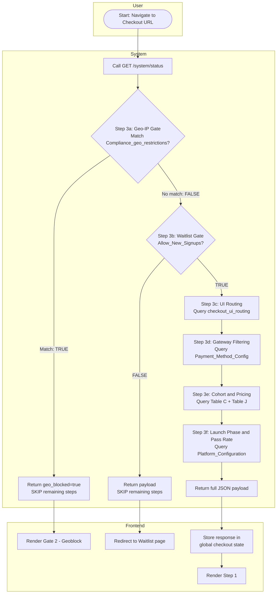

#### 3. SCREEN DESCRIPTION

N/A — this is a background check with no screen of its own. Its result decides which of the three following screens the user actually sees: Step 1, the Waitlist page, or the region-block screen.

#### 4. BUSINESS RULES

| # | BR Code | Function | Description |
| --- | --- | --- | --- |
| 1 | BR_1.1.1 | Single Call Per Session | `GET /system/status` called exactly once per checkout page load. Step navigation (Steps 1–5) does NOT trigger a new call. Full page refresh triggers a new call to re-hydrate global state. |
| 2 | BR_1.1.2 | Response Persistence | Full API response stored in global checkout state. All subsequent steps read from cached state — no re-fetching. |

#### 5. MESSAGE LIST

| # | Message Code | Type | Trigger |
| --- | --- | --- | --- |
| 1 | MSG-01 | Toast | Network error/timeout on `GET /system/status` |
| 2 | MSG-02 | Full-page Error | HTTP 5xx from `GET /system/status` |

*Full message text: see MESSAGE CATALOG at the end of this document.*

### UC_1.2 - Geo-Based Compliance UI Variants (Flow A–G)

#### 1. USE CASE SPECIFICATION TABLE

| Field | Content |
| --- | --- |
| **Use Case ID** | UC_1.2 |
| **Use Case Name** | Geo-Based Compliance UI Variants (Flow A–G) |
| **Use Case Description** | This use case allows the System to render the correct region-specific compliance disclosures and checkboxes at Step 5, in order to satisfy local regulatory requirements without manual per-country customization by developers. |
| **Actor(s)** | System |
| **Pre-Condition(s)** | `required_flow` stored in global checkout state (from Step 0). |
| **Trigger** | Step 5 renders. |
| **Post-Condition(s)** | Correct flow-specific compliance content (disclosures + checkboxes) is displayed. |
| **Basic Flow** | 1. Step 5 mounts. <br/ > 2. Frontend reads `required_flow` from state. <br/ > 3. Frontend renders the matching hardcoded UI variant per the routing table below. |
| **List Screen** | Step 5 (PII & Compliance) |
| **Exception Flow** | N/A — routing itself has no failure state; unmatched country defaults to Flow A at the backend level (see UC_1.1). |

#### 2. ROUTING TABLE (Flow A–G)

| Flow | Countries / Regions | UI Behavior at Step 5 |
| --- | --- | --- |
| **A** | USA + all unmatched (default) | 2 standard checkboxes only |
| **B** | UK, Australia | 2 checkboxes + pass-rate disclosure (varies by `is_launch_phase`) |
| **C** | EU/EEA (29 countries) | 2 checkboxes + pass-rate disclosure + 1 EU 14-day waiver checkbox (3 total) |
| **D** | Canada — Quebec only | Entire checkout UI (Steps 1–7) in French, incl. all labels/errors/toasts. Standard 2 checkboxes |
| **E** | UAE | 2 checkboxes + DFSA/ADGM non-regulation disclaimer |
| **F** | Sanctioned countries | Hard block — Gate 2 (UC_1.4). Step 5 never reached |
| **G** | India | 2 standard checkboxes only |

#### 3. SCREEN DESCRIPTION

Flow A: Global Default UI
{center}

| # | Component | Type | Required? | Description |
| --- | --- | --- | --- | --- |
| 1 | Checkbox 1 — Commercial Acknowledgment | Checkbox | Yes | **Description:** Confirms user understands they are purchasing a skills-assessment evaluation, not opening a brokerage account. <br/ > **Displaying Rules:** Default unchecked, all flows except F. Exact text: *"I acknowledge that I am purchasing a skills assessment software evaluation for commercial purposes to secure an independent contractor agreement with a US-domiciled C-Corporation, and I am not opening a retail financial, brokerage, or investment account."* <br/ > **Behaviour Rules:** N/A. <br/ > **Validation Rules:** Must be checked before [Next] enables. |
| 2 | Checkbox 2 — Age & ToS | Checkbox | Yes | **Description:** Confirms age ≥18 and agreement to ToS. <br/ > **Displaying Rules:** Default unchecked. Text: *"By clicking 'Complete Purchase', I confirm that I am at least 18 years of age and agree to the Terms of Service for the Data Processing and Performance Evaluation Service (Associate Track)."* The words "Terms of Service" are a clickable hyperlink. <br/ > **Behaviour Rules:** Click "Terms of Service" → opens Modal `MDL-01` with ToS content (same as public `/terms` page) — does NOT navigate away or reset checkout. Closing modal preserves all form state. <br/ > **Validation Rules:** Must be checked before [Next] enables. |
| 3 | Checkbox 3 — EU Withdrawal Waiver (Flow C only) | Checkbox | Yes (Flow C only) | **Description:** EU-specific 14-day withdrawal waiver, legally required for EU/EEA. <br/ > **Displaying Rules:** Only rendered for Flow C. Default unchecked. Text: *"I expressly consent to the immediate commencement of the digital evaluation service and waive my 14-day right of withdrawal under EU consumer protection law."* Positioned between standard checkboxes and [Next]. <br/ > **Behaviour Rules:** N/A. <br/ > **Validation Rules:** Must be checked before [Next] enables (Flow C only). |
| 4 | Pass-Rate Disclosure (Flow B, C) | Static Text | N/A | **Description:** Discloses historical pass rate or launch-phase unavailability. <br/ > **Displaying Rules:** Above standard checkboxes. If `is_launch_phase = TRUE`: *"This is a newly launched proprietary trading evaluation program. Historical pass-rate and success data is currently unavailable."* Else: *"Historically, only [historical_pass_rate]% of participants successfully pass the evaluation to become authorized traders."* Same text for UK & Australia. <br/ > **Behaviour/Validation:** N/A. |
| 5 | UAE Disclaimer (Flow E) | Static Text | N/A | **Description:** Discloses non-regulation status in UAE. <br/ > **Displaying Rules:** Above standard checkboxes, Flow E only. Text: *"Stack Trading is a U.S.-domiciled entity and is not licensed, registered, or regulated by the Dubai Financial Services Authority (DFSA) or the Abu Dhabi Global Market (ADGM)."* |
| 6 | Hypothetical Performance Disclaimer (All flows) | Static Text | N/A | **Description:** Mandatory legal disclaimer on simulated performance. <br/ > **Displaying Rules:** Always visible, non-collapsible, all flows. Full CFTC-style disclaimer text. No user interaction. |

#### 4. BUSINESS RULES

| # | BR Code | Function | Description |
| --- | --- | --- | --- |
| 1 | BR_1.2.1 | Flow-to-UI Mapping is Frontend-Hardcoded | The mapping of `required_flow` → UI content is hardcoded in frontend (fixed enum switch). Changing content requires a FE code change. |
| 2 | BR_1.2.2 | Country-to-Flow Assignment is Dynamic (DB-Driven) | Which country maps to which flow is managed via `checkout_ui_routing` PostgreSQL table — Ops-configurable without code deploy. |

#### 5. MESSAGE LIST

N/A — this UC has no error/toast messages of its own; all content is static. (Modal `MDL-01` is referenced in §3 row 2 — see MODAL CATALOG at the end of this document.)

### UC_1.3 — Gate 1: Waitlist

#### 1. USE CASE SPECIFICATION TABLE

| Field | Content |
| --- | --- |
| **Use Case ID** | UC_1.3 |
| **Use Case Name** | Gate 1 — Waitlist |
| **Use Case Description** | This use case allows the User to join a waitlist when new signups are paused, in order to be notified and retain their place once enrollment reopens. |
| **Actor(s)** | User, ActiveCampaign, Klaviyo |
| **Pre-Condition(s)** | User is on checkout page. `GET /system/status` returns `Global_Var_Allow_New_Signups == FALSE`. |
| **Trigger** | `Global_Var_Allow_New_Signups == FALSE` detected in `/system/status` response. |
| **Post-Condition(s)** | Direct API calls fired to BOTH Klaviyo and ActiveCampaign with email + UTM. Page shows success state. |
| **Basic Flow** | 1. `/system/status` returns flag FALSE. <br/ > 2. Frontend redirects (client-side, same tab) to dedicated Waitlist page — Marketing Header/Footer rendered. <br/ > 3. User selects Primary Market (Futures/Forex). <br/ > 4. User enters email. <br/ > 5. User clicks [Join Waitlist] (button behavior: Ref `CR-06`). <br/ > 6. Frontend reads UTM per `CR-05`, calls Klaviyo + ActiveCampaign APIs directly and in parallel. <br/ > 7. On success → success state (`MSG-03`). <br/ > 8. User clicks [Return to Homepage] → navigated to homepage. |
| **List Screen** | Waitlist Page |
| **Exception Flow** | E1 — CRM API fails on submit (`MSG-04`): Button reverts to "Join Waitlist" (enabled). Form data NOT cleared. |

#### 2. ACTIVITY FLOW

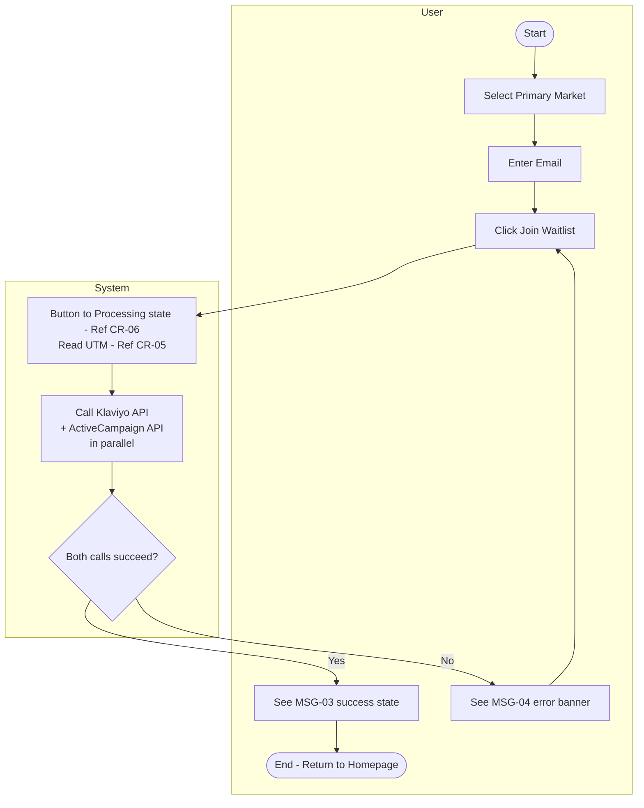

#### 3. SCREEN DESCRIPTION

Waitlist UI
{center}

| # | Component | Type | Required? | Description |
| --- | --- | --- | --- | --- |
| 1 | Primary Market | Dropdown (Single-selection) | Yes | **Description:** Lets user indicate which market they intend to trade. <br/ > **Displaying/Behaviour Rules:** Ref `CR-01`. Placeholder *"Select primary market"*. Options: `Futures`, `Forex`, `Crypto`. <br/ > **Validation Rules:** Required — inline error if empty on submit. |
| 2 | Email | Textbox | Yes | **Description:** Captures lead email for CRM. <br/ > **Validation Rules:** Ref `CR-02`. |
| 3 | [Join Waitlist] | Button (Primary) | N/A | **Description:** Submits lead to CRM systems. <br/ > **Behaviour Rules:** Ref `CR-06`. On click → validate all fields; invalid → inline errors, no submit. Valid → "Processing..." → parallel Klaviyo + ActiveCampaign calls with email + UTM (`CR-05`). On CRM fail → reverts to enabled, shows `MSG-04`. |

#### 4. BUSINESS RULES

| # | BR Code | Function | Description |
| --- | --- | --- | --- |
| 1 | BR_1.3.1 | Global Scope | `Global_Var_Allow_New_Signups == FALSE` is a global toggle — redirects ALL countries simultaneously. |
| 2 | BR_1.3.2 | No Interrupt Logic | If the flag changes to FALSE mid-checkout (user started when TRUE), the user completes the ENTIRE flow uninterrupted. Frontend does not re-check after initial load. |
| 3 | BR_1.3.3 | CRM-Side Deduplication (No Info Leakage) | No custom backend dedup check exists. Klaviyo/ActiveCampaign handle identity resolution natively. If email already exists, CRM silently dedupes/updates to prevent revealing whether an email is already registered. (Same intent as `CR-12`, applied here to a 3rd-party CRM rather than an internal endpoint.) |

#### 5. MESSAGE LIST

| # | Message Code | Type | Trigger |
| --- | --- | --- | --- |
| 1 | MSG-03 | Alert (Popup) — Success | Waitlist join succeeds |
| 2 | MSG-04 | Error (Banner) | CRM API fails on Waitlist submit |

*Full message text: see MESSAGE CATALOG at the end of this document.*

### UC_1.4 — Gate 2: Geoblock

#### 1. USE CASE SPECIFICATION TABLE

| Field | Content |
| --- | --- |
| **Use Case ID** | UC_1.4 |
| **Use Case Name** | Gate 2 — Geoblock (Flow F) |
| **Use Case Description** | This use case allows the System to hard-block a user from a sanctioned jurisdiction, in order to comply with OFAC/FATF regulatory requirements. |
| **Actor(s)** | System, Cloudflare |
| **Pre-Condition(s)** | N/A |
| **Trigger** | `GET /system/status` returns HTTP 403 (`geo_blocked == true`, `CF-IPCountry`/`CF-Region` matches `Compliance_geo_restrictions`). |
| **Post-Condition(s)** | Entire checkout UI replaced by hard-stop block page (`FPS-01`). User cannot proceed. |
| **Basic Flow** | 1. `/system/status` returns HTTP 403. <br/ > 2. Frontend renders full-page block (`FPS-01`) replacing entire checkout UI — no header/nav/footer/step indicators/appeal link. |
| **List Screen** | Gate 2 — Geoblock (full-page) |
| **Exception Flow** | N/A |

#### 2. ACTIVITY FLOW

See UC_1.1 Activity Flow, branch "Match: TRUE" at the Geo-IP Gate decision node.

#### 3. SCREEN DESCRIPTION

Flow F: Geo-Block
{center}

| # | Component | Type | Required? | Description |
| --- | --- | --- | --- | --- |
| 1 | Full-page block message (`FPS-01`) | Static Text | N/A | **Description:** Sole content of the page — no header, nav, footer, step indicator, or appeal link. <br/ > **Displaying Rules:** Text: `MSG-05`. <br/ > **Behaviour Rules:** Page is a dead end. Button: Return to homepage. <br/ > **Validation Rules:** N/A. |

#### 4. BUSINESS RULES

| # | BR Code | Function | Description |
| --- | --- | --- | --- |
| 1 | BR_1.4.1 | Hard Stop — Full Page Replacement | HTTP 403 = absolute hard stop. Geoblock state replaces the ENTIRE checkout UI. Only the block message is shown. |

#### 5. MESSAGE LIST

| # | Message Code | Type | Trigger |
| --- | --- | --- | --- |
| 1 | MSG-05 | Error (Full-page) | `geo_blocked = true` from `/system/status` |

*Full message text: see MESSAGE CATALOG at the end of this document.*

### UC_1.5 — Pricing Engine

#### 1. USE CASE SPECIFICATION TABLE

| Field | Content |
| --- | --- |
| **Use Case ID** | UC_1.5 |
| **Use Case Name** | Pricing Engine |
| **Use Case Description** | This use case allows the System to dynamically populate the correct price (Standard or Founder) for all 3 Evaluation Package tiers, in order to keep pricing centrally managed in Zapier Table J without requiring a code deploy for price changes. |
| **Actor(s)** | System |
| **Pre-Condition(s)** | `is_founder_cohort` and `pricing_tiers` available in global checkout state (from Step 0). |
| **Trigger** | Step 2 renders. |
| **Post-Condition(s)** | Correct pricing (Founder or Standard) displayed on all 3 cards, formatted per `CR-04`. |
| **Basic Flow** | 1. Frontend reads `is_founder_cohort` from state. <br/ > 2. If TRUE → render Founder Price column values with strikethrough Standard price. <br/ > 3. If FALSE → render Standard price + "one-time" label. |
| **List Screen** | Step 2 (Capital Allocation Selection) |
| **Exception Flow** | E1 — Race Condition (Stale Pricing, `MSG-06`): triggered at Step 6 [Pay] click if Founder cohort sold out or tax changed between `/calculate-cart` and `/execute-checkout` → backend returns `PRICE_CHANGED`. |

#### 2. ACTIVITY FLOW

Governed entirely by state read at Step 0; see UC_3 (Step 2) Screen Description for rendered result.

#### 3. SCREEN DESCRIPTION

N/A — this UC has no unique screen; its output is rendered inside UC_3's pricing cards (Step 2).

#### 4. BUSINESS RULES

| # | BR Code | Function | Description |
| --- | --- | --- | --- |
| 1 | BR_1.5.1 | Founder Cohort Detection | `is_founder_cohort = TRUE` → display Founder Price column (Table J). `FALSE` → Challenge Price column. Prices never hardcoded in FE — always read from `pricing_tiers`. Display format: Ref `CR-04`. |
| 2 | BR_1.5.2 | Race Condition — Stale Pricing | Triggered at Step 6 Pay click if server-side re-check detects Founder cohort sold out (reverts to Standard) OR tax rate changed since `/calculate-cart`. Returns `PRICE_CHANGED` — no charge, no promo reservation. `MSG-06` shown; [Refresh now] closes overlay + refreshes Order Summary, no full reload. |
| 3 | BR_1.5.3 | Price Data Source | Founder/Standard prices for all 3 tiers stored in Zapier Table J. Backend packs into `pricing_tiers` at Step 3e of `/system/status`. No additional API call needed at Step 2. |

**Current Table J Snapshot (Ops-editable, source of truth = Zapier, not this doc):**

| Track | Challenge Price | Futures Reset | Forex Reset | Extension Fee | Founder Price | Founder Reset Fee |
| --- | --- | --- | --- | --- | --- | --- |
| Associate (L1) | $650 | $375 | $325 | $150 | $499 | $325 |
| Accelerated (L2) | $1,250 | $725 | $625 | $275 | $1,049 | $600 |
| Advanced (L5) | **$7,000** | $3,800 | $3,500 | $1,500 | **$5,599** | $3,250 |

#### 5. MESSAGE LIST

| # | Message Code | Type | Trigger |
| --- | --- | --- | --- |
| 1 | MSG-06 | Alert (Popup) | `PRICE_CHANGED` returned at `/execute-checkout` |

*Full message text: see MESSAGE CATALOG at the end of this document. (Note: same event/message also referenced from UC_8.1 §6 — defined once here to avoid duplication.)*

## STEP 1 — ASSET CLASS SELECTION

### UC_2 — Asset Class Selection

#### 1. USE CASE SPECIFICATION TABLE

| Field | Content |
| --- | --- |
| **Use Case ID** | UC_2 |
| **Use Case Name** | Step 1: Asset Class Selection |
| **Use Case Description** | This use case allows the User to select their preferred trading asset class (Futures or Forex), in order to determine the subsequent step count and platform/risk configuration used throughout checkout. |
| **Actor(s)** | User |
| **Pre-Condition(s)** | `Global_Var_Allow_New_Signups == TRUE`. `geo_blocked == FALSE`. `/system/status` response stored in state. |
| **Trigger** | User passes Gate 1 and Gate 2 at Step 0. |
| **Post-Condition(s)** | `asset_class` stored in session state. User proceeds to Step 2. |
| **Basic Flow** | 1. Step 1 renders 2 cards: Futures, Forex. <br/ > 2. User clicks one card. <br/ > 3. Selection stored (persistence: Ref `CR-07`). <br/ > 4. User clicks [Next] to proceed. |
| **List Screen** | Step 1 (Asset Class Selection) |
| **Exception Flow** | N/A |

#### 2. ACTIVITY FLOW

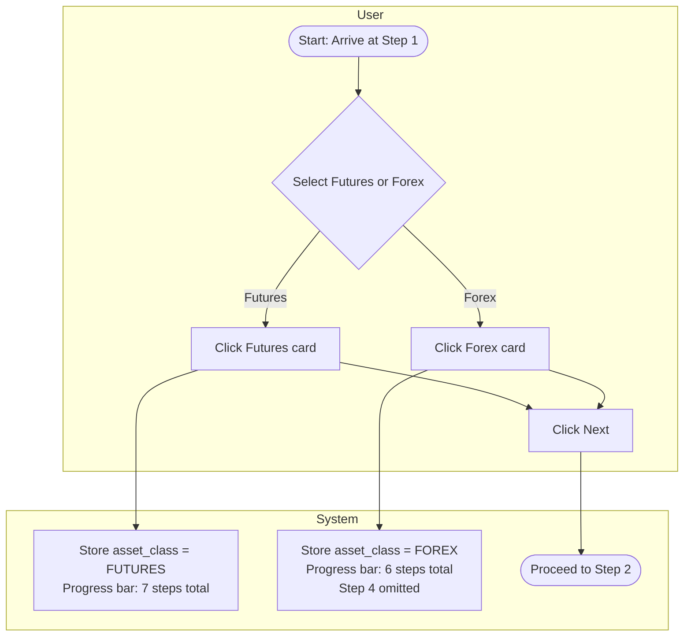

#### 3. SCREEN DESCRIPTION

Step 1: Asset Class Selection
{center}

| # | Component | Type | Required? | Description |
| --- | --- | --- | --- | --- |
| 1 | Futures | Radio Group | Yes | **Description:** Selects Futures as the trading asset class. <br/ > **Displaying Rules:** Title *"Futures"*, subtitle *"via CME"*. Default unselected. <br/ > **Behaviour Rules:** On click → stores `asset_class='FUTURES'`, deselects Forex if selected. If switching FROM Forex: Step 3 platform selection resets, Step 4 (Market Data) re-added to flow, progress bar updates to 7 steps. <br/ > **Validation Rules:** N/A. |
| 2 | Forex | Radio Group | Yes | **Description:** Selects Forex as the trading asset class. <br/ > **Displaying Rules:** Title *"Forex"*, subtitle *"Currency pairs"*. Default unselected. <br/ > **Behaviour Rules:** On click → stores `asset_class='FOREX'`, deselects Futures if selected. If switching FROM Futures: Step 3 platform selection resets, Step 4 removed from flow, progress bar updates to 6 steps. <br/ > **Validation Rules:** N/A. |
| 3 | [Next] | Button (Primary) | N/A | **Description:** Proceeds to Step 2. <br/ > **Behaviour Rules:** Ref `CR-06`. Disabled until one asset class selected; on click when enabled → navigate to Step 2. <br/ > **Validation Rules:** N/A. |

#### 4. BUSINESS RULES

| # | BR Code | Function | Description |
| --- | --- | --- | --- |
| 1 | BR_2.1 | Fixed Options | 2 options (Futures, Forex) hardcoded in FE — not API-driven. Both always displayed. |
| 2 | BR_2.2 | Session Persistence | Ref `CR-07`. Selection stored in session state for duration of checkout — refresh does NOT return user to Step 1 if local storage cart state is present. |
| 3 | BR_2.3 | Asset Class Change — Progress Bar & Step Count Impact | **Futures:** 7 steps (1→2→3→4→5→6→7). <br/ > **Forex:** 6 steps (1→2→3→5→6→7, Step 4 omitted). Applies on initial selection AND when navigating back to change selection. Futures→Forex: Step 3 selection reset, Step 4 removed, bar → 6 steps. Forex→Futures: Step 3 reset, Step 4 added back, bar → 7 steps. <br/ > **Step 5 data is NOT reset** on asset class change — only cleared on full page refresh (this is the one exception to `CR-07`'s general back-navigation persistence rule). |

#### 5. MESSAGE LIST

N/A — no error/toast messages in this UC.

## STEP 2 — CAPITAL ALLOCATION SELECTION

### UC_3 — Capital Allocation Selection

#### 1. USE CASE SPECIFICATION TABLE

| Field | Content |
| --- | --- |
| **Use Case ID** | UC_3 |
| **Use Case Name** | Step 2: Capital Allocation Selection |
| **Use Case Description** | This use case allows the User to select one of three Evaluation Package tiers, in order to determine their starting notional capital, evaluation targets, and career-ladder entry point. |
| **Actor(s)** | User |
| **Pre-Condition(s)** | `asset_class` in session state. `/system/status` pricing data in global checkout state. |
| **Trigger** | User clicks [Next] at Step 1 with an asset class selected. |
| **Post-Condition(s)** | `product_id` (EVAL_L1/L2/L5) stored in session state. User proceeds to Step 3. |
| **Basic Flow** | 1. Step 2 renders 3 pricing cards (Advanced, Accelerated, Associate). <br/ > 2. User clicks a card (or [Select Track] button) to select. <br/ > 3. User clicks [Next]. |
| **List Screen** | Step 2 (Capital Allocation Selection) |
| **Exception Flow** | N/A |

#### 2. ACTIVITY FLOW

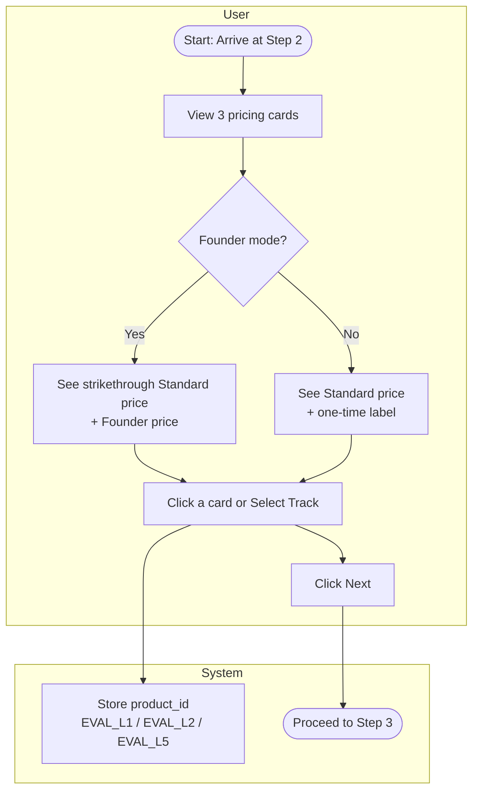

> **Note:** `Daily Loss Limit` (`Daily_Loss_Ratio × max_drawdown`) is a backend/ops metric — it is **NOT displayed** in the Step 2 checkout UI. `Daily_Loss_Ratio` is read from Table C at runtime but never surfaced to the user at this step.

#### 3. EVALUATION PACKAGE DATA (reference)

| Parameter | Advanced (EVAL_L5) | Accelerated (EVAL_L2) | Associate (EVAL_L1) |
| --- | --- | --- | --- |
| Standard Price | $7,000 | $1,250 | $650 |
| Founder Price | $5,599 | $1,049 | $499 |
| Status Ribbon | Recommended for Pros | Best Value | Foundation |
| Eval Req. — Futures | 7 ES | 16 Micros | 8 Micros |
| Eval Req. — Forex | $150,000 Notional | $50,000 Notional | $25,000 Notional |
| Target/Stop | 14% / 7.5%, 60 days (dynamic %, fixed days) | same | same |
| Career Entry | Level 5 | Level 2 | Level 1 |
| Distance to W2 | 1 Promotion Away | 4 Promotions Away | 5 Promotions Away |
| Live Stop Loss | $10,500 | $2,500 | $1,250 |
| Live Profit Target | $14,100 | $3,750 | $1,875 |

*All monetary values in this table follow the display format in `CR-04`.*

#### 4. SCREEN DESCRIPTION

Step 2: Capital Allocation
{center}

| # | Component | Type | Required? | Description |
| --- | --- | --- | --- | --- |
| 1 | Pricing Card ×3 — Top | Radio Group | Yes | **Description:** Selects the Evaluation Package tier. <br/ > **Displaying Rules:** 3 cards left-to-right: Advanced · Accelerated · Associate. Each shows: Status Ribbon, Track name, Price block (`CR-04`), Evaluation Requirements box, [Select Track] button. Standard mode: Standard Price + "one-time". Founder mode: Standard Price (strikethrough) + Founder Price (full size), no "one-time" label. Evaluation Requirements box row 2 renders `"{target}% Target / {stop}% Stop, 60 days"` dynamically from Table C. No card pre-selected by default. <br/ > **Behaviour Rules:** Click anywhere on card OR [Select Track] → selects tier, stores `product_id`, deselects previous card. <br/ > **Validation Rules:** N/A. |
| 2 | Pricing Card ×3 — Bottom | Static Display | N/A | **Description:** Shows the Live Account & Career Path preview upon passing. <br/ > **Displaying Rules:** Always visible, not collapsible. Header: *"Live Account & Career Path (Upon Passing)"*. Fields: Career Ladder Entry, Distance to W2 (1/4/5 Promotions Away), Live Capital Allocation, Live Stop Loss (with "Firm takes 100% of the risk" + tooltip), Live Profit Target. |
| 3 | Live Stop Loss — Tooltip ⓘ | Tooltip | N/A | **Description:** Explains firm-absorbed risk. <br/ > **Behaviour Rules:** On hover → shows: *"If you pass the evaluation, the firm backs your account with this exact amount of real capital at risk. We absorb the losses so you can focus on execution."* |
| 4 | [Select Track] | Button (Secondary) | N/A | **Description:** Per-card select button. <br/ > **Behaviour Rules:** Equivalent to clicking card body. |
| 5 | [Back] | Button (Secondary) | N/A | **Behaviour Rules:** Navigates back to Step 1. Data persistence: Ref `CR-07`. |
| 6 | [Next] | Button (Primary) | N/A | **Validation Rules:** Disabled until a card is selected. <br/ > **Behaviour Rules:** Ref `CR-06`. On click → navigate to Step 3. |

#### 5. BUSINESS RULES

| # | BR Code | Function | Description |
| --- | --- | --- | --- |
| 1 | BR_3.1 | Pricing Mode — Standard vs Founder | `is_founder_cohort=TRUE` → strikethrough Standard + full-size Founder, no "one-time" label. `FALSE` → Standard price + "one-time" label. Display format: Ref `CR-04`. |
| 2 | BR_3.2 | Card Selection | Only one card selectable at a time; new selection deselects previous. [Next] disabled until a card is selected. |

#### 6. MESSAGE LIST

N/A — no error/toast messages in this UC.

## STEP 3 — PLATFORM SELECTION

### UC_4 — Platform Selection

#### 1. USE CASE SPECIFICATION TABLE

| Field | Content |
| --- | --- |
| **Use Case ID** | UC_4 |
| **Use Case Name** | Step 3: Platform Selection |
| **Use Case Description** | This use case allows the User to select their preferred trading platform from a list dynamically filtered by asset class, in order to determine which execution gateway (Rithmic / MT5 / TraderEvolution) their evaluation account is provisioned on. |
| **Actor(s)** | User |
| **Pre-Condition(s)** | `asset_class` in session state. |
| **Trigger** | User clicks [Next] at Step 2 with a package selected. |
| **Post-Condition(s)** | `platform` stored in session state. User proceeds to Step 4 (Futures) or Step 5 (Forex). |
| **Basic Flow** | 1. Step 3 renders. <br/ > 2. Frontend calls `GET /public/platform-options?asset_class=[asset_class]`. <br/ > 3. Platform options render as logo tiles. <br/ > 4. User clicks a tile → stored. <br/ > 5. User clicks [Next]. |
| **List Screen** | Step 3 (Platform Selection) |
| **Exception Flow** | E1 — Empty array returned (`MSG-07`). <br/ > E2 — HTTP 500/timeout (`MSG-08`). |

#### 2. ACTIVITY FLOW

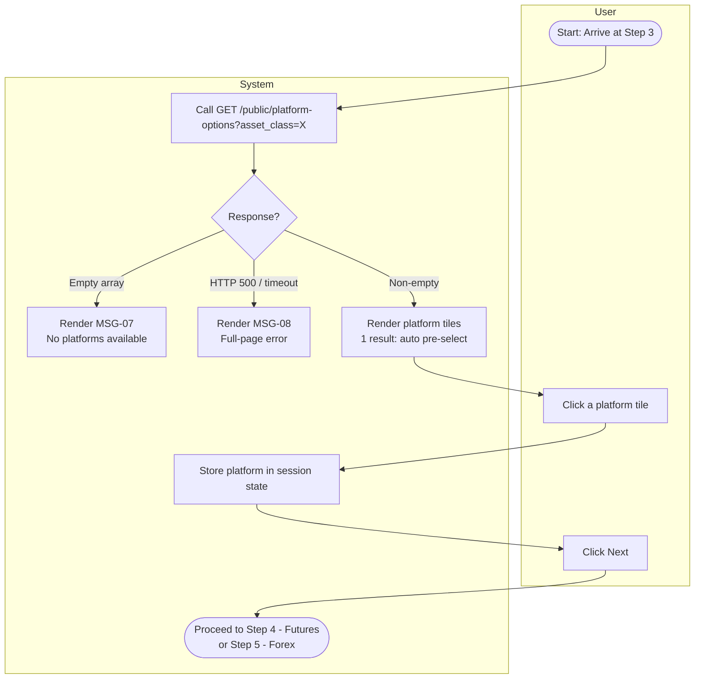

#### 3. PLATFORM REGISTRY (Zapier Table I — snapshot)

| Platform Name | Asset Class | Gateway | Is_Active | Risk_Group_Template |
| --- | --- | --- | --- | --- |
| **TradeSea** (was NinjaTrader 8) | Futures | Rithmic | TRUE | Sim_Rithmic_Default |
| Quantower | Futures | Rithmic | TRUE | Sim_Rithmic_Default |
| ATAS | Futures | Rithmic | TRUE | Sim_Rithmic_Default |
| MotiveWave | Futures | Rithmic | TRUE | Sim_Rithmic_Default |
| Sierra Chart | Futures | Rithmic | TRUE | Sim_Rithmic_Default |
| MetaTrader 5 | Forex | MT5 | TRUE | Sim_MT5_Default |
| TradingView | Forex | TraderEvolution | TRUE | Sim_TV_Default |

#### 4. SCREEN DESCRIPTION

Platform Selection
{center}

| # | Component | Type | Required? | Description |
| --- | --- | --- | --- | --- |
| 1 | Platform Tiles | Radio Group | Yes | **Description:** Logo-driven platform selector. <br/ > **Displaying Rules:** API returns only `Platform_Name` strings — no logo/icon in response; FE maps each name to a local static logo asset. Default unselected, unless only 1 option returned → auto pre-selected (still requires [Next] click, no auto-advance). <br/ > **Behaviour Rules:** On click → select tile, deselect previous, store `platform`. <br/ > **Validation Rules:** N/A. |
| 2 | [Back] | Button (Secondary) | N/A | **Behaviour Rules:** Navigate back to Step 2. Data persistence: Ref `CR-07`. |
| 3 | [Next] | Button (Primary) | N/A | **Behaviour Rules:** Ref `CR-06`. Disabled until a tile is selected. On click → navigate to Step 4 (Futures) or Step 5 (Forex). |

#### 5. BUSINESS RULES

| # | BR Code | Function | Description |
| --- | --- | --- | --- |
| 1 | BR_4.1 | Dynamic List — No Hardcoding | Options fetched from `GET /public/platform-options?asset_class=X`. Response is only `{ "platforms": [string] }` — no icon field. Logos are static FE assets mapped by name. |
| 2 | BR_4.2 | Pre-selection with 1 Result | 1 platform returned → auto pre-select (highlighted). User must still click [Next] — no auto-advance. |
| 3 | BR_4.3 | Navigation — Back from Later Steps | Ref `CR-07`. Changing platform via back-navigation from Step 5 does NOT reset Step 4 (Market Data) or Step 5 data — independent. |

#### 6. MESSAGE LIST

| # | Message Code | Type | Trigger |
| --- | --- | --- | --- |
| 1 | MSG-07 | Alert (Popup) | `GET /public/platform-options` returns empty array |
| 2 | MSG-08 | Error (Full-page) | HTTP 500 or network timeout |

*Full message text: see MESSAGE CATALOG at the end of this document.*

## STEP 4 — MARKET DATA SELECTION (FUTURES ONLY)

### UC_5 — Market Data Selection

#### 1. USE CASE SPECIFICATION TABLE

| Field | Content |
| --- | --- |
| **Use Case ID** | UC_5 |
| **Use Case Name** | Step 4: Market Data Selection (Futures Only) |
| **Use Case Description** | This use case allows the Futures User to select additional market data feed subscriptions beyond the mandatory CME feed, in order to enable trading on the corresponding exchanges during evaluation. |
| **Actor(s)** | User |
| **Pre-Condition(s)** | `asset_class == 'FUTURES'`. `GET /public/market-data-products` returns a non-empty array. |
| **Trigger** | User clicks [Next] at Step 3 AND `asset_class == 'FUTURES'`. |
| **Post-Condition(s)** | `addon_ids[]` stored in session state. User proceeds to Step 5. |
| **Basic Flow** | 1. Step 4 renders. <br/ > 2. Frontend calls `GET /public/market-data-products` (backend reads product list + prices from Table C — never hardcoded). <br/ > 3. Toggle grid renders. <br/ > 4. CME: pre-checked, locked. <br/ > 5. User toggles optional feeds (NYMEX/CBOT/COMEX). <br/ > 6. All selected feeds show `"Cost: $0.00 (Covered by Stack Trading)"`. <br/ > 7. User clicks [Next]. |
| **List Screen** | Step 4 (Market Data Selection) — Forex users skip this step entirely |
| **Exception Flow** | E1 — 0 products returned (`MSG-09`), treated as system error. |

#### 2. ACTIVITY FLOW

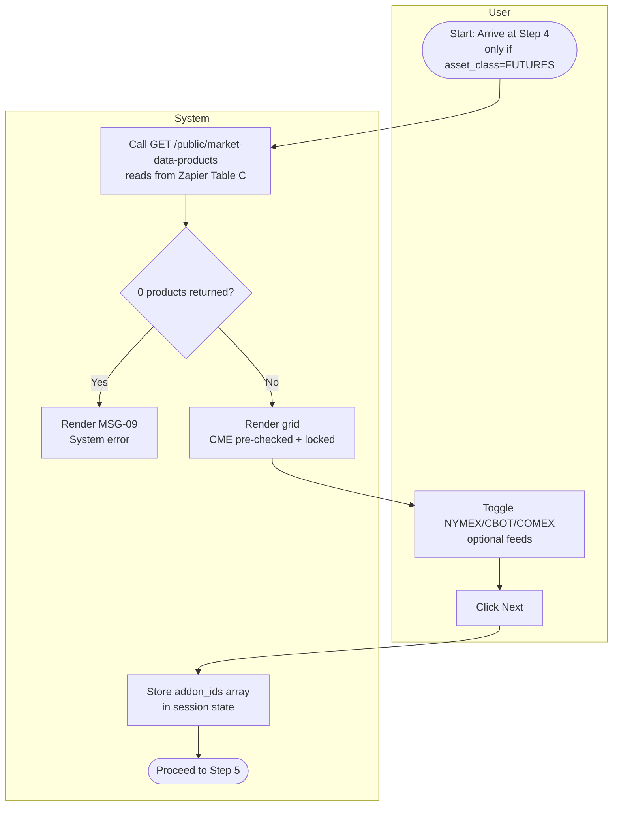

#### 3. SCREEN DESCRIPTION

Market Data
{center}

| # | Component | Type | Required? | Description |
| --- | --- | --- | --- | --- |
| 1 | CME Feed | Toggle/Switch | Yes (locked) | **Description:** Mandatory base data feed. <br/ > **Displaying Rules:** ON label *"CME Level 2"*. Default ON, "Most Popular" badge. <br/ > **Behaviour Rules:** Always ON, non-toggleable — always included in `addon_ids[]`. |
| 2 | Optional Feeds (NYMEX/CBOT/COMEX) | Toggle/Switch ×3 | No | **Description:** Additional exchange feeds. <br/ > **Displaying Rules:** Default OFF for all. Cost display: *"Cost: $0.00 (Covered by Stack Trading)"*. <br/ > **Behaviour Rules:** Toggle ON → add to `addon_ids[]`; OFF → remove. Selections preserved on back-navigation (Ref `CR-07`). |
| 3 | Market Data Lifecycle Disclosure | Static Text | N/A | **Displaying Rules:** Static, non-collapsible, always visible, below the feed grid. Line 1: *"Associate Track Evaluation: The Firm pays 100% of data costs."* Line 2: *"Level 1 and 2: The Trader pays (Standard Exchange Professional Data rates apply)."* Line 3: *"Level 3: The Trader is fully reimbursed for all Base CME market data costs incurred during Levels 1 and 2."* (Reimbursement is scoped specifically to **Base CME** costs, not all data costs.) Line 4: *"Level 3 to Level 24: The Firm covers 100% of Base CME data costs."* |
| 4 | [Back] | Button (Secondary) | N/A | **Behaviour Rules:** Navigate back to Step 3. |
| 5 | [Next] | Button (Primary) | N/A | **Behaviour Rules:** Always enabled (CME always selected). On click → store final `addon_ids[]`, navigate to Step 5. |

#### 4. BUSINESS RULES

| # | BR Code | Function | Description |
| --- | --- | --- | --- |
| 1 | BR_5.1 | CME Locked ON | Pre-checked and locked ON by default — cannot be unchecked. |
| 2 | BR_5.2 | Optional Feed Defaults | NYMEX, CBOT, COMEX default to OFF. |
| 3 | BR_5.3 | Cost Display | All selected options show `"Cost: $0.00 (Covered by Stack Trading)"`. |
| 4 | BR_5.4 | Navigation — Back from Later Steps | Ref `CR-07`. Previously selected `addon_ids[]` states preserved on return to Step 4 — not reset to default. |
| 5 | BR_5.5 | Product & Price Source — Table C (No Hardcoding) | `GET /public/market-data-products` MUST read product list + prices from Zapier Table C at request time. Backend must NOT hardcode. Applies also to the authenticated Dashboard variant (`GET /market-data-products`), which additionally filters out already-owned feeds. |

#### 5. MESSAGE LIST

| # | Message Code | Type | Trigger |
| --- | --- | --- | --- |
| 1 | MSG-09 | Error (Full-page) | `GET /public/market-data-products` returns 0 products |

*Full message text: see MESSAGE CATALOG at the end of this document.*

## STEP 5 — PII CAPTURE, COMPLIANCE & CART ABANDONMENT

### UC_6.1 — PII Capture & Compliance

#### 1. USE CASE SPECIFICATION TABLE

| Field | Content |
| --- | --- |
| **Use Case ID** | UC_6.1 |
| **Use Case Name** | Step 5: PII Capture & Compliance |
| **Use Case Description** | This use case allows the User to submit personal and billing information, complete flow-dependent compliance checkboxes, and trigger tax calculation, in order to move to the checkout/payment step with a validated, sanctions-cleared, tax-calculated order. |
| **Actor(s)** | User, Quaderno, Google Places/Address Validation API, Everflow |
| **Pre-Condition(s)** | Session state has `asset_class`, `product_id`, `platform`, `addon_ids[]` (empty array `[]` for Forex path). `required_flow` available in global state. |
| **Trigger** | User clicks [Next] at Step 4 (Futures) or Step 3 (Forex). |
| **Post-Condition(s)** | PII validated. `POST /calculate-cart` returned HTTP 200 (Sanctions Gate passed). All required checkboxes checked. User can proceed to Step 6. |
| **Basic Flow** | See Detailed 10-step flow below. |
| **List Screen** | Step 5 (PII Capture & Compliance) — 7 flow-specific wireframe variants |
| **Exception Flow** | E1 — Blocked jurisdiction selected (`MSG-10`): placement varies by whether whole-country or specific-region match; Next stays disabled until valid selection made. <br/ > E2 — Address mismatch, US/CA only (`MSG-11`). <br/ > E3 — `/calculate-cart` HTTP 5xx (`MSG-12`). |

#### 2. DETAILED BASIC FLOW

1. Step 5 renders all PII fields. Flow-dependent compliance UI (UC_1.2) renders simultaneously.
2. Current UTM values read per `CR-05` — not re-parsed from URL here.
3. User fills fields. Email `onBlur` → triggers UC_6.2 Phase 1 (Capture Lead), independently of this flow.
4. Typing in Billing Address suggests a dropdown (cascading behavior: Ref `CR-08`); selecting an entry auto-populates Billing Address, ZIP, and attempts to match Country/State/City dropdowns. Overwrites any existing values in those fields. If auto-selected Country is blocked → fires immediately per step 7.
5. User selects Country. State/Region, City, ZIP fields visible on load — City starts disabled (no Region yet). On Country selection: hide State/Region if country has none → also hide City; hide ZIP if `zip_requirements[country] = false` (Ref `CR-08`).
6. User selects State/Region. Frontend clears existing City selection, fetches City list scoped to Region. No city data → City stays hidden; otherwise enabled with fetched options.
7. Sanctions pre-check (immediate-validation timing: Ref `CR-09`): on every Country/State selection — blocked immediately (`MSG-10`), Region/ZIP disabled per placement rule; not blocked → no warning.
8. User checks all required compliance checkboxes + fills remaining fields, including Confirm Email (must match Email — see Screen Description row 3).
9. User clicks [Next] → `POST /calculate-cart` fires (deferred-validation timing: Ref `CR-09`). Payload: `product_id, addon_ids, billing_country, billing_region, billing_city, user_ip, user_id, promo_code (NULL), zip_code (conditional)`. "Calculating regional taxes..." shown below State/Region dropdown; [Next] disabled during call (Ref `CR-06`). Backend processes 6 steps in order: **(1) Sanctions Gate** → 403 if matched (`MSG-10`), skips 2–6. **(2) Pricing Engine** → Table J lookup, Founder Price if cohort open, returning-user branch, market data entitlement check. **(3) Location Check** → N/A at Step 5 (billing_country always user-supplied here). **(4) Address Validation Gate** → US/CA only, rate-limited 15 req/min + 24h cache; mismatch → HTTP 400 (`MSG-11`), skips 5–6; all other countries bypass this gate entirely. **(5) Tax Engine** → Quaderno API call with running amount from step 2. **(6) Return** → `{ base_price, discount_amount, tax_amount, total_price }`, saved silently to session state — nothing rendered at Step 5.
10. On HTTP 200 → "Calculating..." text disappears, triggers UC_6.2 Phase 2 (full PII UPSERT), navigates to Step 6. No price/tax shown at Step 5.

#### 3. ACTIVITY FLOW

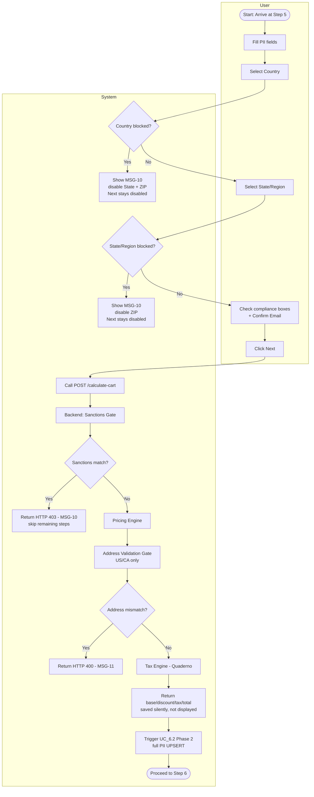

#### 4. SCREEN DESCRIPTION

Trader Details
{center}

| # | Component | Type | Required? | Description |
| --- | --- | --- | --- | --- |
| 1 | First Name / Last Name | Text Input | Yes | **Description:** Legal name capture. <br/ > **Validation Rules:** Ref `CR-03`. |
| 2 | Email | Text Input | Yes | **Description:** Primary identifier and cart-abandonment trigger. <br/ > **Behaviour Rules:** `onBlur` → triggers `POST /capture-lead` (UC_6.2 Phase 1). <br/ > **Validation Rules:** Ref `CR-02`. |
| 3 | Confirm Email | Text Input | Yes | **Description:** Prevents checkout completion on a mistyped email, since the activation link in Step 7 is the only way the user receives their account. <br/ > **Validation Rules:** Must match Email field exactly (case-insensitive). [Next] stays disabled while mismatched — see row 12. |
| 4 | Billing Address | Text Input w/ Autocomplete | Yes | **Description:** Street address with Google Places Autocomplete. <br/ > **Behaviour Rules:** Ref `CR-08`. Selecting a suggestion auto-fills ZIP + attempts to match Country/State/City dropdowns. Manual typing without selecting a suggestion does NOT auto-fill other fields. |
| 5 | Country | Dropdown | Yes | **Displaying/Behaviour Rules:** Ref `CR-01`, `CR-08`. Sanctions pre-check fires immediately on selection (`CR-09`). Hides State/Region if country has none; hides City consequently; hides ZIP if not required for this country. |
| 6 | State / Province / Region | Dropdown | Conditional | **Displaying Rules:** Ref `CR-01`, `CR-08`. Hidden if selected country has no regions. <br/ > **Behaviour Rules:** Sanctions pre-check fires on selection (`CR-09`). Clears + re-fetches City options scoped to this region. |
| 7 | City | Dropdown | Conditional | **Displaying Rules:** Ref `CR-01`, `CR-08`. Disabled until Region selected; hidden if Region has no city data. |
| 8 | ZIP / Postal Code | Text Input | Conditional | **Displaying Rules:** Ref `CR-08`. Shown/hidden per `zip_requirements[billing_country]` map from Step 0. |
| 9 | Shirt Size | Dropdown | Yes | **Displaying Rules:** Ref `CR-01`. Options: S, M, L, XL, XXL. |
| 10 | Compliance Checkboxes (2 or 3, flow-dependent) | Checkbox | Yes | See UC_1.2 §3 for exact text and per-flow variants. |
| 11 | "Calculating regional taxes..." | Static Text | N/A | **Displaying Rules:** Shown below State/Region dropdown only while `POST /calculate-cart` is in flight. |
| 12 | [Back] | Button (Secondary) | N/A | **Behaviour Rules:** Navigate back to Step 4/Step 3. Data persistence: Ref `CR-07`. |
| 13 | [Next] | Button (Primary) | N/A | **Validation Rules (Ref `BR_6.1.2`):** Disabled until: (1) all required fields valid, (2) no unresolved Sanctions pre-check match, (3) all required checkboxes checked, (4) Confirm Email matches Email (row 3). <br/ > **Behaviour Rules:** Ref `CR-06`. On click → fires `POST /calculate-cart`; stays disabled during call; navigates to Step 6 only on HTTP 200. |

#### 5. BUSINESS RULES

| # | BR Code | Function | Description |
| --- | --- | --- | --- |
| 1 | BR_6.1.1 | Sanctions Pre-Check & Tax Calculation Timing | Ref `CR-09`. Two independent mechanisms: (1) Immediate sanctions pre-check on every Country/State selection — no debounce; (2) Tax calculation call ONLY on [Next] click, never on field `onChange`/`onBlur` (except Email `onBlur` which triggers a separate lead-capture call, not this one). |
| 2 | BR_6.1.2 | Next Button Gate | 4 conditions must all be true simultaneously (see Screen Description row 13). On click, if met → fires `/calculate-cart`; navigation happens only on HTTP 200. |
| 3 | BR_6.1.3 | Everflow Cookie Capture | 2 parallel paths run on page init, always, regardless of SDK status: Path 1 = Everflow JS SDK captures affiliate params, stores `transaction_id` as first-party cookie. Path 2 = raw affiliate URL params parsed directly into `st_affiliate_data` cookie (not ad-blocker-dependent). If SDK fails to load: FE appends `everflow_sdk_blocked=true` + `st_affiliate_data` to `/execute-checkout` payload; backend generates `transaction_id` on-the-fly via Everflow S2S Click API. |
| 4 | BR_6.1.4 | Data Persistence on Back Navigation | Ref `CR-07`. Step 5 data preserved across back nav. |
| 5 | BR_6.1.5 | No Price Display at Step 5 | `base_price/discount/tax/total` from `/calculate-cart` saved silently to session state — nothing rendered on this screen. First shown at Step 6 Order Summary. |
| 6 | BR_6.1.6 | Email/Confirm Email do not trigger tax call | Changes to these two fields never trigger `POST /calculate-cart`. |
| 7 | BR_6.1.7 | Field Disable Placement on Sanctions Match | Whole-country match → disables State/Region + ZIP. Specific-region match → disables ZIP only. |
| 8 | BR_6.1.8 | Google Places Autocomplete Behavior | Ref `CR-08`. See detailed flow step 4 above. |
| 9 | BR_6.1.9 | Returning User Detection | If email matches an existing Users record with `status IN ('Failed','Terminated')`, pricing branches on `Post_Failure_Retention_Days` (Table C) × founder × professional status. **⚠️ Cần xác nhận với BAL:** exact branch matrix — chưa đủ rõ trong tài liệu hiện có để mô tả chi tiết. |
| 10 | BR_6.1.10 | Market Data Entitlement Check (Returning Users) | For Futures/Rithmic returning users, must check already-purchased market data before allowing new feed purchase. **⚠️ Cần xác nhận với BAL:** UI treatment cụ thể tại Step 5. |
| 11 | BR_6.1.11 | City Cascades From Region | Ref `CR-08`. City dropdown always scoped to the selected State/Region; changing Region clears City selection and re-fetches options. |
| 12 | BR_6.1.12 | Address Validation Gate (US/CA only) | Rate-limited 15 req/min per user/session + 24h success cache per normalized State+City+ZIP. Mismatch on `administrative_area_level_1`/`locality`/`postal_code` → HTTP 400 (`MSG-11`), request dropped before Tax Engine runs. All other countries bypass this gate — proceed straight to Tax Engine. |
| 13 | BR_6.1.13 | Address Validation API Error Cases | **⚠️ Cần xác nhận với BAL:** danh sách đầy đủ các trường hợp lỗi trả về từ Google Address Validation API mà QC cần test — chưa được liệt kê chi tiết ở tài liệu hiện có. |

#### 6. MESSAGE LIST

| # | Message Code | Type | Trigger |
| --- | --- | --- | --- |
| 1 | MSG-10 | Validation (Inline) | Blocked Country/Region selected (pre-check) or 403 from `/calculate-cart` |
| 2 | MSG-11 | Validation (Inline) | Google Address Validation flags mismatch (US/CA only) |
| 3 | MSG-12 | Error (Full-page) | `/calculate-cart` HTTP 5xx |

*Full message text: see MESSAGE CATALOG at the end of this document.*

### UC_6.2 — Lead Capture & Cart Abandonment

#### 1. USE CASE SPECIFICATION TABLE

| Field | Content |
| --- | --- |
| **Use Case ID** | UC_6.2 |
| **Use Case Name** | Step 5: Lead Capture & Cart Abandonment |
| **Use Case Description** | This use case allows the System to capture a partial lead the moment the user finishes typing their email, in order to enable cart-abandonment remarketing even if the user never completes checkout. |
| **Actor(s)** | System |
| **Pre-Condition(s)** | User is on Step 5. |
| **Trigger** | Phase 1: Email field `onBlur`. Phase 2: [Next] click succeeds at Step 5 (`/calculate-cart` HTTP 200). |
| **Post-Condition(s)** | Phase 1: Guest record created/updated + `Cart_Abandonment` webhook fired. Phase 2: full PII UPSERTed into the same record. No Auth0 account exists at either phase. |
| **Basic Flow** | Phase 1: Email `onBlur` → `POST /capture-lead` (email + UTM per `CR-05`) → creates/updates Guest record, fires `Cart_Abandonment` webhook. <br/ > Phase 2: [Next] click succeeds → UPSERT full PII into same Guest record → navigate to Step 6. |
| **List Screen** | N/A (silent background call within Step 5) |
| **Exception Flow** | **⚠️ Cần xác nhận với BAL:** hành vi khi `POST /capture-lead` tự nó thất bại — hiện chưa có trạng thái báo lỗi nào cho người dùng ở lệnh gọi "fire-and-forget" này. |

#### 2. ACTIVITY FLOW

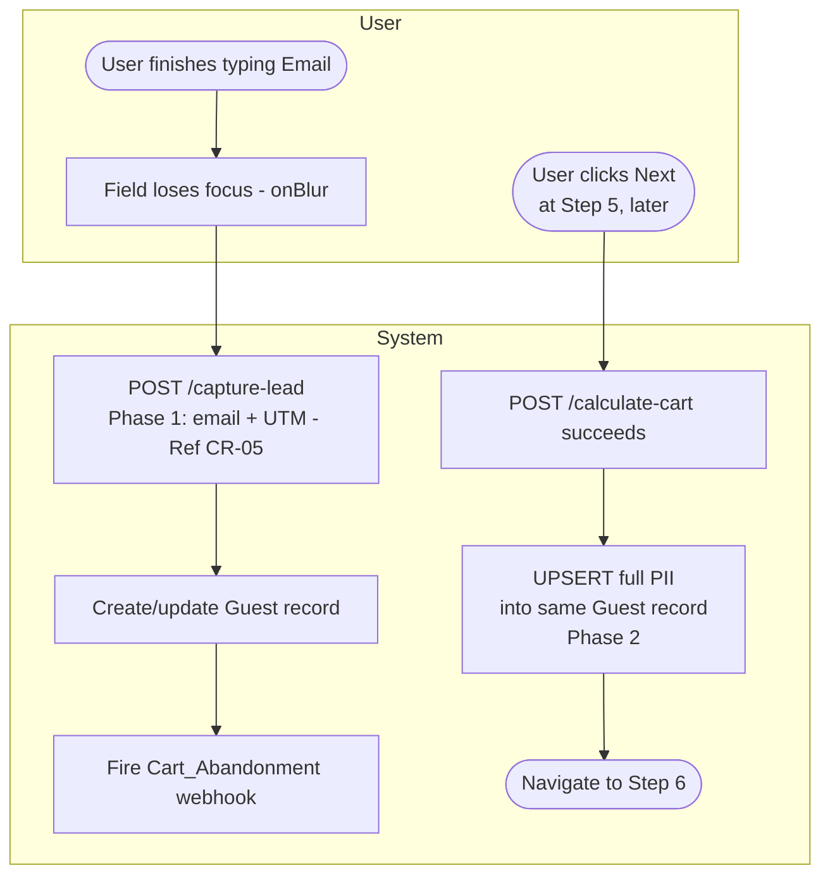

#### 3. SCREEN DESCRIPTION

N/A — silent background operation, no dedicated screen elements beyond the Email field itself (documented in UC_6.1).

#### 4. BUSINESS RULES

| # | BR Code | Function | Description |
| --- | --- | --- | --- |
| 1 | BR_6.2.1 | Two-Phase Capture | Phase 1 (onBlur) captures minimal data early to survive drop-off; Phase 2 (Next success) enriches the same record with full PII — never creates a duplicate record. |
| 2 | BR_6.2.2 | No Auth0 Account at Either Phase | A Guest record is a DB row only — no authentication account exists until Step 7 provisioning completes. |

#### 5. MESSAGE LIST

N/A — background call, no user-facing message.

## STEP 6 — CHECKOUT & PAYMENT

### UC_7.1 — Order Summary

#### 1. USE CASE SPECIFICATION TABLE

| Field | Content |
| --- | --- |
| **Use Case ID** | UC_7.1 |
| **Use Case Name** | Order Summary |
| **Use Case Description** | This use case allows the System to render the split-panel Step 6 checkout page, in order to present payment method selection alongside a persistent order summary without any additional API calls. |
| **Actor(s)** | User, System |
| **Pre-Condition(s)** | `/calculate-cart` succeeded at Step 5 (`total/tax/base_price` in state). `methods[]` loaded from Step 0. User passed Step 5 compliance gate. |
| **Trigger** | User navigates to Step 6 after Step 5. |
| **Post-Condition(s)** | Step 6 renders fully. First method in `methods[]` pre-selected. Matching execution environment renders. |
| **Basic Flow** | See Detailed Flow below (§2). |
| **List Screen** | Step 6 (Secure Checkout) |
| **Exception Flow** | E1 — `methods[]` empty (`MSG-13`): blocking popup, user cannot proceed. |

#### 2. DETAILED BASIC FLOW

1. On mount, Step 6 always renders split-panel, headline *"Secure Checkout"*. If email is currently locked (`MSG-14`, Modal `MDL-04`) → renders on top, on every mount including forward nav and reload. **F5 note:** payment has no resumable mid-state — reload routes directly to correct final state.
2. System reads `methods[]` from session state (populated at Step 0). Each renders as radio + label + explanatory text + inline icons + CTA button.
3. First method auto-selected; DOM swap executes immediately.
4. FE applies client-side OS/browser detection for Apple Pay / Google Pay visibility.
5. User clicks CTA → 2 possible groups covered in this document:
   - **Group A (CC only):** fills form directly on page, no modal (UC_7.2).
   - **Group B (Apple Pay, Google Pay):** 3rd-party modal opens. Case A = user closes before paying → no overlay. Case B = modal closed mid-payment → background listening continues per `CR-13`. Case C = payment completes in modal → confirmation (UC_7.3, UC_7.4).

#### 3. ACTIVITY FLOW

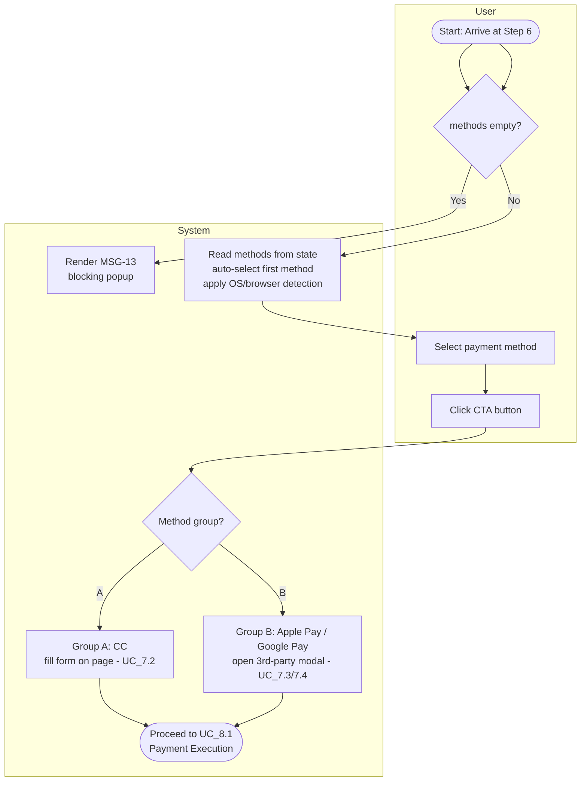

#### 4. SCREEN DESCRIPTION

Checkout and Payment
.png){center}

| # | Component | Type | Required? | Description |
| --- | --- | --- | --- | --- |
| 1 | Payment method radio list | Radio Group | Yes | **Displaying Rules:** Rendered dynamically from `methods[]`. Each row: radio + label + inline SVG icons + CTA. Apple Pay/Google Pay rendered only if OS/browser supports. <br/ > **Behaviour Rules:** On click → DOM swap. Default: first method pre-selected. |
| 2 | `explanatory_text` block | Static Text | N/A | **Displaying Rules:** Renders selected method's `explanatory_text`; updates on selection change. |
| 3 | Order Summary — Selections | Static Text | N/A | **Displaying Rules:** 3 read-only lines: Asset Class / Platform / Market Data. Market Data line hidden for Forex. Truncate + tooltip on overflow. |
| 4 | Order Summary — Financials | Static Text | N/A | **Displaying Rules:** Ref `CR-04`. `[Tier] Evaluation Price / Tax / Total / Discount` — values from `calculate-cart` response. |
| 5 | Value Reinforcement Block | Static Text | N/A | **Displaying Rules:** 3 green checkmark items: "Instant Platform Credentials" / "Zero Trailing Drawdowns & No Consistency Rules" / "One-Time Fee". |
| 6 | "Have a promo code?" | Text Link / Button | N/A | **Behaviour Rules:** Expands promo section; state preserved on collapse/re-expand. See UC_7.5. |
| 7 | Trust Anchors | Static Display | N/A | **Displaying Rules:** 256-bit SSL icon, PCI-DSS badge, payment logos. No interaction. |
| 8 | [Back] | Button (Secondary) | N/A | **Behaviour Rules:** Navigate back to Step 5. |

#### 5. BUSINESS RULES

| # | BR Code | Function | Description |
| --- | --- | --- | --- |
| 1 | BR_7.1.1 | Data Source at Step 6 | `methods[]` read from Step 0 state — no re-query. Initial pricing read from Step 5 `/calculate-cart` state — no re-query on load. `/calculate-cart` IS re-called at Step 6 only when a promo code is applied. |
| 2 | BR_7.1.2 | Payment Method List Is Dynamic | Never hardcoded. Built server-side at Step 0 from `Payment_Method_Config` (GLOBAL + country-specific merge, minus backend exclusion rules e.g. India strips CC/Apple Pay/Google Pay). |
| 3 | BR_7.1.3 | Apple Pay / Google Pay — Client-Side Detection | Included in `methods[]` globally, but FE only renders them if client environment supports. |
| 4 | BR_7.1.4 | Background Listening on Modal Close | Ref `CR-13`. |

#### 6. MESSAGE LIST

| # | Message Code | Type | Trigger |
| --- | --- | --- | --- |
| 1 | MSG-13 | Alert (Popup, blocking) | `methods[]` is empty |
| 2 | MSG-14 | Alert (Popup, blocking, countdown) | Email currently under 5-failure lock (Modal `MDL-04`) |
| 3 | MSG-15 | Alert (Popup, processing) | Payment processing overlay (Modal `MDL-02`) |
| 4 | MSG-16 | Alert (Popup, success) | Payment succeeds (Modal `MDL-03`) |

*Full message text: see MESSAGE CATALOG at the end of this document. (MSG-14, MSG-15, MSG-16 are defined once here and in UC_8.1 §6 — same events, single definition, see MESSAGE CATALOG.)*

### UC_7.2 — Credit Card (NMI Collect.js)

#### 1. USE CASE SPECIFICATION TABLE

| Field | Content |
| --- | --- |
| **Use Case ID** | UC_7.2 |
| **Use Case Name** | Credit Card (NMI Collect.js) |
| **Use Case Description** | This use case allows the User to pay via Credit/Debit Card using NMI-hosted PCI-compliant iframes, in order to complete the evaluation purchase without Stack Trading ever handling raw card data. |
| **Actor(s)** | User, NMI |
| **Pre-Condition(s)** | `CC` method selected. NMI Collect.js hosted fields injected successfully. Name, Card Number, Expiration, CVC filled. |
| **Trigger** | User clicks CTA button after filling CC form. |
| **Post-Condition(s)** | HTTP 200 → auto-transitions to UC_8.1. Declined → failure banner with raw NMI decline reason (Ref `CR-11`). |
| **Basic Flow** | 1. User clicks CTA. <br/ > 2. FE fires `POST /capture-lead` (fire-and-forget) updating `abandoned_step`. <br/ > 3. NMI Collect.js tokenizes card server-side → `payment_token`. <br/ > 4. Process transitions to UC_8.1 for payload assembly + execution. |
| **List Screen** | Step 6 — Credit Card DOM state |
| **Exception Flow** | See UC_8.1 §5 for decline handling. |

#### 2. ACTIVITY FLOW

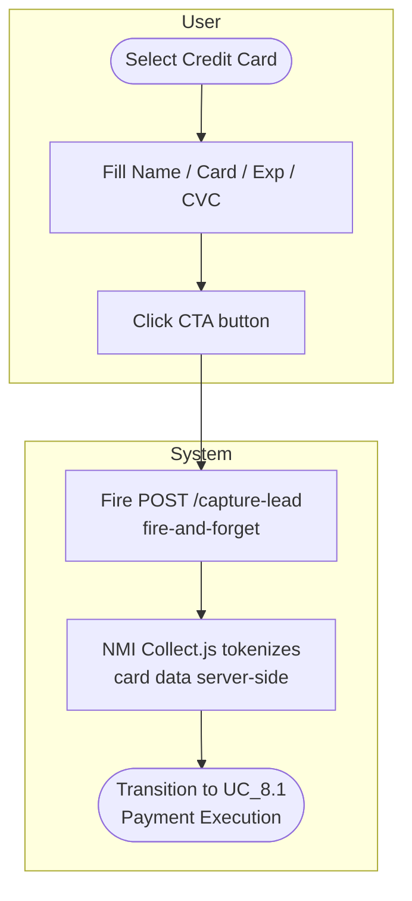

#### 3. SCREEN DESCRIPTION

Credit Card (NMI Collect.js)
.png){center}

| # | Component | Type | Required? | Description |
| --- | --- | --- | --- | --- |
| 1 | Name on card | Text Input | Yes | **Validation Rules:** Ref `CR-03`. |
| 2 | Card Number | NMI Collect.js iframe | Yes | **Validation Rules:** Ref `CR-10`. |
| 3 | Expiration (MM/YY) | NMI Collect.js iframe | Yes | Ref `CR-10`. |
| 4 | CVC | NMI Collect.js iframe | Yes | Ref `CR-10`. |

#### 4. BUSINESS RULES

| # | BR Code | Function | Description |
| --- | --- | --- | --- |
| 1 | BR_7.2.1 | Secure Payment Field Handling | Ref `CR-10`. Card Number, Expiration, CVC MUST use NMI Collect.js hosted iframes. Custom HTML inputs strictly forbidden (PCI DSS). |
| 2 | BR_7.2.2 | Lead Capture | `POST /capture-lead` fires on CTA click to update abandoned-step record. Does NOT block payment execution — `/execute-checkout` proceeds regardless of outcome. |

#### 5. MESSAGE LIST

N/A — decline messaging is centralized in UC_8.1 (raw gateway message, Ref `CR-11`, no dedicated code).

### UC_7.3 — Apple Pay

#### 1. USE CASE SPECIFICATION TABLE

| Field | Content |
| --- | --- |
| **Use Case ID** | UC_7.3 |
| **Use Case Name** | Apple Pay |
| **Use Case Description** | This use case allows the User to pay via the native Apple Pay wallet sheet (iOS Safari / macOS Safari), in order to complete purchase with biometric authentication instead of manual card entry. |
| **Actor(s)** | User, NMI (Apple Pay integration) |
| **Pre-Condition(s)** | Apple Pay visible (per `BR_7.1.3`). |
| **Trigger** | User clicks CTA button with Apple Pay selected. |
| **Post-Condition(s)** | Case C (success) → UC_8.1. Case A (cancel) → no overlay. Failure → UC_8.1 §5, raw error (Ref `CR-11`). |
| **Basic Flow** | 1. User clicks CTA. <br/ > 2. FE fires `POST /capture-lead` fire-and-forget. <br/ > 3. NMI invokes native Apple Pay sheet (3rd-party modal). <br/ > 4. Outcome per case table below. |
| **List Screen** | Step 6 — Apple Pay wallet sheet (native, not a Stack Trading screen) |
| **Exception Flow** | See case table below. |

#### 2. CASE TABLE

| Case | Trigger | Result |
| --- | --- | --- |
| A | User dismisses sheet before authenticating | Sheet closes → CTA returns to normal state. No overlay. |
| B | N/A | Apple Pay auth is atomic — no mid-authentication close state exists. |
| C | User authenticates, payment completes | Sheet closes → `PAYMENT_RESULT=success` → UC_8.1. |
| Failure | `PAYMENT_RESULT=failure` | Overlay removed → UC_8.1 §5. Failure banner = raw Apple Pay/NMI response (Ref `CR-11`). |

#### 3. ACTIVITY FLOW

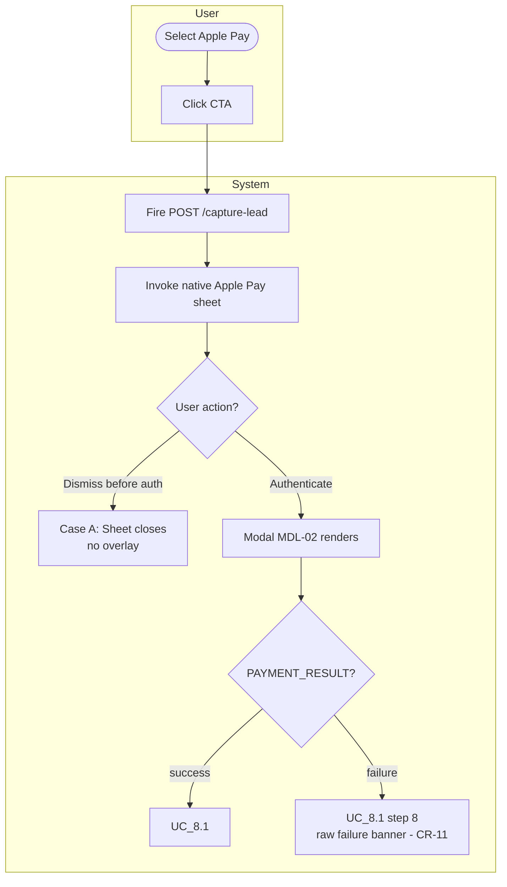

#### 4. SCREEN DESCRIPTION

N/A — wallet sheet is native Apple UI, not a Stack Trading-designed screen. See Screen Description for surrounding Step 6 context in UC_7.1.

#### 5. BUSINESS RULES

N/A feature-specific — governed by `BR_7.1.3` (visibility) and UC_8.1 (execution/failure handling).

#### 6. MESSAGE LIST

N/A — see UC_8.1 for failure banner handling (Ref `CR-11`, raw provider message, no dedicated code).

### UC_7.4 — Google Pay

#### 1. USE CASE SPECIFICATION TABLE

| Field | Content |
| --- | --- |
| **Use Case ID** | UC_7.4 |
| **Use Case Name** | Google Pay |
| **Use Case Description** | This use case allows the User to pay via the native Google Pay wallet sheet (Android Chrome / Chrome desktop), in order to complete purchase with device authentication instead of manual card entry. |
| **Actor(s)** | User, NMI (Google Pay integration) |
| **Pre-Condition(s)** | Google Pay visible (per `BR_7.1.3`). |
| **Trigger** | User clicks CTA button with Google Pay selected. |
| **Post-Condition(s)** | Identical pattern to UC_7.3 (Apple Pay) — Case C success → UC_8.1; Case A cancel → no overlay; failure → UC_8.1 §5. |
| **Basic Flow** | Identical structure to UC_7.3, substituting Google Pay's native wallet sheet (hosted by Google) for Apple's. |
| **List Screen** | Step 6 — Google Pay wallet sheet (native) |
| **Exception Flow** | Same case table pattern as UC_7.3 — Case B N/A (atomic device auth: biometrics/PIN). |

#### 2. ACTIVITY FLOW

Identical structure to UC_7.3 — see that diagram, substituting "Google Pay sheet" for "Apple Pay sheet".

#### 3. SCREEN DESCRIPTION

N/A — native Google UI, not a Stack Trading-designed screen.

#### 4. BUSINESS RULES

N/A feature-specific — governed by `BR_7.1.3` and UC_8.1.

#### 5. MESSAGE LIST

N/A — see UC_8.1.

### UC_7.5 — Apply Promo Code

#### 1. USE CASE SPECIFICATION TABLE

| Field | Content |
| --- | --- |
| **Use Case ID** | UC_7.5 |
| **Use Case Name** | Apply Promo Code |
| **Use Case Description** | This use case allows the User to apply a discount code to their order, in order to reduce the total price before payment, with the reservation only finalized at the moment of successful payment. |
| **Actor(s)** | User, System |
| **Pre-Condition(s)** | User is at Step 6. |
| **Trigger** | User clicks "Have a promo code?" or the expand button. |
| **Post-Condition(s)** | Success: Order Summary shows Discount + Subtotal lines, input locked, button = [Remove]. Failure: inline error, input stays editable (or locked-with-error for re-validation failures). |
| **Basic Flow** | See Detailed Flow below (§2). |
| **List Screen** | Step 6 — Promo code panel (expandable) |
| **Exception Flow** | E1 — HTTP 422 (invalid/expired/limit, `MSG-18`/`MSG-19`/`MSG-21`): inline error, [Apply] re-enables, input editable. <br/ > E2 — HTTP 5xx: no network, request timeout, or HTTP 500. |

#### 2. DETAILED BASIC FLOW

1. User clicks "Have a promo code?" → input + [Apply] expand.
2. [Apply] disabled until ≥1 character entered (Ref `CR-06`).
3. User enters code, clicks [Apply] → spinner + disabled → `POST /calculate-cart` with `promo_code`.
4. HTTP 200 (`discount_amount > 0`): inline success (`MSG-17`); Discount line appears (labeled `Promo code (<code>)`, code as-typed); Tax/Total update per `CR-04`; **input LOCKS**, [Apply] swaps to [Remove].
5. HTTP 422: inline error (`MSG-18` invalid/expired/limit, or `MSG-19` per-user limit, or `MSG-21` product mismatch); [Apply] re-enables, input editable.
6. HTTP 5xx: no network, request timeout, or HTTP 500.
7. [Remove] click → spinner + disabled → `/calculate-cart` without `promo_code` → recalculates Tax/Total → removes Discount line → unlocks + clears input → button reverts to [Apply] → clears success text.
8. User may enter a new code and repeat from step 3.

#### 3. ACTIVITY FLOW

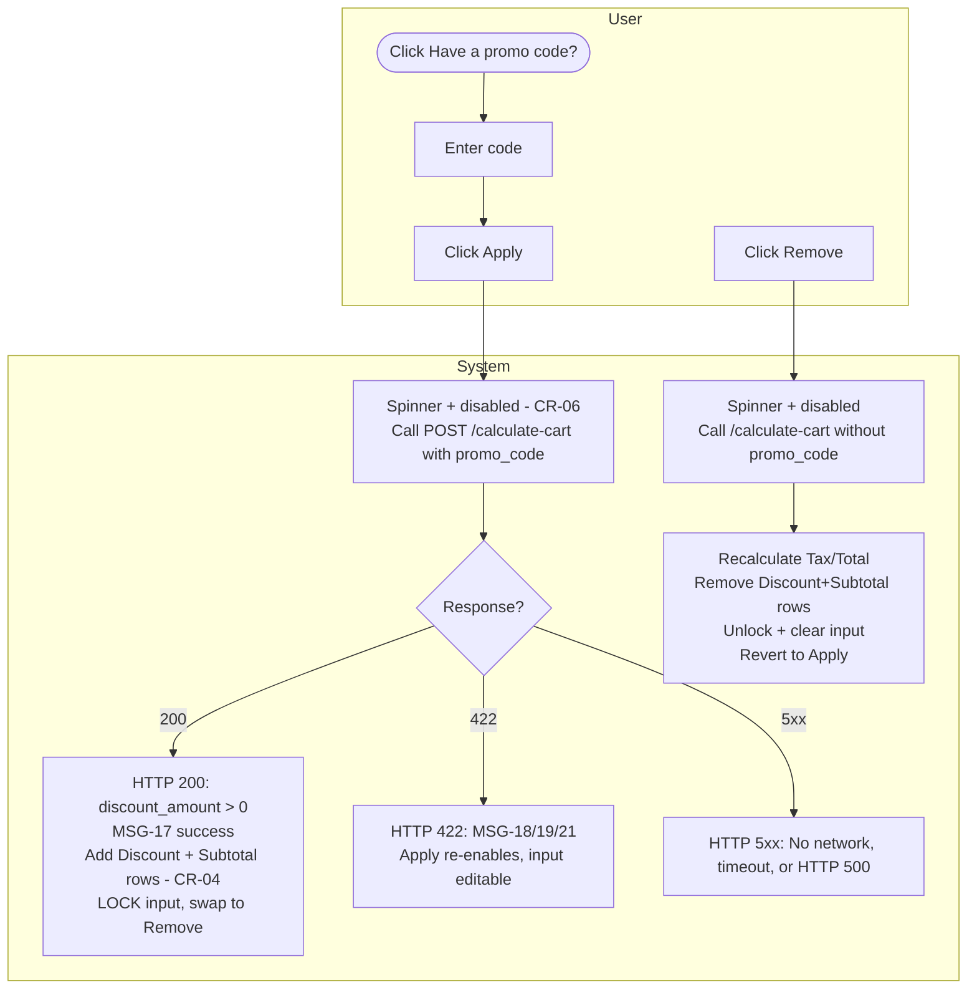

#### 4. SCREEN DESCRIPTION

Apply Promo Code
.png){center}

| # | Component | Type | Required? | Description |
| --- | --- | --- | --- | --- |
| 1 | Promo code input | Search Field | No | **Validation Rules:** Max 100 chars (block input at limit). <br/ > **Behaviour Rules:** Expands on "Have a promo code?" click. Locks (read-only) after successful apply. Stays locked with the now-invalid code on re-validation failure at Pay time — not auto-cleared. |
| 2 | [Apply] / [Remove] | Button (Secondary) | N/A | **Behaviour Rules:** Ref `CR-06`. See Detailed Basic Flow steps 3–7. |
| 3 | Inline success text (`MSG-17`) | Static Text | N/A | **Displaying Rules:** Visible below input on HTTP 200 success. Persists while applied; cleared only on [Remove]. |
| 4 | Inline error text (`MSG-18`/`MSG-19`/`MSG-20`/`MSG-21`) | Static Text | N/A | **Displaying Rules:** `MSG-20` (re-validation failure at Pay time) requires manual [Remove], not auto-cleared. |
| 5 | Discount (Order Summary row) | Static Text | N/A | **Displaying Rules:** Ref `CR-04`. Visible when `discount_amount > 0`. Position: between base price row and Tax row. Label: `Promo code (<code>)`. Amount: `−$XX.XX`. Removed only via [Remove]. |
| 6 | Subtotal (Order Summary row) | Static Text | N/A | **Displaying Rules:** Ref `CR-04`. Same show/hide rule as Discount row — directly below it. Label: `Subtotal`. Value: `(Base_Price + Addon_Prices) − discount_amount`. |

#### 5. BUSINESS RULES

| # | BR Code | Function | Description |
| --- | --- | --- | --- |
| 1 | BR_7.5.1 | Apply Trigger — Click Only | `/calculate-cart` w/ promo code fires only on explicit [Apply] click, never `onBlur`. User may apply/re-apply different codes multiple times before payment — replaces the prior discount each time. `current_usage_count` incremented AFTER server-side price/tax check passes at `/execute-checkout` time (step 6.1.b) — NOT at [Apply] click. Genuine decline → restored immediately (+1). 10-min timeout → NOT restored immediately — stays reserved until backend webhook confirms explicit failure. Success → deduction kept permanently + `promo_code_usage_log` record inserted. |
| 2 | BR_7.5.2 | One Promo Code Per Transaction | Only one code may be applied per checkout. |
| 3 | BR_7.5.3 | Subtotal Field | See Screen Description row 6. Ref `CR-04`. |
| 4 | BR_7.5.4 | Promo Code Types & DB Schema | Percentage discount: `discount_amount = Base_Price × rate`. Flat-rate: `discount_amount = promo_code_value`. FE only reads `discount_amount` — never the type. Input case-insensitive. **`promo_codes` table:** `code, discount_amount, discount_percentage (nullable), expiration_date, usage_limit, current_usage_count, max_uses_per_user (nullable, default 1), product_id (enum, NOT NULL)`. Invalid if: expired OR `current_usage_count >= usage_limit` OR personal count `>= max_uses_per_user`. |
| 5 | BR_7.5.5 | Tax Calculated on Post-Discount Amount | Quaderno receives `Final_Amount = (Base_Price + Addon_Prices) − discount_amount`, NOT the base price. `Total = Final_Amount + tax_amount`. Percentage discount applies to `Base_Price` only, not add-ons. |
| 6 | BR_7.5.6 | Promo Code Re-Validation at Execute-Checkout | Re-validated AND reserved atomically at step 6.1.b of `/execute-checkout` — only after price/tax check (6.1.a) passes. If 6.1.a fails (`PRICE_CHANGED`, `MSG-06`), promo re-validation is entirely skipped for that attempt. If code invalid/limit-reached at this point → HTTP 422, `MSG-20`, Discount+Subtotal rows removed, Tax/Total revert, input stays locked with now-invalid code (manual [Remove] required). |
| 7 | BR_7.5.7 | Promo Code Mapped 1-to-1 to Product ID | Recognized `product_id` values: `EVAL_L1, EVAL_L2, EVAL_L5, RESET, REBUY, EXTENSION, MARKET_DATA`. Mismatch check runs at [Apply] click only (`MSG-21`). |

#### 6. MESSAGE LIST

| # | Message Code | Type | Trigger |
| --- | --- | --- | --- |
| 1 | MSG-17 | Validation (Inline, success) | Promo applied successfully |
| 2 | MSG-18 | Validation (Inline, error) | HTTP 422 at [Apply] click — invalid/expired/limit-reached |
| 3 | MSG-19 | Validation (Inline, error) | `max_uses_per_user` exceeded |
| 4 | MSG-20 | Error (Banner, not overlay) | Promo invalid/limit reached at `/execute-checkout` time |
| 5 | MSG-21 | Validation (Inline, error) | Promo `product_id` mismatch at [Apply] click |

*Full message text: see MESSAGE CATALOG at the end of this document.*

## STEP 7 — ORDER PROCESSING & PROVISIONING

### UC_8.1 — Phase 1: Payment Execution

#### 1. USE CASE SPECIFICATION TABLE

| Field | Content |
| --- | --- |
| **Use Case ID** | UC_8.1 |
| **Use Case Name** | Phase 1 — Payment Execution |
| **Use Case Description** | This use case allows the System to execute the actual charge against the selected gateway with full server-side integrity checks, in order to guarantee no duplicate charges, correct pricing, and correct promo-code accounting regardless of payment method or network reliability. |
| **Actor(s)** | User, System, NMI, Quaderno |
| **Pre-Condition(s)** | Payment method selected, all required fields completed. `/calculate-cart` already succeeded (pricing/tax/totals up to date). No active email lock. |
| **Trigger** | User clicks the CTA button on Step 6. |
| **Post-Condition(s)** | Success: payment executed → confirmation state, Flow 1 triggered via webhook. Failure: failure banner (Ref `CR-11`), retry allowed. Email Lock: 5+ failures (`MSG-14`) → all inputs locked 15 min. |
| **Basic Flow** | See Detailed Flow below (§2) — steps run in strict sequence; steps 6–7 are server-side within the single `/execute-checkout` call. |
| **List Screen** | Step 7 Phase 1 — Processing overlay (`MDL-02`), Payment Successful overlay (`MDL-03`), Failure banner state, Email lock overlay (`MDL-04`), Post-payment restricted-region refund states (`FPS-03`/`FPS-04`) |
| **Exception Flow** | See §3 below (10-min timeout, HTTP 409 duplicate, post-success double-payment race, 5-Failure Email Lock). |

#### 2. DETAILED BASIC FLOW

**Payment Submission (client-side):**

1. User clicks CTA.
2. CTA disabled immediately (Ref `CR-06`).
3. Modal `MDL-02` renders (`MSG-15`).
4. Promo reservation happens server-side later (step 6.1.b).
5. FE calls `POST /execute-checkout` with the following payload:

| Parameter | Source |
| --- | --- |
| `product_id` | Session state |
| `addon_ids` | Session state |
| `promo_code` | Session state (if applied) |
| `billing_country` | Session state (Step 5) — forwarded to gateway for AVS check |
| `billing_region` | Session state (Step 5) — forwarded to gateway for AVS check |
| `billing_city` | Session state (Step 5) — forwarded to gateway for AVS check (Ref `CR-08`) |
| `billing_address` | Session state (Step 5) — forwarded to gateway for AVS check |
| `zip_code` | Session state (Step 5), conditional per `country_zip_requirements` — forwarded to gateway for AVS check |
| `payment_method` | e.g. `"CC"`, `"GOOGLE_PAY"`, `"APPLE_PAY"` |
| `payment_token` | Gateway-specific token (e.g. NMI Collect.js response) (Optional) |
| `utm_source/medium/campaign/term/content` | Read at submit time per `CR-05` (Optional) |
| `user_ip` | Backend-detected (silent) |
| `timestamp_utc` | FE-generated at submit (silent, Optional) |
| `everflow_transaction_id` | Everflow SDK cookie via `getTransactionId()` (silent, Optional) — `NULL` if SDK failed to load |
| `everflow_sdk_blocked` | FE-generated boolean (silent, Optional) — `true` when SDK failed to load; fail-open, does not block checkout |
| `st_affiliate_data` | First-party cookie parsed from raw URL affiliate params (silent, Optional) — forwarded only when `getTransactionId()` returns `null` |
| `user_id` | Current logged-in user (Optional) |

*Note: only `CC`, `APPLE_PAY`, and `GOOGLE_PAY` are in scope for this document — see UC_7.2/7.3/7.4. Other payment method values are out of scope here and not documented in this SRS.*

#### 3. EXCEPTIONAL FLOW

| Scenario | Handling |
| --- | --- |
| **10-min frontend session timeout** | Modal `MDL-02` dissolves. Banner `MSG-22` shown. CTA re-enables. Server-side webhooks keep listening independently of what FE now shows. |
| **HTTP 409 — Duplicate Payment** | `provider_event_id` already exists (prior payment succeeded). Modal `MDL-02` dismissed. Banner `MSG-23` shown. No new charge. CTA re-enables. |
| **Double-Payment Detected Post-Success** | Banner `MSG-24` shown. CTA stays disabled. Logged for manual reconciliation. |
| **5-Failure Email Lock** | 5+ consecutive declines within a rolling 10-min window, keyed by email (not device/IP). Modal `MDL-04` renders (`MSG-14`). 15-min countdown. Resets after countdown ends. |

#### 4. SCREEN DESCRIPTION

Payment Execution
{center}

| # | Component | Type | Required? | Description |
| --- | --- | --- | --- | --- |
| 1 | Processing Overlay (`MDL-02`) | Modal (blocking) | N/A | **Displaying Rules:** Orizon dark overlay + gold spinner. Text: `MSG-15`. |
| 2 | Success Overlay (`MDL-03`) | Modal (auto-dismiss) | N/A | **Displaying Rules:** "Payment Successful" state (`MSG-16`), auto-dismisses after ~2s. |
| 3 | Failure Banner | Banner (inline, top of screen) | N/A | **Displaying Rules:** Red banner, raw gateway decline text (Ref `CR-11`, not generalized). CTA re-enables alongside it. |
| 4 | Email Lock Overlay (`MDL-04`) | Modal (blocking, 15-min countdown) | N/A | **Displaying Rules:** `MSG-14`. All inputs disabled underneath. |
| 5 | Post-Payment Restricted-Region — Refunding (`FPS-03`) | Full-page state | N/A | `MSG-25`. **⚠️ Cần xác nhận với BAL:** tại sao có kiểm tra khu vực hạn chế lần thứ 3 ở đây (đã kiểm tra ở Step 0 và Step 5). |
| 6 | Post-Payment Restricted-Region — Refunded (`FPS-04`) | Full-page state | N/A | `MSG-26`. |

#### 5. BUSINESS RULES

| # | BR Code | Function | Description |
| --- | --- | --- | --- |
| 1 | BR_8.1.1 | CTA Disabled During Processing | Ref `CR-06`. Disabled from click until API resolves or 10-min timer expires. |
| 2 | BR_8.1.2 | 5-Failure Lock Is Cross-Method | See §3 Exceptional Flow table above — email-keyed, response-order counted, counts failures across all payment methods together. |
| 3 | BR_8.1.3 | CTA Re-enable on Failure Only | Not re-enabled on overlay dismissal or back-nav while payment in progress — only on an actual failure response (incl. 10-min timeout). |
| 4 | BR_8.1.4 | Retry Allowed When Prior Payment Failed or In-Progress | Dedup Check does not block retries for failed or still-in-progress prior attempts — only blocks when a prior attempt for this `user_id` already succeeded (`MSG-23`). |

#### 6. MESSAGE LIST

| # | Message Code | Type | Trigger |
| --- | --- | --- | --- |
| 1 | MSG-06 | Alert (Popup) | `PRICE_CHANGED` at `/execute-checkout` (defined once at UC_1.5 §5) |
| 2 | MSG-14 | Alert (Popup, blocking, countdown) | 5th consecutive failure within 10 min |
| 3 | MSG-15 | Alert (Popup, processing) | Payment submitted, awaiting result |
| 4 | MSG-16 | Alert (Popup, success) | Payment succeeds |
| 5 | MSG-22 | Error (Banner) | 10-min frontend timeout |
| 6 | MSG-23 | Error (Banner) | HTTP 409 duplicate payment |
| 7 | MSG-24 | Error (Banner) | Double-payment detected post-success |
| 8 | MSG-25 | Error/Info (Full-page) | Post-payment restricted-region match, refund initiated |
| 9 | MSG-26 | Error/Info (Full-page) | Refund completes |

*Full message text: see MESSAGE CATALOG at the end of this document.*

### UC_8.2 — Phase 2: Account Claim

#### 1. USE CASE SPECIFICATION TABLE

| Field | Content |
| --- | --- |
| **Use Case ID** | UC_8.2 |
| **Use Case Name** | Phase 2 — Account Claim |
| **Use Case Description** | This use case allows the User to activate their newly provisioned account by clicking the emailed link and providing a phone number, in order to proceed to Phase 3 (Provisioning & Redirect to Login) — notably WITHOUT setting a password at this step. |
| **Actor(s)** | User, System |
| **Pre-Condition(s)** | Email 2 (Claim Account) received, containing a valid JWT link. |
| **Trigger** | User clicks "Claim Your Account" link in Email 2. |
| **Post-Condition(s)** | `POST /claim-account` HTTP 200 → transitions to UC_8.3 (Phase 3). |
| **Basic Flow** | 1. User clicks emailed link. <br/ > 2. If JWT valid (within 48h) → "Create an Account" screen renders: Phone Number field only. <br/ > 3. User enters phone, submits → `POST /claim-account` (email + transaction_id + phone_number). <br/ > 4. HTTP 200 (fresh claim or resumed already-claimed link) → UC_8.3. |
| **List Screen** | Step 7 Phase 2 — "Create an Account" (Phone Number only) |
| **Exception Flow** | E1 — JWT expired: "Link Expired" state (`MDL-07`) + [Resend link] → `POST /public/resend-activation-link` (no auth, always HTTP 200, Ref `CR-12`) → fires `MSG-27`. <br/ > E2 — Admin-side resend: separate Admin-only `POST /resend-welcome` (Admin JWT required) — out of user-facing scope. |

#### 2. ACTIVITY FLOW

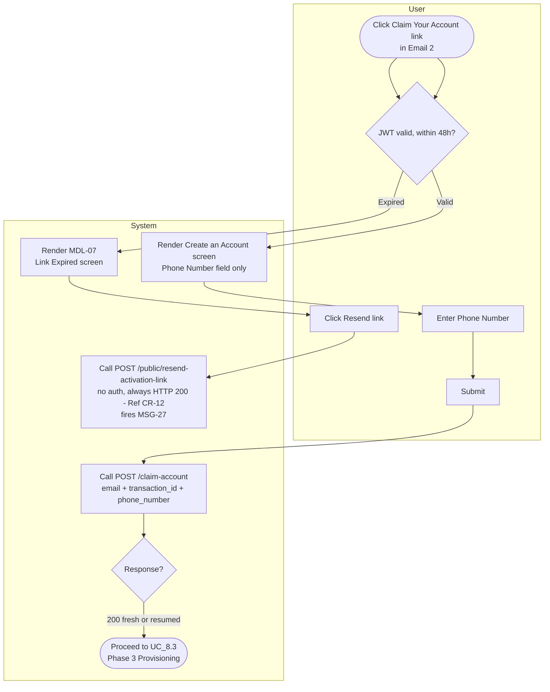

#### 3. SCREEN DESCRIPTION

Create an Account
{center}

| # | Component | Type | Required? | Description |
| --- | --- | --- | --- | --- |
| 1 | Phone Number | Text Input w/ country code dropdown | Yes | **Description:** Sole PII field required at this phase. <br/ > **Validation Rules:** Ref `CR-03`. |
| 2 | [Activate Account] / [Submit] | Button (Primary) | N/A | **Behaviour Rules:** Ref `CR-06`. On click → `POST /claim-account`. On success → transitions to UC_8.3. |
| 3 | "Link Expired" state (`MDL-07`) | Static Text + Button | N/A | **Behaviour Rules:** [Resend link] → `POST /public/resend-activation-link` → always HTTP 200 (Ref `CR-12`) → fires `MSG-27` if the address exists. |

#### 4. BUSINESS RULES

| # | BR Code | Function | Description |
| --- | --- | --- | --- |
| 1 | BR_8.2.1 | Password Field Removed | Phase 2 no longer collects a password from the user — only phone number. **⚠️ Cần xác nhận với BAL:** login credential của tài khoản được thiết lập ở đâu/thời điểm nào nếu không phải ở bước này. |
| 2 | BR_8.2.2 | Anti-Enumeration on Resend | Ref `CR-12`. `POST /resend-welcome` (Admin JWT, unchanged, admin-only) vs. `POST /public/resend-activation-link` (no auth, always returns HTTP 200 regardless of whether the email exists). |

#### 5. MESSAGE LIST

| # | Message Code | Type | Trigger |
| --- | --- | --- | --- |
| 1 | MSG-27 | Email | `POST /public/resend-activation-link` called |

*Full message text: see MESSAGE CATALOG at the end of this document.*

### UC_8.3 — Phase 3: Provisioning & Redirect to Login

#### 1. USE CASE SPECIFICATION TABLE

| Field | Content |
| --- | --- |
| **Use Case ID** | UC_8.3 |
| **Use Case Name** | Phase 3 — Provisioning & Redirect to Login |
| **Use Case Description** | This use case allows the System to finalize account provisioning (Auth0 + SIM) and hand the user off to the login screen, in order to complete the checkout-to-active-account journey. |
| **Actor(s)** | User, System, Auth0 |
| **Pre-Condition(s)** | Entered via `POST /claim-account` HTTP 200 (fresh) OR reopening an already-claimed link (resumed). |
| **Trigger** | Successful transition from UC_8.2. |
| **Post-Condition(s)** | Success: redirected to Auth0 login. Failure: `MDL-05` renders instead. |
| **Basic Flow** | 1. "Setting up your trading floor" interstitial (`MDL-06`) renders (4-step sequence) — masks provisioning latency. <br/ > 2. Backend completes Auth0 account creation + SIM account provisioning in parallel/sequence. <br/ > 3. On success → redirect to Auth0 login screen. <br/ > 4. On failure (after backend auto-retry exhausts) → `MDL-05` renders instead. |
| **List Screen** | Step 7 Phase 3 — "Setting up your trading floor" interstitial |
| **Exception Flow** | E1 — Reload checks `account_status`: `Active_SIM` → redirect to login; `Guest` → keep showing provisioning/waiting state **indefinitely** (no frontend timeout) — failure handling fully delegated to backend auto-retry. |

#### 2. ACTIVITY FLOW

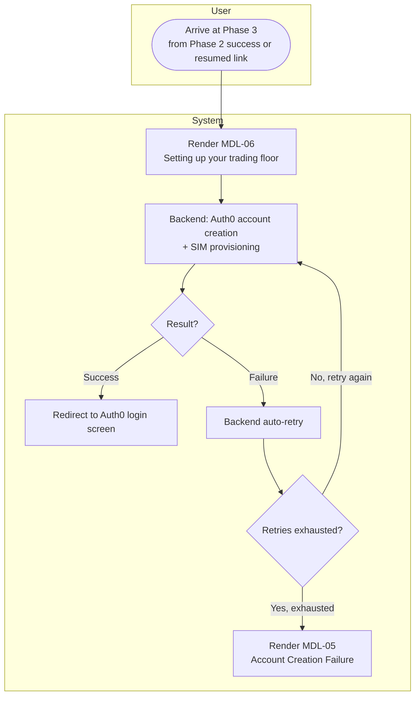

#### 3. SCREEN DESCRIPTION

Setting up your trading floor
{center}

| # | Component | Type | Required? | Description |
| --- | --- | --- | --- | --- |
| 1 | "Setting up your trading floor" interstitial (`MDL-06`) | Static/Animated Display | N/A | **Displaying Rules:** 4-step animated sequence. **⚠️ Cần xác nhận với BAL:** nội dung/label cụ thể của 4 bước. Holds indefinitely if `account_status = 'Guest'` on reload — no frontend timeout. |
| 2 | "Account Creation Failure" (`MDL-05`) | Modal | N/A | **Displaying Rules:** `MSG-28`. Renders only after backend auto-retry is exhausted. |

#### 4. BUSINESS RULES

| # | BR Code | Function | Description |
| --- | --- | --- | --- |
| 1 | BR_8.3.1 | No Frontend Timeout at Phase 3 | Reload while `account_status = 'Guest'` → keeps showing wait state indefinitely. Reload while `account_status = 'Active_SIM'` → redirect to Auth0 login immediately. |
| 2 | BR_8.3.2 | Backend Auto-Retry on Provisioning Failure | **⚠️ Cần xác nhận với BAL:** số lần retry / khoảng cách giữa các lần thử — chưa có thông tin cụ thể. |

#### 5. MESSAGE LIST

| # | Message Code | Type | Trigger |
| --- | --- | --- | --- |
| 1 | MSG-28 | Alert (Popup) | Backend auto-retry exhausted without successful provisioning |

*Full message text: see MESSAGE CATALOG at the end of this document.*

---
---

## COMMON RULES

Định nghĩa một lần, dùng chung cho toàn bộ file trên. Mọi UC chỉ ref mã `CR-XX`, không lặp lại nội dung.

| Code | Tên | Nội dung |
| --- | --- | --- |
| **CR-01** | Dropdown Display Behavior | Mọi dropdown phải hiển thị placeholder rõ ràng (vd. "Select primary market") thay vì tự chọn sẵn option đầu tiên. Không có lựa chọn mặc định trừ khi có rule riêng nói khác (vd. platform tự chọn khi chỉ có 1 kết quả — `BR_4.2`). |
| **CR-02** | Email Field Validation | Email là bắt buộc, phải đúng định dạng chuẩn, báo lỗi inline ngay khi rời field nếu sai định dạng. |
| **CR-03** | Required Text Field Validation | Text field bắt buộc phải báo lỗi inline nếu để trống khi submit; không chặn nhập liệu, chỉ chặn submit. |
| **CR-04** | Monetary Value Display Format | Mọi giá trị tiền tệ hiển thị dạng `$X,XXX.XX` — luôn có ký hiệu `$`, dấu phẩy ngăn cách hàng nghìn, 2 chữ số thập phân. Số âm (discount) hiển thị dạng `−$XX.XX`. |
| **CR-05** | Campaign / UTM Parameter Capture & Persistence | Tham số UTM trên URL chỉ được đọc **một lần** khi user vào trang lần đầu, lưu vào `localStorage`, và được tái sử dụng ở mọi bước gửi request sau đó (Step 5, Step 7) — không parse lại từ URL mỗi lần. |
| **CR-06** | Submit Button State During Async Request | Bất kỳ button nào kích hoạt gọi API đều phải: disable ngay khi click → hiện trạng thái xử lý → chỉ re-enable khi có kết quả rõ ràng (thành công hoặc thất bại). Mục đích: chống submit trùng. |
| **CR-07** | Step Data Persistence on Back-Navigation | Dữ liệu đã nhập ở một bước phải được giữ nguyên nếu user quay lại bước đó sau này trong cùng phiên — chỉ mất khi refresh toàn trang. Ngoại lệ: nếu một lựa chọn ở bước trước đó thay đổi và bước sau phụ thuộc vào nó, bước sau phải reset theo rule riêng (vd. `BR_2.3`). |
| **CR-08** | Conditional / Cascading Field Display (Address Fields) | Field địa chỉ có thể ẩn/hiện hoặc phụ thuộc lẫn nhau theo lựa chọn trước đó: State/Region ẩn nếu quốc gia không có vùng con; City chỉ hiện sau khi chọn Region và luôn refetch theo Region đã chọn; ZIP ẩn/hiện theo từng quốc gia. |
| **CR-09** | Immediate vs. Deferred Validation Timing | Có 2 loại kiểm tra khác nhau về thời điểm chạy: (a) kiểm tra rẻ/tại chỗ (vd. sanctions pre-check) chạy **ngay lập tức** mỗi khi field thay đổi; (b) kiểm tra tốn kém/gọi dịch vụ ngoài (vd. tính thuế) chỉ chạy **một lần duy nhất** khi user bấm nút submit của bước đó. |
| **CR-10** | Secure Payment Field Handling | Các field nhạy cảm liên quan thẻ thanh toán (số thẻ, ngày hết hạn, CVC) bắt buộc dùng hosted field/iframe do cổng thanh toán cung cấp — tuyệt đối không dùng input HTML thường. |
| **CR-11** | Raw Gateway Error Passthrough (Payment Failures Only) | Khi thanh toán thất bại, hiển thị nguyên văn lý do trả về từ cổng thanh toán — không viết lại thành thông báo chung chung — để user có thông tin cụ thể để xử lý. |
| **CR-12** | Anti-Enumeration Response for Public Email-Based Actions | Bất kỳ endpoint công khai (không cần đăng nhập) nào thao tác theo địa chỉ email đều phải trả về **cùng một phản hồi** dù email đó có tồn tại trong hệ thống hay không. |
| **CR-13** | Background Result Listening for Asynchronous Payment Confirmation | Nếu user đóng/rời khỏi giao diện đang chờ xác nhận thanh toán không đồng bộ trước khi có kết quả, hệ thống vẫn phải tiếp tục lắng nghe kết quả ở nền — không được huỷ giao dịch chỉ vì user rời màn hình. |

---

## MESSAGE CATALOG

Nội dung đầy đủ (EN/VN) cho mọi `MSG-XX` được ref trong file trên. Mỗi message chỉ định nghĩa **một lần duy nhất** tại đây.

| Code | Type | Message (EN) | Message (VN) |
| --- | --- | --- | --- |
| MSG-01 | Toast | We couldn't load checkout right now. Please refresh the page. | Không thể tải trang thanh toán. Vui lòng tải lại trang. |
| MSG-02 | Full-page Error | Something went wrong on our end. Please try again in a few minutes. | Đã có lỗi xảy ra. Vui lòng thử lại sau ít phút. |
| MSG-03 | Alert (Popup, Success) | You're on the list! We'll email you as soon as spots open up. | Bạn đã vào danh sách chờ! Chúng tôi sẽ email khi có suất trống. |
| MSG-04 | Error (Banner) | We couldn't add you to the waitlist. Please try again. | Không thể thêm bạn vào danh sách chờ. Vui lòng thử lại. |
| MSG-05 | Error (Full-page) | Service Unavailable — Stack Trading's evaluation services are not available in your region due to regulatory restrictions. We are unable to process registrations or accept payments from your current location. If you believe this is an error, please contact `support@stacktrading.com` with your location details. | Dịch vụ không khả dụng — Stack Trading hiện không cung cấp dịch vụ đánh giá tại khu vực của bạn do hạn chế quy định. Chúng tôi không thể xử lý đăng ký hoặc thanh toán từ vị trí hiện tại của bạn. Nếu bạn cho rằng đây là nhầm lẫn, vui lòng liên hệ `support@stacktrading.com` kèm thông tin vị trí. |
| MSG-06 | Alert (Popup) | Prices may have changed since you last viewed this page. Please review your order before continuing. | Giá có thể đã thay đổi kể từ lần bạn xem gần nhất. Vui lòng kiểm tra lại đơn hàng trước khi tiếp tục. |
| MSG-07 | Alert (Popup) | No trading platforms are currently available for this asset class. Please try again later or contact support. | Hiện không có nền tảng giao dịch nào khả dụng cho loại tài sản này. Vui lòng thử lại sau hoặc liên hệ hỗ trợ. |
| MSG-08 | Full-page Error | Something went wrong loading platform options. Please try again in a few minutes. | Đã có lỗi khi tải danh sách nền tảng. Vui lòng thử lại sau ít phút. |
| MSG-09 | Full-page Error | Something went wrong loading market data options. Please try again in a few minutes. | Đã có lỗi khi tải danh sách gói dữ liệu thị trường. Vui lòng thử lại sau ít phút. |
| MSG-10 | Inline Validation | Stack Trading is unable to accept clients from the selected country or region at this time. | Stack Trading hiện không thể nhận khách hàng từ quốc gia hoặc khu vực đã chọn. |
| MSG-11 | Inline Validation | We couldn't verify this address. Please check and try again. | Không thể xác minh địa chỉ này. Vui lòng kiểm tra và thử lại. |
| MSG-12 | Full-page Error | Something went wrong calculating your order. Please try again in a few minutes. | Đã có lỗi khi tính toán đơn hàng. Vui lòng thử lại sau ít phút. |
| MSG-13 | Alert (Popup, blocking) | No payment methods are currently available for your region. Please contact support. | Hiện không có phương thức thanh toán nào khả dụng cho khu vực của bạn. Vui lòng liên hệ hỗ trợ. |
| MSG-14 | Alert (Popup, blocking, countdown) | For your security, we've temporarily paused new payment attempts on this account. Please try again in 15 minutes. | Vì lý do bảo mật, chúng tôi tạm dừng các lần thử thanh toán mới trên tài khoản này. Vui lòng thử lại sau 15 phút. |
| MSG-15 | Alert (Popup, processing) | Please do not refresh the page or click the back button. This may take a few moments. | Vui lòng không tải lại trang hoặc bấm nút quay lại. Quá trình này có thể mất vài giây. |
| MSG-16 | Alert (Popup, success, auto-dismiss) | Payment successful! | Thanh toán thành công! |
| MSG-17 | Inline (success) | Promo code applied. | Đã áp dụng mã giảm giá. |
| MSG-18 | Inline (error) | This promo code is invalid or has expired. | Mã giảm giá này không hợp lệ hoặc đã hết hạn. |
| MSG-19 | Inline (error) | You've already used this promo code. | Bạn đã sử dụng mã giảm giá này rồi. |
| MSG-20 | Banner (error) | This promo code is no longer valid. It has been removed from your order. | Mã giảm giá này không còn hiệu lực. Đã được gỡ khỏi đơn hàng của bạn. |
| MSG-21 | Inline (error) | This promo code isn't valid for the selected package. | Mã giảm giá này không áp dụng cho gói bạn đã chọn. |
| MSG-22 | Banner (error) | Payment session expired. If you already submitted your payment, please check your email for confirmation. If you have not paid yet, please try again. | Phiên thanh toán đã hết hạn. Nếu bạn đã gửi thanh toán, vui lòng kiểm tra email xác nhận. Nếu chưa thanh toán, vui lòng thử lại. |
| MSG-23 | Banner (error) | It looks like this order has already been paid for. Please check your email for your account details. | Có vẻ đơn hàng này đã được thanh toán. Vui lòng kiểm tra email để lấy thông tin tài khoản. |
| MSG-24 | Banner (error) | We noticed a duplicate charge on your order. Our team has been notified and will reach out to resolve this. | Chúng tôi phát hiện đơn hàng bị tính phí trùng. Đội ngũ hỗ trợ đã được thông báo và sẽ liên hệ để xử lý. |
| MSG-25 | Full-page (info) | Your payment is being refunded due to a regional restriction. This process may take a few business days. | Khoản thanh toán của bạn đang được hoàn trả do hạn chế khu vực. Quá trình này có thể mất vài ngày làm việc. |
| MSG-26 | Full-page (info) | Your refund has been completed. Please allow a few business days for the funds to appear in your account. | Khoản hoàn tiền của bạn đã hoàn tất. Vui lòng chờ vài ngày làm việc để tiền về tài khoản. |
| MSG-27 | Email | Subject: Your activation link — Here's your new link to activate your Stack Trading account: [link]. This link expires in 48 hours. | Tiêu đề: Link kích hoạt của bạn — Đây là link kích hoạt tài khoản Stack Trading mới của bạn: [link]. Link có hiệu lực trong 48 giờ. |
| MSG-28 | Alert (Popup) | We're having trouble setting up your account. Please contact support so we can help. | Chúng tôi gặp sự cố khi thiết lập tài khoản của bạn. Vui lòng liên hệ hỗ trợ để được trợ giúp. |

---

## MODAL CATALOG

| Code | Tên Modal | Loại | Dùng tại | Điều kiện hiện | Điều kiện đóng |
| --- | --- | --- | --- | --- | --- |
| MDL-01 | Terms of Service | Modal (thường) | UC_1.2 | User click link "Terms of Service" | User đóng thủ công; không mất dữ liệu form phía sau |
| MDL-02 | Processing Overlay | Modal (blocking) | UC_7.1, UC_8.1 | Ngay sau khi bấm CTA thanh toán | Tự đóng khi có kết quả (→ MDL-03 hoặc banner lỗi) |
| MDL-03 | Success Confirmation | Modal (auto-dismiss) | UC_7.1, UC_8.1 | Thanh toán thành công | Tự đóng sau ~2 giây, chuyển sang UC_8.2 |
| MDL-04 | Email Lock | Modal (blocking, đếm ngược 15 phút) | UC_7.1, UC_8.1 | 5 lần thanh toán thất bại liên tiếp | Hết 15 phút |
| MDL-05 | Account Creation Failure | Modal | UC_8.3 | Backend đã tự thử lại hết số lần cho phép mà vẫn lỗi | User đóng và liên hệ support |
| MDL-06 | "Setting up your trading floor" Interstitial | Modal (animated, chỉ hiển thị) | UC_8.3 | Ngay sau khi Account Claim (UC_8.2) thành công | Tự chuyển sang màn hình login; nếu lỗi → MDL-05 |
| MDL-07 | Link Expired | Modal (thay thế form) | UC_8.2 | JWT trong link kích hoạt đã hết hạn (quá 48h) | User bấm [Resend link] → nhận email mới (MSG-27) |

---

## POPUP CATALOG

| Code | Tên Popup | Dùng tại | Message | Điều kiện hiện |
| --- | --- | --- | --- | --- |
| POP-01 | No Platforms Available | UC_4 | MSG-07 | Danh sách platform trả về rỗng |
| POP-02 | Price Changed | UC_1.5, UC_8.1 | MSG-06 | Giá thay đổi giữa lúc user xem và lúc thanh toán |

---

## FULL-PAGE STATE CATALOG

| Code | Tên | Dùng tại | Message |
| --- | --- | --- | --- |
| FPS-01 | Region Block / Service Unavailable | UC_1.4 | MSG-05 |
| FPS-02 | Generic System Error | UC_1.1, UC_4, UC_5, UC_6.1 | MSG-02, MSG-08, MSG-09, MSG-12 |
| FPS-03 | Refund In Progress | UC_8.1 | MSG-25 |
| FPS-04 | Refund Completed | UC_8.1 | MSG-26 |
