# Associate Track Check Out — UC_main_ver_3

## DOCUMENT CONTROL

| Field | Value |
| --- | --- |
| **Version** | ver_3 (unified draft for BA review) |
| **Scope of this file** | Step 0 → Step 7 (UC_1.1 – UC_8.3), all in **one unified 9-section layout**. |
| **Sources** | Step 0–4 content: `UC_main.md` (round 1), re-laid-out and extended with alternative / exception flows.   Step 5–7 content: `UC_main_ver_2.md`. |
| **Companion files** | `common_rules.md` (CR)    `message_catalog.md` (MSG)     `modal_catalog.md` (MDL)    `popup_catalog.md` (POP)    `full_page_state.md` (FPS) — all re-issued and aligned with this file.|
| **Pending items** | `PND-01` … `PND-22` are kept exactly as flagged in ver_2 (⚠️).   `PND-23` … `PND-30` are **new in ver_3**, found while unifying Steps 0–4 with Steps 5–7 (table below).|

## HOW TO READ THIS FILE

- Section numbers are identical in every UC:   1 Overview   2 Trigger   3 Pre-conditions   4 Post-conditions   5 Actors   6 Main Flow   7 Alternative Flows  8 Exception Flows  9 Business Rules & Data Validation.
- Section 9 has 2 parts everywhere **9.1 Business Rules** (original `BR_x` codes unchanged) and **9.2 Data Validation & Component Rules** (the old "Screen Description") — plus an optional **9.3 Reference Data** where a UC owns a data snapshot (routing/payload, Table J, package data, platform registry).
- `AF-x` = Alternative Flow, `EX-x` = Exception Flow (unique inside each UC). Cross-reference format: `UC_8.1 §8 EX-6`.
- Codes `CR-xx`, `MSG-xx`, `POP-xx`, `MDL-xx`, `FPS-xx` are defined in the companion catalog files; full message text is not repeated here.
- ⚠️ `PND-xx` = an open point.
- Mermaid diagrams are kept for UCs with real branching (UC_1.1, UC_1.3, UC_4, UC_6.1, UC_7.5, UC_8.2, UC_8.3). Other flows are fully described by numbered steps. Original diagrams remain in `UC_main.md`.
- **Step numbering:** "Step N" is the user-facing screen step (progress bar). UC numbers are offset (UC_2 = Step 1 … UC_8.x = Step 7). Progress bar: Futures 7 steps, Forex 6 steps (`BR_2.3`).

## NEW PENDING ITEMS IN ver_3

| ID | Topic | Where it shows up |
| --- | --- | --- |
| PND-23 | Refresh behaviour conflict: `BR_2.2` (localStorage keeps cart) vs `CR-07` / UC_6.1 AF-6 ("lost on full refresh") vs `BR_1.1.1` (refresh re-hydrates state) vs UC_7.1 AF-4 | UC_1.1, UC_2 |
| PND-24 | Gate 2 spec conflicts: HTTP 403 vs JSON `geo_blocked`; "sole content, no link" vs return-to-homepage button | UC_1.4 |
| PND-25 | Compliance flow is chosen by geo-IP, but Step 5 collects a billing country that can differ (and Flow F block is IP-based while Step 5 pre-check is billing-based) | UC_1.2, UC_1.4 |
| PND-26 | Flow D (Quebec, French): no French strings in the message catalog; language rule for other flows (catalog has EN/VN only) | UC_1.2 |
| PND-27 | `addon_ids[]` / platform when the user toggles Forex ↔ Futures after having filled later steps | UC_2, UC_5 |
| PND-28 | Empty / error handling diverges: Step 3 empty list = dismissible popup with no defined next action; Step 4 empty list = full-page error | UC_4, UC_5 |
| PND-29 | Price drift between Step 2 display and Step 5 `/calculate-cart` (Founder sold out) is silent until Step 6 | UC_1.5, UC_6.1 |
| PND-30 | Promo state when the user goes Back (to Step 5 or Step 2) after applying a code; Step 5 re-fires `/calculate-cart` with `promo_code = NULL` | UC_6.1, UC_7.1, UC_7.5, UC_3 |

> `PND-20` is not referenced anywhere in ver_2; it is kept reserved.

## TABLE OF CONTENTS

| Step | Use Cases | Description |
| --- | --- | --- |
| Step 0 | UC_1.1 – UC_1.5 | System Initialization & Access Gates |
| Step 1 | UC_2 | Asset Class Selection |
| Step 2 | UC_3 | Capital Allocation Selection |
| Step 3 | UC_4 | Platform Selection |
| Step 4 | UC_5 | Market Data Selection (Futures only) |
| Step 5 | UC_6.1 – UC_6.2 | PII Capture, Compliance & Cart Abandonment |
| Step 6 | UC_7.1 – UC_7.5 | Checkout & Payment |
| Step 7 | UC_8.1 – UC_8.3 | Order Processing & Provisioning |
| Appendix | A | Session State Map (cross-step consistency) |
| Appendix | B | CHANGE LOG — ver_3 vs UC_main / ver_2 |

---

# STEP 0 — SYSTEM INITIALIZATION & ACCESS GATES

## UC_1.1 — System Status API

### 1. OVERVIEW (Mô tả tổng quan)

| Field | Content |
| --- | --- |
| **Use Case ID** | UC_1.1 |
| **Use Case Name** | System Status API |
| **Description** | This use case allows the System to retrieve, in a single call, all geo-routing, pricing, cohort, and payment-method configuration needed to render the entire checkout flow, in order to avoid repeated API calls and centralize checkout state. |
| **List Screen** | None — background call with no screen of its own. Its result decides which screen the user actually sees: Step 1 (UC_2), the Waitlist page (UC_1.3), or the region-block page (UC_1.4). Checkout page is a dedicated route with no Marketing Header/Footer, except on the Gate 1 redirect. |
| **Related UC** | UC_1.2 (flow variants), UC_1.3 (Gate 1), UC_1.4 (Gate 2), UC_1.5 (pricing), UC_2 (first screen), UC_7.1 (reads `methods[]`) |

### 2. TRIGGER (Sự kiện kích hoạt)

User navigates to the dedicated checkout page URL (page load). A full page refresh triggers it again (`BR_1.1.1`).

### 3. PRE-CONDITIONS (Điều kiện tiên quyết)

- User is on the checkout page.
- No `GET /system/status` response exists yet for the current page load.

### 4. POST-CONDITIONS (Trạng thái sau hoàn thành)

- Full response payload is stored in global checkout state (`BR_1.1.2`).
- Gate 1 (Waitlist) and Gate 2 (Geoblock) conditions are evaluated immediately.
- Exactly one of three outcomes: Step 1 rendered · redirect to Waitlist · region-block page.

### 5. ACTORS (Tác nhân tham gia)

User (implicit — triggers via page load) · System (FE + BE) · Cloudflare (geo-IP headers `CF-IPCountry` / `CF-Region`)

### 6. MAIN FLOW / HAPPY PATH (Luồng xử lý chính)

1. User navigates to the checkout page.
2. FE calls `GET /system/status`. Cloudflare headers `CF-IPCountry` / `CF-Region` are auto-included.
3. Backend processes in this fixed order: **3a Geo-IP Gate** → **3b Waitlist Gate** → **3c UI Routing** → **3d Gateway Filtering & Localization** → **3e Cohort & Pricing** → **3f Launch Phase & Pass Rate**.
4. Backend returns JSON — unless it early-returns at 3a (Geo-IP) or 3b (Waitlist), in which case steps after the gate are skipped.
5. FE stores the full response in global checkout state and renders Step 1 (UC_2).

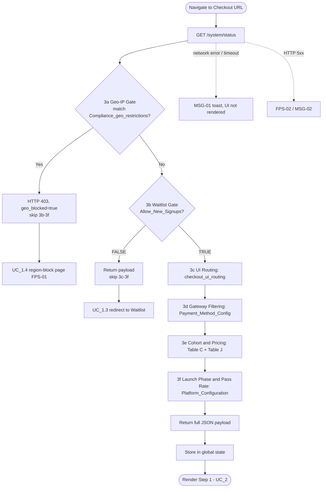

### 7. ALTERNATIVE FLOWS (Luồng phụ / Luồng thay thế)

| ID | Condition | Behaviour |
| --- | --- | --- |
| AF-1 | Geo-IP matches `Compliance_geo_restrictions` | Backend early-returns (`geo_blocked = true`, HTTP 403); FE renders UC_1.4. Steps 3b–3f are skipped. |
| AF-2 | `Global_Var_Allow_New_Signups == FALSE` (and Geo-IP not matched) | Backend early-returns the payload; FE redirects client-side, same tab, to the Waitlist page (UC_1.3). |
| AF-3 | Both gates would apply (blocked region **and** signups paused) | Geo-IP Gate runs first (fixed order, `BR_1.1.3`), so the user sees the region-block page, not the Waitlist. |
| AF-4 | User navigates between Steps 1–5 | No new call; all steps read cached state (`BR_1.1.1`, `BR_1.1.2`). |
| AF-5 | Full page refresh on any step | A new `GET /system/status` re-hydrates global state. What happens to the user's previous selections is ⚠️ PND-23. |

### 8. EXCEPTION FLOWS (Luồng ngoại lệ / Xử lý lỗi)

| ID | Scenario | Handling | Message |
| --- | --- | --- | --- |
| EX-1 | Network error / timeout on `GET /system/status` | Checkout UI is **not rendered**; toast only. Retry mechanism and timeout threshold are not defined (see `Q-E01`). | `MSG-01` |
| EX-2 | HTTP 5xx | Full-page error `FPS-02`. | `MSG-02` |
| EX-3 | Geo headers missing / empty / `"XX"` | **Fail-open:** defaults to `geo_country = 'US'`, `required_flow = 'FLOW_A'`; user is **not** blocked (`BR_1.1.4`). Legal exposure of this default: `Q-E02`. | — |
| EX-4 | `checkout_ui_routing` returns 0 rows | **Fail-open:** defaults to `FLOW_A`; user is **not** blocked (`BR_1.1.4`). | — |

> HTTP 403 is **not** an error state — it is the intended Gate 2 signal (AF-1 → UC_1.4).

### 9. BUSINESS RULES & DATA VALIDATION (Quy tắc nghiệp vụ & Ràng buộc dữ liệu)

#### 9.1 Business Rules

| # | BR Code | Function | Description |
| --- | --- | --- | --- |
| 1 | BR_1.1.1 | Single Call Per Page Load | `GET /system/status` is called exactly once per checkout page load. Step navigation (Steps 1–5) does NOT trigger a new call. A full page refresh triggers a new call to re-hydrate global state. |
| 2 | BR_1.1.2 | Response Persistence | Full API response is stored in global checkout state. All subsequent steps read from cached state — no re-fetching. |
| 3 | BR_1.1.3 | Gate Order & Short-Circuit | Backend order is fixed: Geo-IP → Waitlist → UI Routing → Gateway Filtering → Cohort & Pricing → Launch Phase. A hit at Geo-IP or Waitlist stops all later steps. *(Formalised from the Basic Flow; no new behaviour.)* |
| 4 | BR_1.1.4 | Fail-Open Defaults for Geo / Routing | Missing geo headers or missing routing rows never block the user — they fall back to US / Flow A. Only a positive match on `Compliance_geo_restrictions` blocks. *(Formalised from original exceptions E3/E4.)* |

#### 9.2 Data Validation & Component Rules

N/A — no screen component.

#### 9.3 Reference Data — State payload

Fields the rest of the flow reads from the cached response. Field names are those used across the spec; the exact response schema is not documented in the source (⚠️ PND-21).

| Field | Set at backend step | Consumed by |
| --- | --- | --- |
| `Global_Var_Allow_New_Signups` | 3b | UC_1.3 (redirect), UC_2 pre-condition |
| `geo_blocked` | 3a | UC_1.4 |
| `geo_country` (default `'US'`) | 3c | UC_1.2 |
| `required_flow` (e.g. `FLOW_A`) | 3c | UC_1.2, UC_6.1 |
| `methods[]` | 3d | UC_7.1 |
| `zip_requirements` (map country → bool) | not stated in source | UC_6.1 |
| `is_founder_cohort`, `pricing_tiers` | 3e | UC_1.5, UC_3 |
| `is_launch_phase`, `historical_pass_rate` | 3f | UC_1.2 (pass-rate disclosure) |

#### 📝 BA NOTE — Sections to add on rework (10–14)

- **§10 API Contracts:** full `GET /system/status` response schema (including 403 body and the early-return shape at the Waitlist gate), `zip_requirements` and `methods[]` structures → PND-21.
- **§11 Regional Compliance Matrix:** see UC_1.2 — PND-22.
- **§12 State Machine:** page-load states — Loading → Gate 2 / Gate 1 / Ready / Error.
- **§13 Security/Privacy:** reliance on `CF-IPCountry` (spoofable via VPN), fail-open policy (`Q-E02`).
- **§14 UI/UX:** loading state while the call is in flight (not defined).

---

## UC_1.2 — Geo-Based Compliance UI Variants (Flow A–G)

### 1. OVERVIEW (Mô tả tổng quan)

| Field | Content |
| --- | --- |
| **Use Case ID** | UC_1.2 |
| **Use Case Name** | Geo-Based Compliance UI Variants (Flow A–G) |
| **Description** | This use case allows the System to render the correct region-specific compliance disclosures and checkboxes at Step 5, in order to satisfy local regulatory requirements without manual per-country customization by developers. |
| **List Screen** | Step 5 (PII & Compliance) — 7 flow-specific wireframe variants |
| **Related UC** | UC_1.1 (source of `required_flow`), UC_1.4 (Flow F), UC_6.1 (host screen) |

### 2. TRIGGER (Sự kiện kích hoạt)

Step 5 renders.

### 3. PRE-CONDITIONS (Điều kiện tiên quyết)

`required_flow` is stored in global checkout state (from Step 0).

### 4. POST-CONDITIONS (Trạng thái sau hoàn thành)

The correct flow-specific compliance content (disclosures + checkboxes) is displayed.

### 5. ACTORS (Tác nhân tham gia)

System

### 6. MAIN FLOW / HAPPY PATH (Luồng xử lý chính)

1. Step 5 mounts.
2. FE reads `required_flow` from state.
3. FE renders the matching hardcoded UI variant per the routing table below.

**Flow routing table**

| Flow | Countries / Regions | UI Behavior at Step 5 |
| --- | --- | --- |
| **A** | USA + all unmatched (default) | 2 standard checkboxes only |
| **B** | UK, Australia | 2 checkboxes + pass-rate disclosure (varies by `is_launch_phase`) |
| **C** | EU/EEA (29 countries) | 2 checkboxes + pass-rate disclosure + 1 EU 14-day waiver checkbox (3 total) |
| **D** | Canada — Quebec only | Entire checkout UI (Steps 1–7) in French, incl. all labels/errors/toasts. Standard 2 checkboxes |
| **E** | UAE | 2 checkboxes + DFSA/ADGM non-regulation disclaimer |
| **F** | Sanctioned countries | Hard block — Gate 2 (UC_1.4). Step 5 never reached |
| **G** | India | 2 standard checkboxes only |

⚠️ PND-22: the matrix lacks Flow H/I/J and lists Belgium/Bulgaria as both blocked and Flow C.

### 7. ALTERNATIVE FLOWS (Luồng phụ / Luồng thay thế)

| ID | Condition | Behaviour |
| --- | --- | --- |
| AF-1 | Flow B or C, `is_launch_phase = TRUE` | Pass-rate disclosure shows the "newly launched program — data unavailable" text (see §9.2 row 4). |
| AF-2 | Flow B or C, `is_launch_phase = FALSE` | Disclosure shows `[historical_pass_rate]%` text. Same wording for UK and Australia. |
| AF-3 | Flow C | A 3rd required checkbox (EU 14-day withdrawal waiver) appears between the standard checkboxes and [Next]. |
| AF-4 | Flow D (Quebec) | All of Steps 1–7 render in French — not only Step 5. ⚠️ PND-26 (French strings not in the message catalog). |
| AF-5 | Flow E (UAE) | DFSA/ADGM disclaimer shown above the standard checkboxes. |
| AF-6 | Flow G (India) | Same checkboxes as Flow A. Payment-method list is stripped separately at Step 0 (`BR_7.1.2`, ⚠️ PND-18). |
| AF-7 | Flow F | Never reaches Step 5 through Gate 2. Note: Step 5 has its **own** billing-country sanctions pre-check (`CR-09`, UC_6.1) — the two mechanisms are independent. ⚠️ PND-25 (flow is chosen by IP, not by billing country). |
| AF-8 | Country matches no routing row | Backend defaults to Flow A (UC_1.1 EX-4). |
| AF-9 | Click "Terms of Service" in checkbox 2 | Opens `MDL-01`; no navigation, no form reset; closing preserves all form state. |

### 8. EXCEPTION FLOWS (Luồng ngoại lệ / Xử lý lỗi)

| ID | Scenario | Handling | Message |
| --- | --- | --- | --- |
| EX-1 | Routing itself has no failure state | Unmatched country → Flow A at backend level (UC_1.1). | — |
| EX-2 | `required_flow` value outside the FE enum (Ops adds a flow in DB without an FE deploy) | Not defined (`BR_1.2.1`: FE mapping is hardcoded). See `Q-E06`. | — |

### 9. BUSINESS RULES & DATA VALIDATION (Quy tắc nghiệp vụ & Ràng buộc dữ liệu)

#### 9.1 Business Rules

| # | BR Code | Function | Description |
| --- | --- | --- | --- |
| 1 | BR_1.2.1 | Flow-to-UI Mapping is Frontend-Hardcoded | `required_flow` → UI content is a fixed enum switch in FE. Changing content requires an FE code change. |
| 2 | BR_1.2.2 | Country-to-Flow Assignment is Dynamic (DB-Driven) | Which country maps to which flow lives in the `checkout_ui_routing` PostgreSQL table — Ops-configurable without a code deploy. |

#### 9.2 Data Validation & Component Rules

Flow A: Global Default UI

| # | Component | Type | Req. | Displaying / Behaviour | Validation |
| --- | --- | --- | --- | --- | --- |
| 1 | Checkbox 1 — Commercial Acknowledgment | Checkbox | Yes | Confirms the user is buying a skills-assessment evaluation, not opening a brokerage account. Default unchecked; all flows except F. Exact text: *"I acknowledge that I am purchasing a skills assessment software evaluation for commercial purposes to secure an independent contractor agreement with a US-domiciled C-Corporation, and I am not opening a retail financial, brokerage, or investment account."* | Must be checked before [Next] enables. |
| 2 | Checkbox 2 — Age & ToS | Checkbox | Yes | Confirms age ≥ 18 and ToS agreement. Default unchecked. Text: *"By clicking 'Complete Purchase', I confirm that I am at least 18 years of age and agree to the Terms of Service for the Data Processing and Performance Evaluation Service (Associate Track)."* "Terms of Service" is a hyperlink → `MDL-01` (same content as public `/terms`); does not navigate away or reset checkout. Wording vs. actual button labels: `Q-E18`. | Must be checked before [Next] enables. |
| 3 | Checkbox 3 — EU Withdrawal Waiver (Flow C only) | Checkbox | Yes (Flow C) | Rendered only for Flow C. Default unchecked. Text: *"I expressly consent to the immediate commencement of the digital evaluation service and waive my 14-day right of withdrawal under EU consumer protection law."* Positioned between standard checkboxes and [Next]. | Must be checked before [Next] enables (Flow C only). |
| 4 | Pass-Rate Disclosure (Flow B, C) | Static Text | N/A | Above standard checkboxes. If `is_launch_phase = TRUE`: *"This is a newly launched proprietary trading evaluation program. Historical pass-rate and success data is currently unavailable."* Else: *"Historically, only [historical_pass_rate]% of participants successfully pass the evaluation to become authorized traders."* Same text for UK & Australia. | N/A |
| 5 | UAE Disclaimer (Flow E) | Static Text | N/A | Above standard checkboxes, Flow E only. Text: *"Stack Trading is a U.S.-domiciled entity and is not licensed, registered, or regulated by the Dubai Financial Services Authority (DFSA) or the Abu Dhabi Global Market (ADGM)."* | N/A |
| 6 | Hypothetical Performance Disclaimer (all flows) | Static Text | N/A | Mandatory legal disclaimer on simulated performance. Always visible, non-collapsible, all flows. Full CFTC-style disclaimer text. No interaction. | N/A |

#### 📝 BA NOTE — Sections to add on rework (10–14)

- **§11 Regional Compliance Matrix (priority):** single matrix Country/Region → Flow → disclosures → checkbox count → language → blocked (PND-22, PND-25, PND-26).
- **§13 Legal:** the flow is decided by geo-IP; confirm that legal accepts IP-based flow selection for EU/UK/Quebec purchasers with a different billing country (PND-25).
- **§14 UI/UX:** French strings for Flow D across all 7 steps; checkbox layout on mobile.

---

## UC_1.3 — Gate 1: Waitlist

### 1. OVERVIEW (Mô tả tổng quan)

| Field | Content |
| --- | --- |
| **Use Case ID** | UC_1.3 |
| **Use Case Name** | Gate 1 — Waitlist |
| **Description** | This use case allows the User to join a waitlist when new signups are paused, in order to be notified and retain their place once enrollment reopens. |
| **List Screen** | Waitlist Page (Marketing Header/Footer rendered) |
| **Related UC** | UC_1.1 (trigger) |

### 2. TRIGGER (Sự kiện kích hoạt)

`GET /system/status` returns `Global_Var_Allow_New_Signups == FALSE` (and the user is not geo-blocked).

### 3. PRE-CONDITIONS (Điều kiện tiên quyết)

User is on the checkout page; UC_1.1 completed with the flag FALSE.

### 4. POST-CONDITIONS (Trạng thái sau hoàn thành)

- Direct API calls fired to **both** Klaviyo and ActiveCampaign with email + UTM.
- Page shows the success state (`MSG-03`).

### 5. ACTORS (Tác nhân tham gia)

User · ActiveCampaign · Klaviyo

### 6. MAIN FLOW / HAPPY PATH (Luồng xử lý chính)

1. `/system/status` returns the flag FALSE.
2. FE redirects (client-side, same tab) to the dedicated Waitlist page.
3. User selects Primary Market (`CR-01`).
4. User enters Email (`CR-02`).
5. User clicks [Join Waitlist] — validate all fields; invalid → inline errors, no submit. Button behaviour: `CR-06`.
6. FE reads UTM per `CR-05` and calls Klaviyo + ActiveCampaign APIs **directly and in parallel**.
7. Both succeed → success state (`MSG-03`, `POP-04`).
8. User clicks [Return to Homepage] → navigated to the homepage.

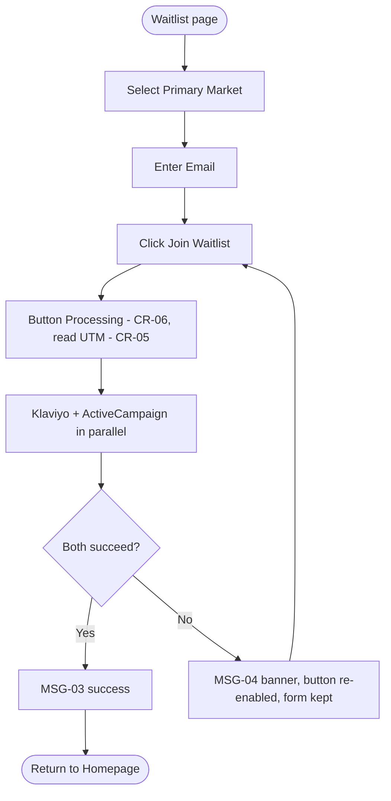

### 7. ALTERNATIVE FLOWS (Luồng phụ / Luồng thay thế)

| ID | Condition | Behaviour |
| --- | --- | --- |
| AF-1 | Email already exists in the CRM | CRM silently dedupes/updates; the user sees the normal success state — no "already registered" signal (`BR_1.3.3`). |
| AF-2 | Flag flips to FALSE while the user is mid-checkout | User completes the entire flow uninterrupted; FE does not re-check (`BR_1.3.2`). Backend enforcement at payment: `Q-E04`. |
| AF-3 | Retry after failure | Safe to resubmit — CRM-side dedupe absorbs a call that already succeeded on one of the two systems (`BR_1.3.3`). |
| AF-4 | Flag is FALSE for the whole platform | Applies to ALL countries at once (`BR_1.3.1`). Blocked regions still see UC_1.4 first (UC_1.1 AF-3). |

### 8. EXCEPTION FLOWS (Luồng ngoại lệ / Xử lý lỗi)

| ID | Scenario | Handling | Message |
| --- | --- | --- | --- |
| EX-1 | One or both CRM calls fail | Treated as a failure: button reverts to "Join Waitlist" (enabled); form data NOT cleared; user may retry. | `MSG-04` (banner) |
| EX-2 | Primary Market empty / Email invalid on submit | Inline errors; no API call (`CR-01`, `CR-02`, `CR-03`). | — |
| EX-3 | Client-side calls blocked (ad-blocker) or CRM key issues | Same as EX-1 from the user's view. See `Q-E05`. | `MSG-04` |

### 9. BUSINESS RULES & DATA VALIDATION (Quy tắc nghiệp vụ & Ràng buộc dữ liệu)

#### 9.1 Business Rules

| # | BR Code | Function | Description |
| --- | --- | --- | --- |
| 1 | BR_1.3.1 | Global Scope | `Global_Var_Allow_New_Signups == FALSE` is a global toggle — redirects ALL countries simultaneously. |
| 2 | BR_1.3.2 | No Interrupt Logic | If the flag changes to FALSE mid-checkout (user started when TRUE), the user completes the ENTIRE flow uninterrupted. FE does not re-check after the initial load. |
| 3 | BR_1.3.3 | CRM-Side Deduplication (No Info Leakage) | No custom backend dedup check exists. Klaviyo/ActiveCampaign resolve identity natively; an existing email is silently deduped/updated so nothing reveals whether an email is registered. Same intent as `CR-12`, applied to a 3rd-party CRM. |

#### 9.2 Data Validation & Component Rules

Waitlist UI
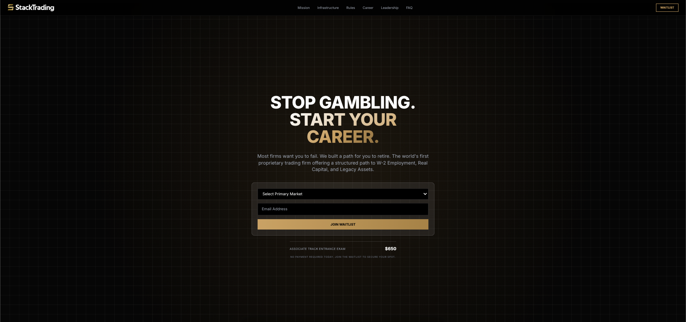

| # | Component | Type | Req. | Displaying / Behaviour | Validation |
| --- | --- | --- | --- | --- | --- |
| 1 | Primary Market | Dropdown (single) | Yes | `CR-01`. Placeholder *"Select primary market"*. Options: `Futures`, `Forex`, `Crypto`. | Required — inline error if empty on submit. |
| 2 | Email | Textbox | Yes | Captures lead email for CRM. | `CR-02` |
| 3 | [Join Waitlist] | Button (Primary) | N/A | `CR-06`. Valid → "Processing..." → parallel Klaviyo + ActiveCampaign calls with email + UTM (`CR-05`). CRM fail → reverts to enabled + `MSG-04`. | All fields valid |
| 4 | Success state | Popup | N/A | `MSG-03` (`POP-04`). Contains [Return to Homepage]. | N/A |

#### 📝 BA NOTE — Sections to add on rework (10–14)

- **§10 API Contracts:** Klaviyo / ActiveCampaign payloads, list IDs, how `Primary Market` maps to CRM fields.
- **§13 Security/Privacy:** direct client-side CRM calls (key exposure, ad-blockers — `Q-E05`), consent for marketing emails per region.
- **§14 UI/UX:** success popup vs. inline state; `Crypto` option exists on the Waitlist but not in checkout asset classes.

---

## UC_1.4 — Gate 2: Geoblock (Flow F)

### 1. OVERVIEW (Mô tả tổng quan)

| Field | Content |
| --- | --- |
| **Use Case ID** | UC_1.4 |
| **Use Case Name** | Gate 2 — Geoblock (Flow F) |
| **Description** | This use case allows the System to hard-block a user from a sanctioned jurisdiction, in order to comply with OFAC/FATF regulatory requirements. |
| **List Screen** | Gate 2 — Geoblock (full-page, `FPS-01`) |
| **Related UC** | UC_1.1 (Geo-IP Gate, activity flow), UC_1.2 (Flow F), UC_6.1 (separate billing-country pre-check) |

### 2. TRIGGER (Sự kiện kích hoạt)

`GET /system/status` returns HTTP 403 (`geo_blocked == true`; `CF-IPCountry` / `CF-Region` matches `Compliance_geo_restrictions`).

### 3. PRE-CONDITIONS (Điều kiện tiên quyết)

None.

### 4. POST-CONDITIONS (Trạng thái sau hoàn thành)

The entire checkout UI is replaced by the hard-stop block page (`FPS-01`). The user cannot proceed.

### 5. ACTORS (Tác nhân tham gia)

System · Cloudflare

### 6. MAIN FLOW / HAPPY PATH (Luồng xử lý chính)

1. `/system/status` returns HTTP 403.
2. FE renders the full-page block (`FPS-01`, `MSG-05`) replacing the entire checkout UI — no header / nav / footer / step indicators / appeal link.

Activity flow: see UC_1.1 §6 diagram, branch "3a Geo-IP Gate → Yes".

### 7. ALTERNATIVE FLOWS (Luồng phụ / Luồng thay thế)

| ID | Condition | Behaviour |
| --- | --- | --- |
| AF-1 | User passes Gate 2 (IP allowed) but later selects a blocked Country/Region at Step 5 | Not handled here — Step 5 shows inline `MSG-10` via its own pre-check (`CR-09`, UC_6.1 EX-1/EX-2). Independent mechanisms. ⚠️ PND-25 |
| AF-2 | User blocked while signups are also paused | Gate 2 wins over Waitlist (UC_1.1 AF-3). |

### 8. EXCEPTION FLOWS (Luồng ngoại lệ / Xử lý lỗi)

| ID | Scenario | Handling | Message |
| --- | --- | --- | --- |
| EX-1 | None — page is a dead end | No retry, no appeal link. Contact route is only the support email inside the message text. | `MSG-05` |

### 9. BUSINESS RULES & DATA VALIDATION (Quy tắc nghiệp vụ & Ràng buộc dữ liệu)

#### 9.1 Business Rules

| # | BR Code | Function | Description |
| --- | --- | --- | --- |
| 1 | BR_1.4.1 | Hard Stop — Full Page Replacement | HTTP 403 = absolute hard stop. The geoblock state replaces the ENTIRE checkout UI; only the block message is shown. |

#### 9.2 Data Validation & Component Rules

Flow F: Geo-Block
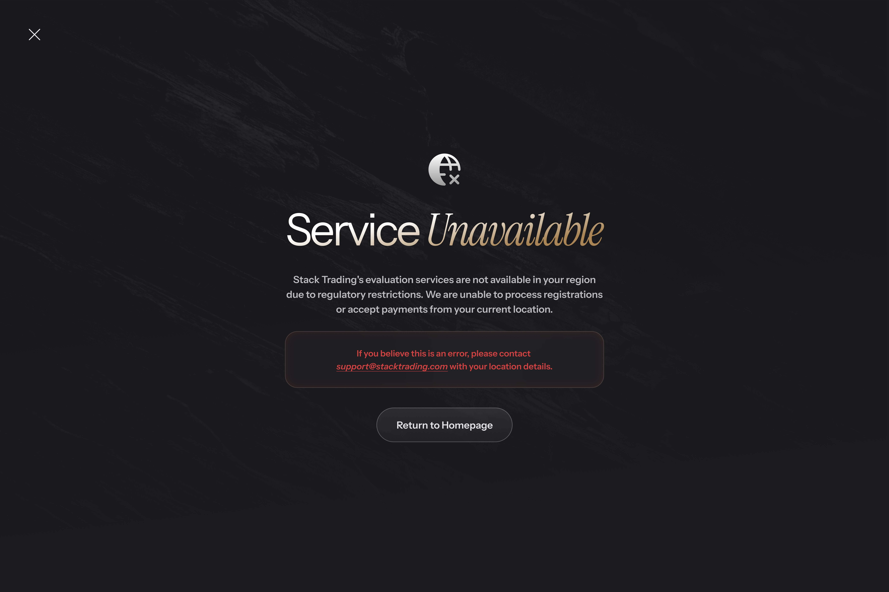

| # | Component | Type | Req. | Displaying / Behaviour |
| --- | --- | --- | --- | --- |
| 1 | Full-page block message (`FPS-01`) | Static Text | N/A | Text `MSG-05`. Sole content of the page — no header, nav, footer, step indicator or appeal link. Page is a dead end. |
| 2 | Return to homepage | Button | N/A | Listed in the source, but conflicts with "sole content" above. ⚠️ PND-24 |

⚠️ PND-24: the source describes Gate 2 both as "HTTP 403" (this UC) and as a JSON response with `geo_blocked = true` (UC_1.1 activity flow); and as "sole content, no link" vs. a return-to-homepage button.

#### 📝 BA NOTE — Sections to add on rework (10–14)

- **§10 API Contracts:** 403 response body shape (PND-24).
- **§11 Regional:** the sanctioned-country list and its owner (`Compliance_geo_restrictions`); OFAC/FATF review cycle.
- **§13 Security/Privacy:** VPN / proxy evasion, logging of blocked attempts.
- **§14 UI/UX:** block page layout, homepage button, mobile view.

---

## UC_1.5 — Pricing Engine

### 1. OVERVIEW (Mô tả tổng quan)

| Field | Content |
| --- | --- |
| **Use Case ID** | UC_1.5 |
| **Use Case Name** | Pricing Engine |
| **Description** | This use case allows the System to dynamically populate the correct price (Standard or Founder) for all 3 Evaluation Package tiers, in order to keep pricing centrally managed in Zapier Table J without requiring a code deploy for price changes. |
| **List Screen** | Step 2 (Capital Allocation Selection) — no unique screen; output renders inside UC_3's pricing cards |
| **Related UC** | UC_1.1 (data source), UC_3 (display), UC_6.1 (Pricing Engine at `/calculate-cart`), UC_8.1 EX-6 (`PRICE_CHANGED`) |

### 2. TRIGGER (Sự kiện kích hoạt)

Step 2 renders.

### 3. PRE-CONDITIONS (Điều kiện tiên quyết)

`is_founder_cohort` and `pricing_tiers` are available in global checkout state (from Step 0, step 3e).

### 4. POST-CONDITIONS (Trạng thái sau hoàn thành)

Correct pricing (Founder or Standard) is displayed on all 3 cards, formatted per `CR-04`.

### 5. ACTORS (Tác nhân tham gia)

System

### 6. MAIN FLOW / HAPPY PATH (Luồng xử lý chính)

1. FE reads `is_founder_cohort` from state.
2. TRUE → render Founder Price with the Standard price struck through.
3. FALSE → render Standard price + "one-time" label.

Governed entirely by state read at Step 0; no API call at Step 2.

### 7. ALTERNATIVE FLOWS (Luồng phụ / Luồng thay thế)

| ID | Condition | Behaviour |
| --- | --- | --- |
| AF-1 | Founder cohort still open at Step 5 | `/calculate-cart` Pricing Engine (UC_6.1 step 9.2) prices with Founder Price. |
| AF-2 | Founder cohort sells out **between Step 2 view and Step 5 `[Next]`** | `/calculate-cart` silently returns the Standard-based totals; nothing is shown at Step 5 (`BR_6.1.5`) — the change is first visible at Step 6 Order Summary. ⚠️ PND-29 |
| AF-3 | Founder cohort sells out, or tax rate changes, **between `/calculate-cart` and `/execute-checkout`** | Backend returns `PRICE_CHANGED` → see EX-1. |

### 8. EXCEPTION FLOWS (Luồng ngoại lệ / Xử lý lỗi)

| ID | Scenario | Handling | Message |
| --- | --- | --- | --- |
| EX-1 | Race condition — stale pricing (`PRICE_CHANGED` at `/execute-checkout`) | No charge, no promo reservation. Popup `POP-02`; [Refresh now] closes the overlay and refreshes the Order Summary — no full page reload (`BR_1.5.2`). Detailed in `UC_8.1 §8 EX-6`. | `MSG-06` |
| EX-2 | `pricing_tiers` missing / incomplete for a tier | Not defined. See `Q-E08`. | — |

### 9. BUSINESS RULES & DATA VALIDATION (Quy tắc nghiệp vụ & Ràng buộc dữ liệu)

#### 9.1 Business Rules

| # | BR Code | Function | Description |
| --- | --- | --- | --- |
| 1 | BR_1.5.1 | Founder Cohort Detection | `is_founder_cohort = TRUE` → Founder Price column (Table J). `FALSE` → Challenge (Standard) Price column. Prices never hardcoded in FE — always read from `pricing_tiers`. Format: `CR-04`. |
| 2 | BR_1.5.2 | Race Condition — Stale Pricing | Triggered at the Step 6 pay click when the server-side re-check detects Founder cohort sold out (reverts to Standard) OR a changed tax rate since `/calculate-cart`. Returns `PRICE_CHANGED` — no charge, no promo reservation. `MSG-06` shown; [Refresh now] closes overlay + refreshes Order Summary, no full reload. |
| 3 | BR_1.5.3 | Price Data Source | Founder/Standard prices for all 3 tiers live in Zapier Table J. Backend packs them into `pricing_tiers` at step 3e of `/system/status`. No additional API call at Step 2. |

#### 9.2 Data Validation & Component Rules

N/A — no unique screen component (see UC_3 §9.2).

#### 9.3 Reference Data — Table J snapshot

*Ops-editable; source of truth = Zapier, not this document. All values follow `CR-04`.*

| Track | Challenge Price | Futures Reset | Forex Reset | Extension Fee | Founder Price | Founder Reset Fee |
| --- | --- | --- | --- | --- | --- | --- |
| Associate (L1) | $650 | $375 | $325 | $150 | $499 | $325 |
| Accelerated (L2) | $1,250 | $725 | $625 | $275 | $1,049 | $600 |
| Advanced (L5) | **$7,000** | $3,800 | $3,500 | $1,500 | **$5,599** | $3,250 |

#### 📝 BA NOTE — Sections to add on rework (10–14)

- **§10 API Contracts:** `pricing_tiers` schema; `PRICE_CHANGED` error body.
- **§12 State Machine:** Founder cohort — Open → Sold-out; how many seats remain and whether a seat is held during checkout (not stated).
- **§14 UI/UX:** strikethrough / Founder price layout; price-change popup wording (`MSG-06`).

---

# STEP 1 — ASSET CLASS SELECTION

## UC_2 — Asset Class Selection

### 1. OVERVIEW (Mô tả tổng quan)

| Field | Content |
| --- | --- |
| **Use Case ID** | UC_2 |
| **Use Case Name** | Step 1: Asset Class Selection |
| **Description** | This use case allows the User to select their preferred trading asset class (Futures or Forex), in order to determine the subsequent step count and platform/risk configuration used throughout checkout. |
| **List Screen** | Step 1 (Asset Class Selection) |
| **Related UC** | UC_1.1 (gates), UC_3 (next), UC_4 (platform depends on asset class), UC_5 (Futures only) |

### 2. TRIGGER (Sự kiện kích hoạt)

User passes Gate 1 and Gate 2 at Step 0.

### 3. PRE-CONDITIONS (Điều kiện tiên quyết)

- `Global_Var_Allow_New_Signups == TRUE`; `geo_blocked == FALSE`.
- `/system/status` response stored in state.

### 4. POST-CONDITIONS (Trạng thái sau hoàn thành)

`asset_class` stored in session state; progress bar reflects 7 (Futures) or 6 (Forex) steps; user proceeds to Step 2.

### 5. ACTORS (Tác nhân tham gia)

User

### 6. MAIN FLOW / HAPPY PATH (Luồng xử lý chính)

1. Step 1 renders 2 cards: Futures, Forex. None selected.
2. User clicks one card → `asset_class` stored; progress bar set (Futures 7 / Forex 6).
3. User clicks [Next] → Step 2 (UC_3). Persistence: `CR-07`.

### 7. ALTERNATIVE FLOWS (Luồng phụ / Luồng thay thế)

| ID | Condition | Behaviour |
| --- | --- | --- |
| AF-1 | User switches Forex → Futures (initial or via back-navigation) | Step 3 platform selection resets; Step 4 (Market Data) re-added; bar → 7 steps. What happens to earlier `addon_ids[]` selections: ⚠️ PND-27. |
| AF-2 | User switches Futures → Forex | Step 3 platform selection resets; Step 4 removed from flow; bar → 6 steps; `addon_ids[] = []` on the Forex path (UC_6.1 pre-condition). |
| AF-3 | User changes asset class after filling Step 5 | Step 5 data is **not** reset (`BR_2.3`). Step 2 package selection is also unaffected. |
| AF-4 | Page refresh on Step 1 | Behaviour conflicts across the spec. ⚠️ PND-23 |
| AF-5 | User re-clicks the already-selected card | Selection unchanged; no reset (radio behaviour). |

### 8. EXCEPTION FLOWS (Luồng ngoại lệ / Xử lý lỗi)

| ID | Scenario | Handling | Message |
| --- | --- | --- | --- |
| EX-1 | None — options are hardcoded in FE, always displayed | N/A | — |
| EX-2 | Deep-link to a later step / browser Back button | Not defined. See `Q-E07`. | — |

### 9. BUSINESS RULES & DATA VALIDATION (Quy tắc nghiệp vụ & Ràng buộc dữ liệu)

#### 9.1 Business Rules

| # | BR Code | Function | Description |
| --- | --- | --- | --- |
| 1 | BR_2.1 | Fixed Options | 2 options (Futures, Forex) hardcoded in FE — not API-driven. Both always displayed. |
| 2 | BR_2.2 | Session Persistence | Ref `CR-07`. Selection is kept in session state for the duration of checkout. The source also says "refresh does NOT return user to Step 1 if local storage cart state is present" — conflicts with `CR-07` ("lost on refresh") → ⚠️ PND-23. |
| 3 | BR_2.3 | Asset Class Change — Progress Bar & Step Count Impact | **Futures:** 7 steps (1→2→3→4→5→6→7). **Forex:** 6 steps (1→2→3→5→6→7, Step 4 omitted). Applies on initial selection AND on back-navigation. Futures→Forex: Step 3 reset, Step 4 removed, bar → 6. Forex→Futures: Step 3 reset, Step 4 added back, bar → 7. **Step 3 reset is the deliberate exception to `CR-07`; Step 5 data is NOT reset** (consistent with `CR-07`) — cleared only on full page refresh. |

#### 9.2 Data Validation & Component Rules

Step 1: Asset Class Selection
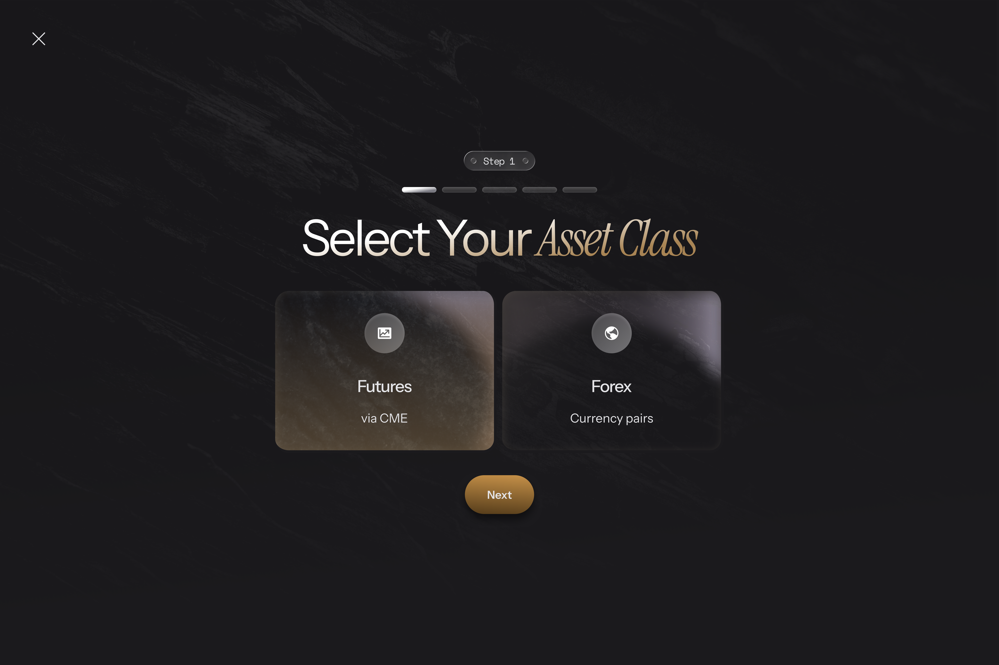

| # | Component | Type | Req. | Displaying / Behaviour | Validation |
| --- | --- | --- | --- | --- | --- |
| 1 | Futures | Radio Group | Yes | Title *"Futures"*, subtitle *"via CME"*. Default unselected. Click → `asset_class = 'FUTURES'`, deselects Forex. If switching FROM Forex: Step 3 resets, Step 4 re-added, bar → 7. | N/A |
| 2 | Forex | Radio Group | Yes | Title *"Forex"*, subtitle *"Currency pairs"*. Default unselected. Click → `asset_class = 'FOREX'`, deselects Futures. If switching FROM Futures: Step 3 resets, Step 4 removed, bar → 6. | N/A |
| 3 | [Next] | Button (Primary) | N/A | Client-side navigation only (no API call, so `CR-06` does not apply). Disabled until one asset class is selected; then → Step 2. | One card selected |

#### 📝 BA NOTE — Sections to add on rework (10–14)

- **§12 State Machine:** session-state map — which keys each step owns and which are reset by which upstream change (asset class, package, platform).
- **§14 UI/UX:** progress-bar update animation when step count changes 7 ↔ 6; card focus/keyboard behaviour.

---

# STEP 2 — CAPITAL ALLOCATION SELECTION

## UC_3 — Capital Allocation Selection

### 1. OVERVIEW (Mô tả tổng quan)

| Field | Content |
| --- | --- |
| **Use Case ID** | UC_3 |
| **Use Case Name** | Step 2: Capital Allocation Selection |
| **Description** | This use case allows the User to select one of three Evaluation Package tiers, in order to determine their starting notional capital, evaluation targets, and career-ladder entry point. |
| **List Screen** | Step 2 (Capital Allocation Selection) |
| **Related UC** | UC_1.5 (pricing), UC_2 (previous), UC_4 (next), UC_7.5 (promo is bound to `product_id`) |

### 2. TRIGGER (Sự kiện kích hoạt)

User clicks [Next] at Step 1 with an asset class selected.

### 3. PRE-CONDITIONS (Điều kiện tiên quyết)

- `asset_class` in session state.
- `/system/status` pricing data (`pricing_tiers`, `is_founder_cohort`) in global checkout state.

### 4. POST-CONDITIONS (Trạng thái sau hoàn thành)

`product_id` (`EVAL_L1` / `EVAL_L2` / `EVAL_L5`) stored in session state; user proceeds to Step 3.

### 5. ACTORS (Tác nhân tham gia)

User

### 6. MAIN FLOW / HAPPY PATH (Luồng xử lý chính)

1. Step 2 renders 3 pricing cards left-to-right: Advanced, Accelerated, Associate. No card is pre-selected.
2. Prices render per UC_1.5 (Standard, or Founder with strikethrough Standard).
3. User clicks a card or its [Select Track] button → `product_id` stored, previous card deselected.
4. User clicks [Next] → Step 3 (UC_4).

> `Daily Loss Limit` (`Daily_Loss_Ratio × max_drawdown`) is a backend/ops metric — **not displayed** at Step 2. `Daily_Loss_Ratio` is read from Table C at runtime but never surfaced here.

### 7. ALTERNATIVE FLOWS (Luồng phụ / Luồng thay thế)

| ID | Condition | Behaviour |
| --- | --- | --- |
| AF-1 | `is_founder_cohort = TRUE` | Standard price struck through + Founder price full size; no "one-time" label (`BR_3.1`). |
| AF-2 | `is_founder_cohort = FALSE` | Standard price + "one-time" label. |
| AF-3 | User clicks [Back] | Returns to Step 1; selection kept (`CR-07`). |
| AF-4 | User comes back and picks a different card | `product_id` is replaced. Effect on an already-applied promo code: ⚠️ PND-30 (promo is 1-to-1 with `product_id`, `BR_7.5.7`). |
| AF-5 | Hover on Live Stop Loss ⓘ | Tooltip explains firm-absorbed risk (see §9.2 row 3). Touch-device equivalent: `Q-E09`. |

### 8. EXCEPTION FLOWS (Luồng ngoại lệ / Xử lý lỗi)

| ID | Scenario | Handling | Message |
| --- | --- | --- | --- |
| EX-1 | None defined — no API call at this step | N/A | — |
| EX-2 | `pricing_tiers` missing a tier / price null | Not defined. See `Q-E08`. | — |

### 9. BUSINESS RULES & DATA VALIDATION (Quy tắc nghiệp vụ & Ràng buộc dữ liệu)

#### 9.1 Business Rules

| # | BR Code | Function | Description |
| --- | --- | --- | --- |
| 1 | BR_3.1 | Pricing Mode — Standard vs Founder | `is_founder_cohort = TRUE` → strikethrough Standard + full-size Founder, no "one-time" label. `FALSE` → Standard + "one-time" label. Format: `CR-04`. |
| 2 | BR_3.2 | Card Selection | Only one card selectable at a time; a new selection deselects the previous. [Next] disabled until a card is selected. |

#### 9.2 Data Validation & Component Rules

Step 2: Capital Allocation
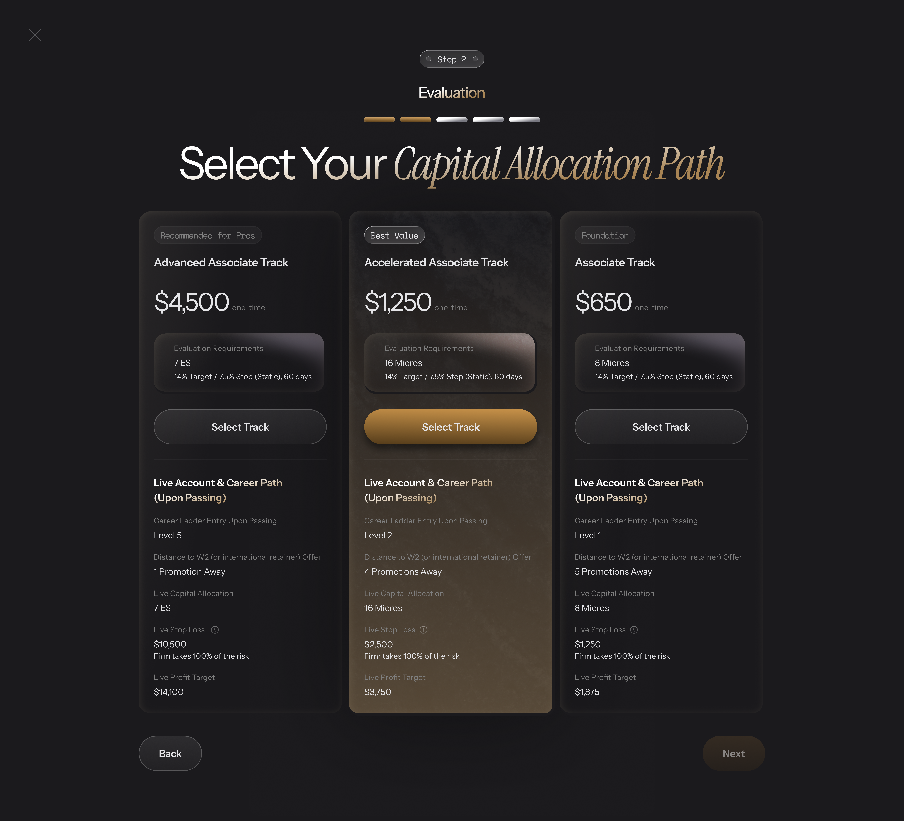

| # | Component | Type | Req. | Displaying / Behaviour | Validation |
| --- | --- | --- | --- | --- | --- |
| 1 | Pricing Card ×3 — Top | Radio Group | Yes | 3 cards: Advanced · Accelerated · Associate. Each: Status Ribbon, Track name, Price block (`CR-04`), Evaluation Requirements box, [Select Track]. Requirements row 2 renders `"{target}% Target / {stop}% Stop, 60 days"` dynamically from Table C. Click anywhere on card OR [Select Track] → selects tier, stores `product_id`, deselects previous. | N/A |
| 2 | Pricing Card ×3 — Bottom | Static Display | N/A | Live Account & Career Path preview. Always visible, not collapsible. Header *"Live Account & Career Path (Upon Passing)"*. Fields: Career Ladder Entry, Distance to W2 (1/4/5 Promotions Away), Live Capital Allocation, Live Stop Loss (with "Firm takes 100% of the risk" + tooltip), Live Profit Target. | N/A |
| 3 | Live Stop Loss — Tooltip ⓘ | Tooltip | N/A | On hover: *"If you pass the evaluation, the firm backs your account with this exact amount of real capital at risk. We absorb the losses so you can focus on execution."* | N/A |
| 4 | [Select Track] | Button (Secondary) | N/A | Per-card; equivalent to clicking the card body. | N/A |
| 5 | [Back] | Button (Secondary) | N/A | → Step 1. Data kept (`CR-07`). | N/A |
| 6 | [Next] | Button (Primary) | N/A | Client-side navigation only (`CR-06` not applicable — no API call). Disabled until a card is selected; then → Step 3. | Card selected |

#### 9.3 Reference Data — Evaluation Package

*All monetary values follow `CR-04`.*

| Parameter | Advanced (EVAL_L5) | Accelerated (EVAL_L2) | Associate (EVAL_L1) |
| --- | --- | --- | --- |
| Standard Price | $7,000 | $1,250 | $650 |
| Founder Price | $5,599 | $1,049 | $499 |
| Status Ribbon | Recommended for Pros | Best Value | Foundation |
| Eval Req. — Futures | 7 ES | 16 Micros | 8 Micros |
| Eval Req. — Forex | $150,000 Notional | $50,000 Notional | $25,000 Notional |
| Target/Stop | 14% / 7.5%, 60 days (dynamic %, fixed days) | same | same |
| Career Entry | Level 5 | Level 2 | Level 1 |
| Distance to W2 | 1 Promotion Away | 4 Promotions Away | 5 Promotions Away |
| Live Stop Loss | $10,500 | $2,500 | $1,250 |
| Live Profit Target | $14,100 | $3,750 | $1,875 |

#### 📝 BA NOTE — Sections to add on rework (10–14)

- **§10 API Contracts:** Table C fields consumed by Step 2 (`target`, `stop`, `Daily_Loss_Ratio`) — how they reach FE (inside `/system/status`, step 3e).
- **§14 UI/UX:** card selection states, ribbon styling, tooltip behaviour on touch devices (`Q-E09`), price block with/without Founder mode.

---

# STEP 3 — PLATFORM SELECTION

## UC_4 — Platform Selection

### 1. OVERVIEW (Mô tả tổng quan)

| Field | Content |
| --- | --- |
| **Use Case ID** | UC_4 |
| **Use Case Name** | Step 3: Platform Selection |
| **Description** | This use case allows the User to select their preferred trading platform from a list dynamically filtered by asset class, in order to determine which execution gateway (Rithmic / MT5 / TraderEvolution) their evaluation account is provisioned on. |
| **List Screen** | Step 3 (Platform Selection) |
| **Related UC** | UC_2 (asset class), UC_5 (next for Futures), UC_6.1 (next for Forex) |

### 2. TRIGGER (Sự kiện kích hoạt)

User clicks [Next] at Step 2 with a package selected.

### 3. PRE-CONDITIONS (Điều kiện tiên quyết)

`asset_class` and `product_id` in session state.

### 4. POST-CONDITIONS (Trạng thái sau hoàn thành)

`platform` stored in session state; user proceeds to Step 4 (Futures) or Step 5 (Forex).

### 5. ACTORS (Tác nhân tham gia)

User · System (FE + BE)

### 6. MAIN FLOW / HAPPY PATH (Luồng xử lý chính)

1. Step 3 renders.
2. FE calls `GET /public/platform-options?asset_class=[asset_class]`.
3. Platform options render as logo tiles (FE maps each returned name to a local static logo).
4. User clicks a tile → `platform` stored.
5. User clicks [Next] → Step 4 (Futures) or Step 5 (Forex).

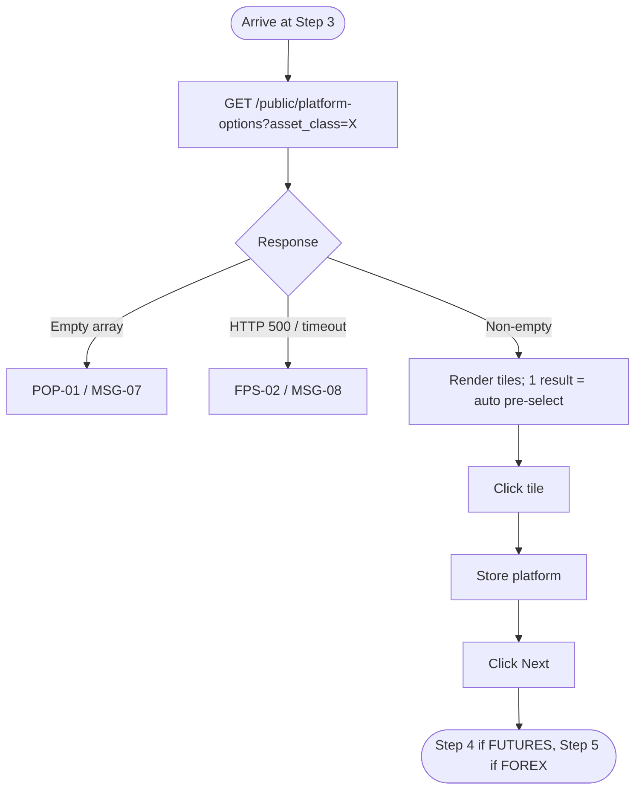

### 7. ALTERNATIVE FLOWS (Luồng phụ / Luồng thay thế)

| ID | Condition | Behaviour |
| --- | --- | --- |
| AF-1 | Exactly 1 platform returned | Auto pre-selected (highlighted). User must still click [Next] — no auto-advance (`BR_4.2`). |
| AF-2 | Asset class was changed on Step 1 | Platform selection was reset (`BR_2.3`); the list is fetched for the new asset class; user must choose again. Refetch/caching policy: `Q-E10`. |
| AF-3 | User returns via [Back] from Step 4/5 and changes platform | Step 4 (Market Data) and Step 5 data are **not** reset — independent (`BR_4.3`). |
| AF-4 | User clicks [Back] | Returns to Step 2; data kept (`CR-07`). |

### 8. EXCEPTION FLOWS (Luồng ngoại lệ / Xử lý lỗi)

| ID | Scenario | Handling | Message |
| --- | --- | --- | --- |
| EX-1 | Empty array returned | Popup `POP-01`. What the user can do next (retry, go Back, switch asset class) is not defined. ⚠️ PND-28 | `MSG-07` |
| EX-2 | HTTP 500 / network timeout | Full-page error `FPS-02`. | `MSG-08` |
| EX-3 | Selected platform becomes inactive between listing and payment | Not defined. See `Q-E11`. | — |

### 9. BUSINESS RULES & DATA VALIDATION (Quy tắc nghiệp vụ & Ràng buộc dữ liệu)

#### 9.1 Business Rules

| # | BR Code | Function | Description |
| --- | --- | --- | --- |
| 1 | BR_4.1 | Dynamic List — No Hardcoding | Options fetched from `GET /public/platform-options?asset_class=X`. Response is only `{ "platforms": [string] }` — no icon field. Logos are static FE assets mapped by name. |
| 2 | BR_4.2 | Pre-selection with 1 Result | 1 platform returned → auto pre-select. User must still click [Next]. |
| 3 | BR_4.3 | Navigation — Back from Later Steps | Ref `CR-07`. Changing platform via back-navigation from Step 5 does NOT reset Step 4 or Step 5 data. |

#### 9.2 Data Validation & Component Rules

Platform Selection
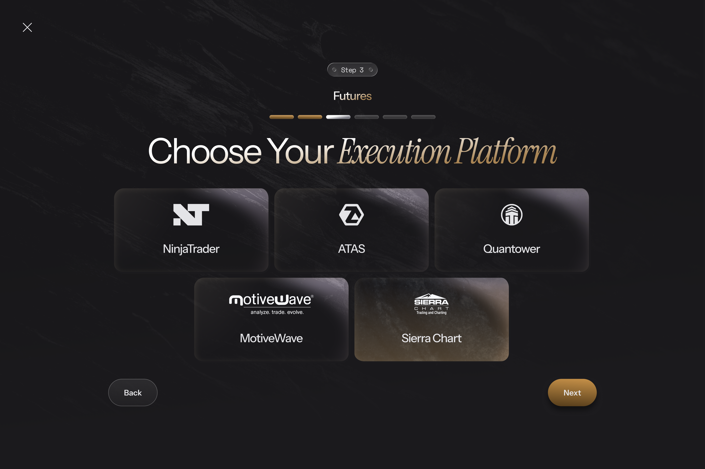

| # | Component | Type | Req. | Displaying / Behaviour | Validation |
| --- | --- | --- | --- | --- | --- |
| 1 | Platform Tiles | Radio Group | Yes | Logo-driven selector. Default unselected, unless only 1 option → auto pre-selected (`CR-01` exception: `BR_4.2`). Click → select, deselect previous, store `platform`. | N/A |
| 2 | [Back] | Button (Secondary) | N/A | → Step 2. Data kept (`CR-07`). | N/A |
| 3 | [Next] | Button (Primary) | N/A | Client-side navigation only (`CR-06` not applicable — the API call happens on step entry, not on click). Disabled until a tile is selected; then → Step 4 (Futures) or Step 5 (Forex). | Tile selected |

#### 9.3 Reference Data — Platform Registry (Zapier Table I, snapshot)

| Platform Name | Asset Class | Gateway | Is_Active | Risk_Group_Template |
| --- | --- | --- | --- | --- |
| **TradeSea** (was NinjaTrader 8) | Futures | Rithmic | TRUE | Sim_Rithmic_Default |
| Quantower | Futures | Rithmic | TRUE | Sim_Rithmic_Default |
| ATAS | Futures | Rithmic | TRUE | Sim_Rithmic_Default |
| MotiveWave | Futures | Rithmic | TRUE | Sim_Rithmic_Default |
| Sierra Chart | Futures | Rithmic | TRUE | Sim_Rithmic_Default |
| MetaTrader 5 | Forex | MT5 | TRUE | Sim_MT5_Default |
| TradingView | Forex | TraderEvolution | TRUE | Sim_TV_Default |

#### 📝 BA NOTE — Sections to add on rework (10–14)

- **§10 API Contracts:** `GET /public/platform-options` response/error bodies; whether `Is_Active = FALSE` rows are filtered server-side.
- **§12 State Machine:** Step 3 states — Loading → Empty / Error / Ready(0 selected | 1 pre-selected | n options).
- **§14 UI/UX:** tile layout, logo fallback if a platform name has no local asset.

---

# STEP 4 — MARKET DATA SELECTION (FUTURES ONLY)

## UC_5 — Market Data Selection

### 1. OVERVIEW (Mô tả tổng quan)

| Field | Content |
| --- | --- |
| **Use Case ID** | UC_5 |
| **Use Case Name** | Step 4: Market Data Selection (Futures Only) |
| **Description** | This use case allows the Futures User to select additional market data feed subscriptions beyond the mandatory CME feed, in order to enable trading on the corresponding exchanges during evaluation. |
| **List Screen** | Step 4 (Market Data Selection) — Forex users skip this step entirely |
| **Related UC** | UC_4 (previous), UC_6.1 (next; `addon_ids[]` feed `/calculate-cart`), UC_2 (step count) |

### 2. TRIGGER (Sự kiện kích hoạt)

User clicks [Next] at Step 3 **and** `asset_class == 'FUTURES'`.

### 3. PRE-CONDITIONS (Điều kiện tiên quyết)

`asset_class == 'FUTURES'`.

### 4. POST-CONDITIONS (Trạng thái sau hoàn thành)

`addon_ids[]` (always containing CME) stored in session state; user proceeds to Step 5.

### 5. ACTORS (Tác nhân tham gia)

User · System (FE + BE)

### 6. MAIN FLOW / HAPPY PATH (Luồng xử lý chính)

1. Step 4 renders.
2. FE calls `GET /public/market-data-products` (backend reads product list + prices from Table C — never hardcoded, `BR_5.5`).
3. Toggle grid renders. CME is pre-checked and locked.
4. User toggles optional feeds (NYMEX / CBOT / COMEX).
5. All selected feeds show *"Cost: $0.00 (Covered by Stack Trading)"*.
6. User clicks [Next] → `addon_ids[]` stored → Step 5.

Flow: Step 4 renders → API call → 0 products → `FPS-02` (`MSG-09`) · otherwise grid → toggle → [Next] → Step 5.

### 7. ALTERNATIVE FLOWS (Luồng phụ / Luồng thay thế)

| ID | Condition | Behaviour |
| --- | --- | --- |
| AF-1 | `asset_class == 'FOREX'` | Step 4 is skipped entirely; `addon_ids[] = []`. |
| AF-2 | User returns to Step 4 via back-navigation | Previous toggle states preserved (`BR_5.4`, `CR-07`). |
| AF-3 | User switched Futures → Forex → Futures | Whether earlier toggles are restored or reset: ⚠️ PND-27. |
| AF-4 | User clicks [Back] | Returns to Step 3. |
| AF-5 | Authenticated Dashboard variant | `GET /market-data-products` additionally filters out already-owned feeds (`BR_5.5`). Out of checkout scope. |

### 8. EXCEPTION FLOWS (Luồng ngoại lệ / Xử lý lỗi)

| ID | Scenario | Handling | Message |
| --- | --- | --- | --- |
| EX-1 | 0 products returned | Treated as a **system error**: full-page `FPS-02`. Note the different treatment vs. Step 3's empty list (popup). ⚠️ PND-28 | `MSG-09` |
| EX-2 | Non-empty response but CME missing, or CME cost ≠ $0.00 | Not defined. See `Q-E12`. | — |
| EX-3 | HTTP 5xx / timeout on `/public/market-data-products` | Not defined separately in the source; presumably same as EX-1. See `Q-E12`. | — |

### 9. BUSINESS RULES & DATA VALIDATION (Quy tắc nghiệp vụ & Ràng buộc dữ liệu)

#### 9.1 Business Rules

| # | BR Code | Function | Description |
| --- | --- | --- | --- |
| 1 | BR_5.1 | CME Locked ON | Pre-checked and locked ON — cannot be unchecked; always in `addon_ids[]`. |
| 2 | BR_5.2 | Optional Feed Defaults | NYMEX, CBOT, COMEX default OFF. |
| 3 | BR_5.3 | Cost Display | All selected options show *"Cost: $0.00 (Covered by Stack Trading)"*. |
| 4 | BR_5.4 | Navigation — Back from Later Steps | Ref `CR-07`. Selected `addon_ids[]` states preserved on return — not reset to default. |
| 5 | BR_5.5 | Product & Price Source — Table C (No Hardcoding) | `GET /public/market-data-products` MUST read the product list + prices from Zapier Table C at request time; backend must NOT hardcode. Also applies to the authenticated Dashboard variant (`GET /market-data-products`), which additionally filters out owned feeds. |

#### 9.2 Data Validation & Component Rules

Market Data
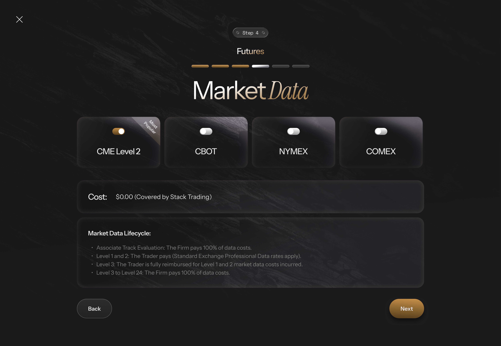

| # | Component | Type | Req. | Displaying / Behaviour | Validation |
| --- | --- | --- | --- | --- | --- |
| 1 | CME Feed | Toggle | Yes (locked) | Label *"CME Level 2"*, "Most Popular" badge. Default ON, non-toggleable, always in `addon_ids[]`. | N/A |
| 2 | Optional Feeds (NYMEX / CBOT / COMEX) | Toggle ×3 | No | Default OFF. Cost text *"Cost: $0.00 (Covered by Stack Trading)"*. ON → add to `addon_ids[]`; OFF → remove. Preserved on back-navigation (`CR-07`). | N/A |
| 3 | Market Data Lifecycle Disclosure | Static Text | N/A | Static, non-collapsible, always visible, below the grid. L1: *"Associate Track Evaluation: The Firm pays 100% of data costs."* L2: *"Level 1 and 2: The Trader pays (Standard Exchange Professional Data rates apply)."* L3: *"Level 3: The Trader is fully reimbursed for all Base CME market data costs incurred during Levels 1 and 2."* (reimbursement scoped to **Base CME** only). L4: *"Level 3 to Level 24: The Firm covers 100% of Base CME data costs."* Clarity of L1 vs L2: `Q-E12`. | N/A |
| 4 | [Back] | Button (Secondary) | N/A | → Step 3. | N/A |
| 5 | [Next] | Button (Primary) | N/A | Client-side navigation only (`CR-06` not applicable). Always enabled (CME always selected). Stores final `addon_ids[]` → Step 5. | N/A |

#### 📝 BA NOTE — Sections to add on rework (10–14)

- **§10 API Contracts:** `GET /public/market-data-products` schema (id, label, price, exchange); how `addon_ids` map to Table C rows.
- **§11 Regional:** exchange-data entitlement rules for returning users on Rithmic (PND-02).
- **§14 UI/UX:** toggle grid layout, locked-state styling, disclosure typography.

---

# STEP 5 — PII CAPTURE, COMPLIANCE & CART ABANDONMENT

## UC_6.1 — PII Capture & Compliance

### 1. OVERVIEW (Mô tả tổng quan)

| Field | Content |
| --- | --- |
| **Use Case ID** | UC_6.1 |
| **Use Case Name** | Step 5: PII Capture & Compliance |
| **Description** | This use case allows the User to submit personal and billing information, complete flow-dependent compliance checkboxes, and trigger tax calculation, in order to move to the checkout/payment step with a validated, sanctions-cleared, tax-calculated order. |
| **List Screen** | Step 5 (PII Capture & Compliance) — 7 flow-specific wireframe variants |
| **Related UC** | UC_1.2 (compliance variants Flow A–G), UC_6.2 (lead capture) |

### 2. TRIGGER (Sự kiện kích hoạt)

User clicks [Next] at Step 4 (Futures) or Step 3 (Forex).

### 3. PRE-CONDITIONS (Điều kiện tiên quyết)

- Session state contains `asset_class`, `product_id`, `platform`, `addon_ids[]` (empty array `[]` on the Forex path).
- `required_flow` is available in global checkout state (from Step 0).

### 4. POST-CONDITIONS (Trạng thái sau hoàn thành)

- All PII fields valid; no unresolved sanctions match; all required checkboxes checked.
- `POST /calculate-cart` returned HTTP 200 (Sanctions Gate passed); `base_price / discount_amount / tax_amount / total_price` saved silently in session state.
- UC_6.2 Phase 2 (full PII UPSERT) has been triggered. User proceeds to Step 6.

### 5. ACTORS (Tác nhân tham gia)

User · System (FE + BE) · Quaderno (tax) · Google Places / Address Validation API · Everflow (affiliate tracking, see PND-16)

### 6. MAIN FLOW / HAPPY PATH (Luồng xử lý chính)

1. Step 5 renders all PII fields. Flow-dependent compliance UI (UC_1.2) renders at the same time.
2. FE reads the current UTM values per `CR-05` (from `localStorage`, not re-parsed from the URL).
3. User fills the fields. Email `onBlur` triggers UC_6.2 Phase 1, independently of this flow.
4. User types in Billing Address and selects a suggestion (see AF-1).
5. User selects Country. State/Region, City and ZIP visibility follows `CR-08` (see AF-2).
6. User selects State/Region. FE clears the existing City and fetches the City list scoped to that Region (see AF-3).
7. Sanctions pre-check runs immediately on every Country/State selection (`CR-09`, immediate timing). Not blocked → no warning. Blocked → see EX-1 / EX-2.
8. User checks all required compliance checkboxes and fills the remaining fields, including Confirm Email (must match Email).
9. User clicks [Next] → `POST /calculate-cart` fires (`CR-09`, deferred timing). `MSG-29` is shown below the State/Region dropdown; [Next] is disabled during the call (`CR-06`). ⚠️ PND-14 (RFQ says the call fires on Country/State selection).
   - Payload: `product_id, addon_ids, billing_country, billing_region, billing_city, user_ip, user_id, promo_code (NULL), zip_code (conditional)`.
   - Backend processes 6 steps in order: **(1) Sanctions Gate** → HTTP 403 if matched, skips 2–6. **(2) Pricing Engine** → Table J lookup, Founder Price if cohort open, returning-user branch, market-data entitlement check. **(3) Location Check** → N/A at Step 5 (`billing_country` is always user-supplied). **(4) Address Validation Gate** → US/CA only; mismatch → HTTP 400, skips 5–6; other countries bypass. **(5) Tax Engine** → Quaderno call with the running amount from step 2. **(6) Return** `{ base_price, discount_amount, tax_amount, total_price }`.
10. On HTTP 200: `MSG-29` disappears, UC_6.2 Phase 2 (full PII UPSERT) is triggered, user navigates to Step 6. No price/tax is shown at Step 5 (`BR_6.1.5`).

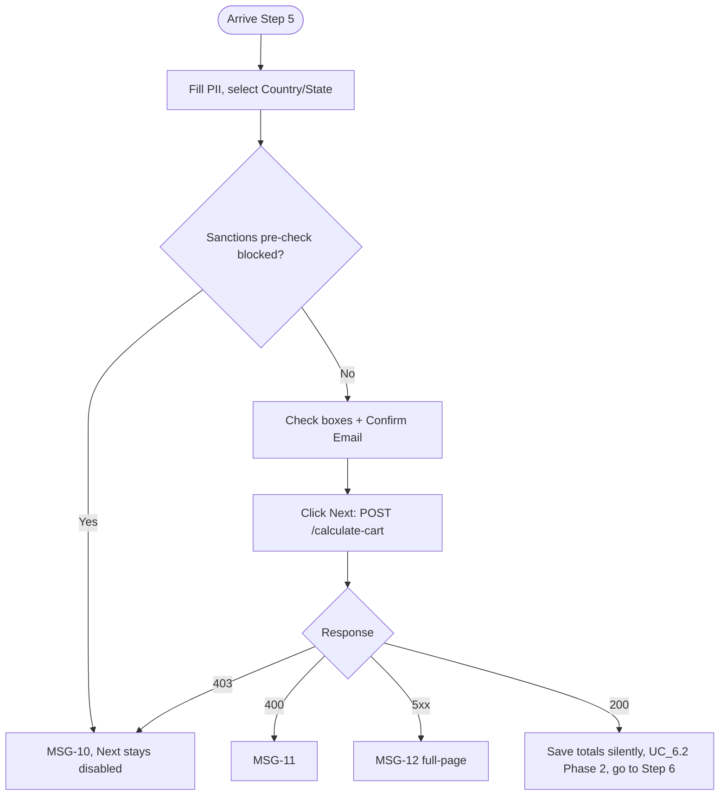

### 7. ALTERNATIVE FLOWS (Luồng phụ / Luồng thay thế)

| ID | Condition | Behaviour |
| --- | --- | --- |
| AF-1 | User selects a Google Places suggestion in Billing Address | Auto-populates Billing Address and ZIP, attempts to match Country/State/City dropdowns, **overwrites** existing values. If the auto-selected Country is blocked → sanctions pre-check fires immediately (main step 7). Manual typing without selecting a suggestion does **not** auto-fill other fields. |
| AF-2 | Selected Country has no sub-regions / ZIP not required | State/Region hidden → City hidden too. ZIP hidden if `zip_requirements[country] = false` (`CR-08`). |
| AF-3 | Selected Region has no city data | City stays hidden; otherwise City is enabled with the fetched options. |
| AF-4 | `required_flow` ≠ Flow A | Additional disclosures/checkboxes render per UC_1.2 (Flow B/C/D/E/G). The flow was fixed by geo-IP at Step 0, not by the billing country chosen here. ⚠️ PND-25 |
| AF-5 | Non-US/CA country | Address Validation Gate is bypassed entirely; request goes straight to Tax Engine (`BR_6.1.12`). |
| AF-6 | User clicks [Back] or changes asset class on an earlier step | Step 5 data is preserved (`CR-07`, `BR_6.1.4`) and is **not** reset on asset-class change (see `BR_2.3`). Cleared only on full page refresh (⚠️ PND-23). |
| AF-7 | Email matches an existing `Failed` / `Terminated` user | Pricing branches (`BR_6.1.9`). ⚠️ PND-01. Email of an existing *Active* user: `Q-E15`. |
| AF-8 | Founder cohort sold out between the Step 2 view and this [Next] | `/calculate-cart` prices with the new (Standard) amount; nothing is displayed at Step 5 (`BR_6.1.5`), so the user first sees it at Step 6. ⚠️ PND-29 |
| AF-9 | User returns to Step 5 from Step 6 (or changes package at Step 2) and clicks [Next] again | `/calculate-cart` re-fires with `promo_code = NULL`; UC_6.2 Phase 2 UPSERT runs again. What happens to a promo already applied at Step 6: ⚠️ PND-30. |

### 8. EXCEPTION FLOWS (Luồng ngoại lệ / Xử lý lỗi)

| ID | Scenario | Handling | Message |
| --- | --- | --- | --- |
| EX-1 | Whole country blocked (pre-check) | Inline error; State/Region **and** ZIP disabled; [Next] stays disabled until a valid selection. Source of the blocked list and what happens to the fields when the user switches back to an allowed country: `Q-E16`. | `MSG-10` |
| EX-2 | Specific region blocked (pre-check) | Inline error; ZIP disabled only; [Next] stays disabled. | `MSG-10` |
| EX-3 | `/calculate-cart` returns HTTP 403 (Sanctions Gate) | Inline error; backend skips steps 2–6; user cannot proceed. | `MSG-10` |
| EX-4 | `/calculate-cart` returns HTTP 400 (address mismatch, US/CA only) | Request dropped before Tax Engine; inline error. | `MSG-11` |
| EX-5 | `/calculate-cart` returns HTTP 5xx | Full-page error `FPS-02`. | `MSG-12` |
| EX-6 | Confirm Email ≠ Email (case-insensitive) | [Next] stays disabled; inline error on Confirm Email. Never triggers a tax call (`BR_6.1.6`). | `MSG-30` (draft, PND-11) |
| EX-7 | Address Validation API returns an error | ⚠️ PND-03 — full list of error cases not yet defined. | — |
| EX-8 | `/calculate-cart` times out or the device is offline (no HTTP status) | Not defined — only 5xx is covered (EX-5); [Next] and `MSG-29` could stay stuck. See `Q-E17`. | — |
| EX-9 | Google Places unavailable, or Region → City list fetch fails | Not defined (AF-3 only covers "no city data"). See `Q-E13`. | — |

### 9. BUSINESS RULES & DATA VALIDATION (Quy tắc nghiệp vụ & Ràng buộc dữ liệu)

#### 9.1 Business Rules

| # | BR Code | Function | Description |
| --- | --- | --- | --- |
| 1 | BR_6.1.1 | Sanctions Pre-Check & Tax Timing | Ref `CR-09`. Two independent mechanisms: (1) immediate sanctions pre-check on every Country/State selection, no debounce; (2) tax calculation only on [Next] click, never on field `onChange`/`onBlur` (except Email `onBlur`, which triggers a separate lead-capture call). |
| 2 | BR_6.1.2 | Next Button Gate | 4 conditions must all be true: (1) all required fields valid, (2) no unresolved sanctions match, (3) all required checkboxes checked, (4) Confirm Email matches Email. On click → fires `/calculate-cart`; navigation only on HTTP 200. |
| 3 | BR_6.1.3 | Everflow Cookie Capture | 2 parallel paths on page init, always: Path 1 = Everflow JS SDK stores `transaction_id` as first-party cookie. Path 2 = raw affiliate URL params parsed into `st_affiliate_data` cookie (not ad-blocker dependent). If SDK fails to load: FE appends `everflow_sdk_blocked=true` + `st_affiliate_data` to the `/execute-checkout` payload; backend generates `transaction_id` via Everflow S2S Click API. ⚠️ PND-16 |
| 4 | BR_6.1.4 | Data Persistence on Back Navigation | Ref `CR-07`. Step 5 data preserved across back navigation. |
| 5 | BR_6.1.5 | No Price Display at Step 5 | `/calculate-cart` results are saved silently in session state; first displayed at Step 6 Order Summary. |
| 6 | BR_6.1.6 | Email / Confirm Email do not trigger tax call | Changes to these fields never trigger `POST /calculate-cart`. |
| 7 | BR_6.1.7 | Field Disable Placement on Sanctions Match | Whole-country match → disables State/Region + ZIP. Specific-region match → disables ZIP only. |
| 8 | BR_6.1.8 | Google Places Autocomplete Behavior | Ref `CR-08`. See AF-1. |
| 9 | BR_6.1.9 | Returning User Detection | If email matches an existing Users record with `status IN ('Failed','Terminated')`, pricing branches on `Post_Failure_Retention_Days` (Table C) × founder × professional status. ⚠️ PND-01 |
| 10 | BR_6.1.10 | Market Data Entitlement Check (Returning Users) | For Futures/Rithmic returning users, already-purchased market data must be checked before a new feed purchase is allowed. ⚠️ PND-02 |
| 11 | BR_6.1.11 | City Cascades From Region | Ref `CR-08`. City is always scoped to the selected Region; changing Region clears City and re-fetches. |
| 12 | BR_6.1.12 | Address Validation Gate (US/CA only) | Rate-limited 15 req/min per user/session + 24h success cache per normalized State+City+ZIP. Mismatch on `administrative_area_level_1` / `locality` / `postal_code` → HTTP 400 (`MSG-11`), dropped before Tax Engine. All other countries bypass. |
| 13 | BR_6.1.13 | Address Validation API Error Cases | Full list of error cases QC must test is not yet defined. ⚠️ PND-03 |

#### 9.2 Data Validation & Component Rules

| # | Component | Type | Req. | Displaying / Behaviour | Validation |
| --- | --- | --- | --- | --- | --- |
| 1 | First Name / Last Name | Text Input | Yes | Legal name capture. | `CR-03` |
| 2 | Email | Text Input | Yes | Primary identifier and cart-abandonment trigger. `onBlur` → `POST /capture-lead` (UC_6.2 Phase 1). | `CR-02` |
| 3 | Confirm Email | Text Input | Yes | Prevents a mistyped email — the activation link in Step 7 is the only way the user receives the account. | Must match Email exactly (case-insensitive); [Next] disabled while mismatched. |
| 4 | Billing Address | Text Input + Autocomplete | Yes | Google Places Autocomplete (`CR-08`). See AF-1. | Required |
| 5 | Country | Dropdown | Yes | `CR-01`, `CR-08`. Sanctions pre-check fires on selection (`CR-09`). Hides State/Region, City, ZIP as per AF-2. | Required; blocked → `MSG-10` |
| 6 | State / Province / Region | Dropdown | Conditional | `CR-01`, `CR-08`. Hidden if country has no regions. Selection clears + refetches City. Pre-check fires on selection. | Required when visible; blocked → `MSG-10` |
| 7 | City | Dropdown | Conditional | `CR-01`, `CR-08`. Disabled until Region selected; hidden if Region has no city data. | Required when visible |
| 8 | ZIP / Postal Code | Text Input | Conditional | Shown/hidden per `zip_requirements[billing_country]` (from Step 0). | Required when visible |
| 9 | Shirt Size | Dropdown | Yes | `CR-01`. Options: S, M, L, XL, XXL. | Required |
| 10 | Compliance Checkboxes (2 or 3) | Checkbox | Yes | Exact text and per-flow variants: UC_1.2 §3. Checkbox 2 links to `MDL-01` (Terms of Service). | All must be checked |
| 11 | "Calculating regional taxes..." | Static Text | N/A | `MSG-29`. Shown below State/Region only while `/calculate-cart` is in flight. | N/A |
| 12 | [Back] | Button (Secondary) | N/A | Back to Step 4 / Step 3. Data kept (`CR-07`). | N/A |
| 13 | [Next] | Button (Primary) | N/A | `CR-06`. Fires `/calculate-cart`; disabled during the call; navigates on HTTP 200 only. | See `BR_6.1.2` |

#### 📝 BA NOTE — Sections to add on rework (10–14)

- **§10 API Contracts:** request/response schema + error body for `POST /calculate-cart` (403/400/5xx), `POST /capture-lead`, Places/Address Validation call. The source spec uses fields not in the RFQ Prop Tech contract (`billing_city`, `zip_code`, `zip_requirements` in `/system/status`, Address Validation step) → PND-21.
- **§11 Regional Compliance Matrix:** one matrix Country/Region → Flow → disclosures → checkbox count → language → blocked. UC_1.2 currently lacks Flow H/I/J and lists Belgium/Bulgaria as both blocked and Flow C → PND-22.
- **§12 State Machine:** Guest record (none → Pending Order → Guest with full PII) and [Next]-gate state (4 conditions).
- **§13 Security/Privacy:** legal basis for capturing email on `onBlur` before consent (UK/EU flows), PII retention, IP handling, 15 req/min rate limit.
- **§14 UI/UX:** cascading field behaviour, disabled-state styling, spinner placement, error focus order, mobile single-column layout.

---

## UC_6.2 — Lead Capture & Cart Abandonment

### 1. OVERVIEW (Mô tả tổng quan)

| Field | Content |
| --- | --- |
| **Use Case ID** | UC_6.2 |
| **Use Case Name** | Step 5: Lead Capture & Cart Abandonment |
| **Description** | This use case allows the System to capture a partial lead the moment the user finishes typing their email, in order to enable cart-abandonment remarketing even if the user never completes checkout. |
| **List Screen** | N/A (silent background call within Step 5) |

### 2. TRIGGER (Sự kiện kích hoạt)

- **Phase 1:** Email field `onBlur`.
- **Phase 2:** [Next] click succeeds at Step 5 (`/calculate-cart` HTTP 200).

### 3. PRE-CONDITIONS (Điều kiện tiên quyết)

User is on Step 5.

### 4. POST-CONDITIONS (Trạng thái sau hoàn thành)

- Phase 1: Guest record created/updated and `Cart_Abandonment` webhook fired.
- Phase 2: full PII UPSERTed into the **same** record.
- No Auth0 account exists at either phase.

### 5. ACTORS (Tác nhân tham gia)

System (FE + BE).

### 6. MAIN FLOW / HAPPY PATH (Luồng xử lý chính)

**Phase 1 — Capture**
1. User finishes typing Email; field loses focus (`onBlur`).
2. FE calls `POST /capture-lead` with email + UTM (`CR-05`).
3. BE creates/updates the Guest record and fires the `Cart_Abandonment` webhook.

**Phase 2 — Enrich**
1. User clicks [Next] at Step 5 and `POST /calculate-cart` succeeds.
2. FE UPSERTs the full PII into the same Guest record.
3. FE navigates to Step 6.

### 7. ALTERNATIVE FLOWS (Luồng phụ / Luồng thay thế)

| ID | Condition | Behaviour |
| --- | --- | --- |
| AF-1 | User never clicks [Next] | Record stays at Phase 1 (email + UTM only) — this is the abandonment case that remarketing targets. |
| AF-2 | User clicks the payment CTA at Step 6 (UC_7.2 – UC_7.4) | FE fires `POST /capture-lead` again (fire-and-forget) to update `abandoned_step`. It never blocks payment (`BR_7.2.2`). |
| AF-3 | User corrects / changes the email after Phase 1 already fired for the first value | Not defined — an orphan record and a `Cart_Abandonment` webhook for the first (possibly mistyped) address may exist. See `Q-E14`. |

### 8. EXCEPTION FLOWS (Luồng ngoại lệ / Xử lý lỗi)

| ID | Scenario | Handling | Message |
| --- | --- | --- | --- |
| EX-1 | `POST /capture-lead` fails | No user-facing state is defined for this fire-and-forget call. ⚠️ PND-04 | — |
| EX-2 | Phase 2 UPSERT fails | Not defined in the source spec. ⚠️ PND-04 | — |

### 9. BUSINESS RULES & DATA VALIDATION (Quy tắc nghiệp vụ & Ràng buộc dữ liệu)

#### 9.1 Business Rules

| # | BR Code | Function | Description |
| --- | --- | --- | --- |
| 1 | BR_6.2.1 | Two-Phase Capture | Phase 1 (`onBlur`) captures minimal data early to survive drop-off; Phase 2 (Next success) enriches the same record — never creates a duplicate. |
| 2 | BR_6.2.2 | No Auth0 Account at Either Phase | A Guest record is a DB row only. No authentication account exists until Step 7 provisioning completes. |

#### 9.2 Data Validation & Component Rules

No screen component of its own. Payload validation:

| Field | Req. | Rule |
| --- | --- | --- |
| `email` | Yes | Format per `CR-02`; backend also validates format before saving (RFQ Prop Tech). |
| `first_name`, `last_name` | No | Optional in Phase 1. |
| `utm_*` | No | Read once and persisted per `CR-05`. |
| `abandoned_step` | Yes | String; updated on each call. |

#### 📝 BA NOTE — Sections to add on rework (10–14)

- **§10 API Contracts:** `POST /capture-lead` schema, idempotency (same email fired multiple times), response codes, and the downstream `Cart_Abandonment` webhook payload (Zapier → Klaviyo per Zapier V7; not written in the source spec).
- **§12 State Machine:** Guest record lifecycle — Pending Order (Phase 1) → Guest with PII (Phase 2) → converted (after payment).
- **§13 Security/Privacy:** consent basis for capturing before submit, public endpoint abuse (rate limit, CR-12-style anti-enumeration), retention period for abandoned leads.

---

# STEP 6 — CHECKOUT & PAYMENT

## UC_7.1 — Order Summary

### 1. OVERVIEW (Mô tả tổng quan)

| Field | Content |
| --- | --- |
| **Use Case ID** | UC_7.1 |
| **Use Case Name** | Order Summary |
| **Description** | This use case allows the System to render the split-panel Step 6 checkout page, in order to present payment method selection alongside a persistent order summary without any additional API calls. |
| **List Screen** | Step 6 (Secure Checkout) |
| **Related UC** | UC_7.2, UC_7.3, UC_7.4 (payment methods), UC_7.5 (promo), UC_8.1 (execution) |

### 2. TRIGGER (Sự kiện kích hoạt)

User navigates to Step 6 after Step 5.

### 3. PRE-CONDITIONS (Điều kiện tiên quyết)

- `/calculate-cart` succeeded at Step 5 (`total / tax / base_price` in state).
- `methods[]` loaded from Step 0.
- User passed the Step 5 compliance gate.

### 4. POST-CONDITIONS (Trạng thái sau hoàn thành)

Step 6 renders fully. The first method in `methods[]` is pre-selected and its execution environment is rendered.

### 5. ACTORS (Tác nhân tham gia)

User · System

### 6. MAIN FLOW / HAPPY PATH (Luồng xử lý chính)

1. On mount, Step 6 renders the split-panel layout with headline "Secure Checkout".
2. System reads `methods[]` from session state (populated at Step 0). Each method renders as radio + label + explanatory text + inline icons + CTA.
3. System reads pricing from the Step 5 `/calculate-cart` state and renders the Order Summary (no API call).
4. First method is auto-selected; DOM swap executes immediately.
5. FE applies client-side OS/browser detection for Apple Pay / Google Pay visibility.
6. User clicks the CTA → Group A (CC, UC_7.2) or Group B (Apple Pay / Google Pay, UC_7.3 / UC_7.4) → UC_8.1 Payment Execution.

### 7. ALTERNATIVE FLOWS (Luồng phụ / Luồng thay thế)

| ID | Condition | Behaviour |
| --- | --- | --- |
| AF-1 | Group A — CC selected | User fills the form directly on the page, no modal (UC_7.2). |
| AF-2 | Group B — Apple Pay / Google Pay | Third-party modal opens. **Case A:** user closes before paying → no overlay. **Case B:** modal closed mid-payment → background listening continues (`CR-13`). **Case C:** payment completes in modal → UC_7.3 / UC_7.4 → UC_8.1. |
| AF-3 | Email currently under 5-failure lock | `MDL-04` (`MSG-14`) renders on top on **every** mount, including forward navigation and reload. |
| AF-4 | Page reload (F5) | Payment has no resumable mid-state; reload routes directly to the correct final state. |
| AF-5 | User changes payment method | DOM swap; `explanatory_text` block updates. |
| AF-6 | Apple Pay / Google Pay unsupported on device | Not rendered, though present in `methods[]` (`BR_7.1.3`). |
| AF-7 | User clicks "Have a promo code?" | Promo panel expands (UC_7.5). |
| AF-8 | User clicks [Back] | Returns to Step 5; data kept (`CR-07`). An applied promo code is affected when the user then clicks [Next] again. ⚠️ PND-30 |

### 8. EXCEPTION FLOWS (Luồng ngoại lệ / Xử lý lỗi)

| ID | Scenario | Handling | Message |
| --- | --- | --- | --- |
| EX-1 | `methods[]` is empty | Blocking popup `POP-03`; user cannot proceed. | `MSG-13` |
| EX-2 | Email under 5-failure lock | Blocking modal with 15-min countdown; all inputs disabled underneath. | `MSG-14` (`MDL-04`) |

### 9. BUSINESS RULES & DATA VALIDATION (Quy tắc nghiệp vụ & Ràng buộc dữ liệu)

#### 9.1 Business Rules

| # | BR Code | Function | Description |
| --- | --- | --- | --- |
| 1 | BR_7.1.1 | Data Source at Step 6 | `methods[]` from Step 0 state — no re-query. Initial pricing from Step 5 `/calculate-cart` state. `/calculate-cart` is re-called at Step 6 **only** when a promo code is applied. |
| 2 | BR_7.1.2 | Payment Method List Is Dynamic | Never hardcoded. Built server-side at Step 0 from `Payment_Method_Config` (GLOBAL + country-specific merge, minus backend exclusions, e.g. India strips CC/Apple Pay/Google Pay). ⚠️ PND-18 |
| 3 | BR_7.1.3 | Apple Pay / Google Pay — Client-Side Detection | Included in `methods[]` globally; FE renders them only if the client environment supports them. |
| 4 | BR_7.1.4 | Background Listening on Modal Close | Ref `CR-13`. |

#### 9.2 Data Validation & Component Rules

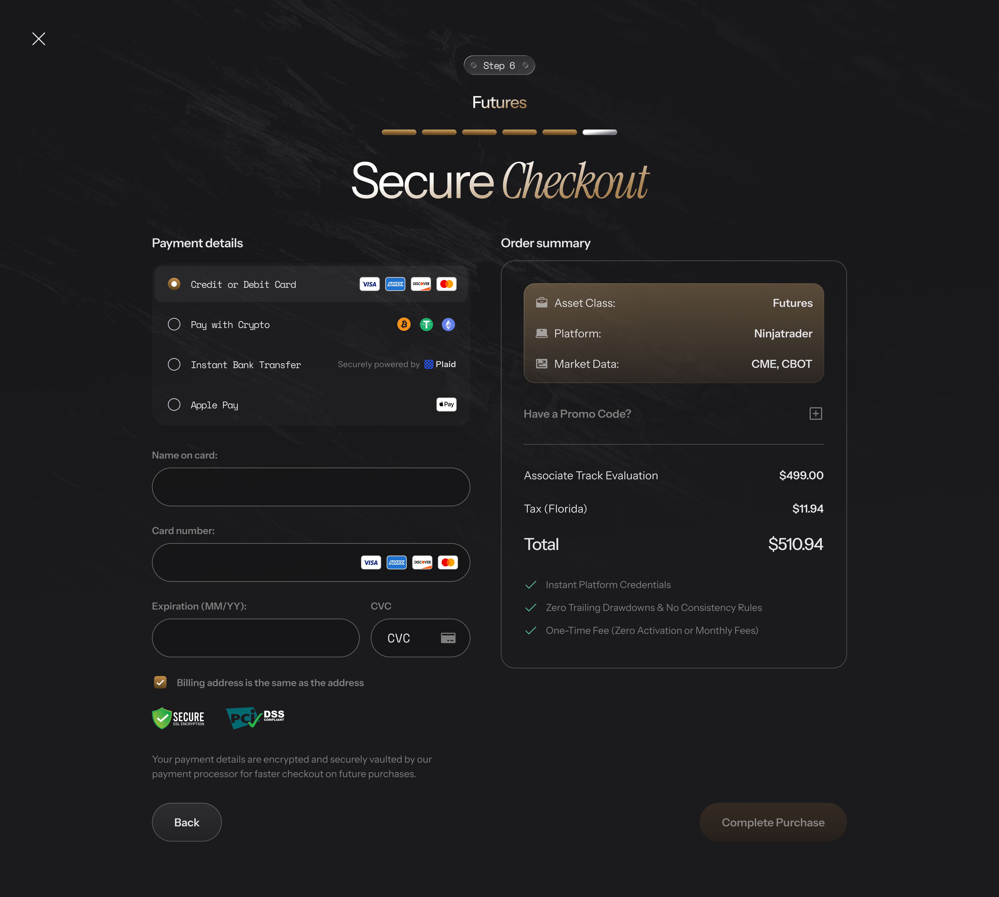

| # | Component | Type | Req. | Displaying / Behaviour |
| --- | --- | --- | --- | --- |
| 1 | Payment method radio list | Radio Group | Yes | Rendered from `methods[]`. Each row: radio + label + inline SVG icons + CTA. Apple Pay/Google Pay only if supported. Click → DOM swap. Default: first method. |
| 2 | `explanatory_text` block | Static Text | N/A | Shows the selected method's `explanatory_text`; updates on change. |
| 3 | Order Summary — Selections | Static Text | N/A | 3 read-only lines: Asset Class / Platform / Market Data. Market Data hidden for Forex. Truncate + tooltip on overflow. |
| 4 | Order Summary — Financials | Static Text | N/A | `CR-04`. `[Tier] Evaluation Price / Tax / Total / Discount` from `calculate-cart`. ⚠️ PND-19 (price source conflict) |
| 5 | Value Reinforcement Block | Static Text | N/A | 3 green checkmarks: "Instant Platform Credentials" / "Zero Trailing Drawdowns & No Consistency Rules" / "One-Time Fee". |
| 6 | "Have a promo code?" | Text Link | N/A | Expands promo section; state preserved on collapse/re-expand (UC_7.5). |
| 7 | Trust Anchors | Static Display | N/A | 256-bit SSL icon, PCI-DSS badge, payment logos. No interaction. |
| 8 | [Back] | Button (Secondary) | N/A | Back to Step 5. |

#### 📝 BA NOTE — Sections to add on rework (10–14)

- **§10 API Contracts:** schema of `methods[]` (`id, label, explanatory_text, cta_text, icon_tags[]`) and the `icon_tags` → SVG mapping table.
- **§11 Regional Compliance:** payment-method matrix per country (from `Payment_Method_Config`) incl. exclusions (India) — RFQ says only CC is stripped, the source spec says CC + wallets → PND-18.
- **§12 State Machine:** Step 6 states — Idle → Method selected → Processing → Success/Failure/Locked; reload behaviour.
- **§13 Security:** PCI scope (`CR-10`), email-lock as anti-fraud control.
- **§14 UI/UX:** split-panel layout (payment left, summary right), mobile stacking, DOM-swap transition, gold CTA, truncation/tooltip.

---

## UC_7.2 — Credit Card (NMI Collect.js)

### 1. OVERVIEW (Mô tả tổng quan)

| Field | Content |
| --- | --- |
| **Use Case ID** | UC_7.2 |
| **Use Case Name** | Credit Card (NMI Collect.js) |
| **Description** | This use case allows the User to pay via Credit/Debit Card using NMI-hosted PCI-compliant iframes, in order to complete the evaluation purchase without Stack Trading ever handling raw card data. |
| **List Screen** | Step 6 — Credit Card DOM state |

### 2. TRIGGER (Sự kiện kích hoạt)

User clicks the CTA button after filling the CC form.

### 3. PRE-CONDITIONS (Điều kiện tiên quyết)

- `CC` method selected.
- NMI Collect.js hosted fields injected successfully.
- Name, Card Number, Expiration, CVC filled.

### 4. POST-CONDITIONS (Trạng thái sau hoàn thành)

- Success (HTTP 200) → automatically transitions to UC_8.1.
- Declined → failure banner with the raw NMI decline reason (`CR-11`).

### 5. ACTORS (Tác nhân tham gia)

User · NMI

### 6. MAIN FLOW / HAPPY PATH (Luồng xử lý chính)

1. User clicks the CTA.
2. FE fires `POST /capture-lead` (fire-and-forget) to update `abandoned_step`.
3. NMI Collect.js tokenizes the card data → `payment_token`.
4. Process transitions to UC_8.1 for payload assembly and execution.

### 7. ALTERNATIVE FLOWS (Luồng phụ / Luồng thay thế)

| ID | Condition | Behaviour |
| --- | --- | --- |
| AF-1 | `POST /capture-lead` fails or is slow | Payment continues regardless (`BR_7.2.2`). |
| AF-2 | Issuer requires 3-D Secure / SCA authentication | Not defined in the source spec. See `Q-E21`. |

### 8. EXCEPTION FLOWS (Luồng ngoại lệ / Xử lý lỗi)

| ID | Scenario | Handling | Message |
| --- | --- | --- | --- |
| EX-1 | Card declined | See `UC_8.1 §8 EX-1` — raw gateway text, no dedicated code (`CR-11`). | — |
| EX-2 | Tokenization fails / hosted fields fail to load | Not defined in the source spec (see BA NOTE). | — |

### 9. BUSINESS RULES & DATA VALIDATION (Quy tắc nghiệp vụ & Ràng buộc dữ liệu)

#### 9.1 Business Rules

| # | BR Code | Function | Description |
| --- | --- | --- | --- |
| 1 | BR_7.2.1 | Secure Payment Field Handling | Ref `CR-10`. Card Number, Expiration, CVC **must** use NMI Collect.js hosted iframes. Custom HTML inputs are strictly forbidden (PCI DSS). |
| 2 | BR_7.2.2 | Lead Capture | `POST /capture-lead` fires on CTA click to update the abandoned-step record. It does **not** block payment; `/execute-checkout` proceeds regardless of outcome. |

#### 9.2 Data Validation & Component Rules

| # | Component | Type | Req. | Validation |
| --- | --- | --- | --- | --- |
| 1 | Name on card | Text Input | Yes | `CR-03` |
| 2 | Card Number | NMI Collect.js iframe | Yes | `CR-10` |
| 3 | Expiration (MM/YY) | NMI Collect.js iframe | Yes | `CR-10` |
| 4 | CVC | NMI Collect.js iframe | Yes | `CR-10` |

#### 📝 BA NOTE — Sections to add on rework (10–14)

- **§10 API Contracts:** Collect.js token → `payment_token` handoff; behaviour when tokenization returns an error (needs a defined message — currently none).
- **§13 Security:** PCI SAQ-A scope, CSP allow-list for NMI iframe, no PAN/CVC in logs, AVS fields forwarded to gateway.
- **§14 UI/UX:** iframe field styling, inline validation states inside hosted fields, card-brand icon detection, mobile keyboard type.

---

## UC_7.3 — Apple Pay

### 1. OVERVIEW (Mô tả tổng quan)

| Field | Content |
| --- | --- |
| **Use Case ID** | UC_7.3 |
| **Use Case Name** | Apple Pay |
| **Description** | This use case allows the User to pay via the native Apple Pay wallet sheet (iOS Safari / macOS Safari), in order to complete purchase with biometric authentication instead of manual card entry. |
| **List Screen** | Step 6 — Apple Pay wallet sheet (native Apple UI, not a Stack Trading screen) |

### 2. TRIGGER (Sự kiện kích hoạt)

User clicks the CTA button with Apple Pay selected.

### 3. PRE-CONDITIONS (Điều kiện tiên quyết)

Apple Pay is visible (per `BR_7.1.3`).

### 4. POST-CONDITIONS (Trạng thái sau hoàn thành)

- Case C (success) → UC_8.1.
- Case A (cancel) → no overlay.
- Failure → `UC_8.1 §8 EX-1`, raw error (`CR-11`).

### 5. ACTORS (Tác nhân tham gia)

User · NMI (Apple Pay integration)

### 6. MAIN FLOW / HAPPY PATH (Luồng xử lý chính)

1. User clicks the CTA.
2. FE fires `POST /capture-lead` (fire-and-forget).
3. NMI invokes the native Apple Pay sheet (third-party modal).
4. User authenticates and payment completes (Case C) → sheet closes → `MDL-02` renders → `PAYMENT_RESULT = success` → UC_8.1.

### 7. ALTERNATIVE FLOWS (Luồng phụ / Luồng thay thế)

| ID | Case | Trigger | Result |
| --- | --- | --- | --- |
| AF-1 | A | User dismisses the sheet before authenticating | Sheet closes → CTA returns to normal. No overlay. |
| AF-2 | B | N/A | Apple Pay authentication is atomic — no mid-authentication close state exists. |
| AF-3 | — | Wallet returns its own billing / contact data that differs from Step 5 | Not defined which one is used for AVS / receipt. See `Q-E20`. |

### 8. EXCEPTION FLOWS (Luồng ngoại lệ / Xử lý lỗi)

| ID | Scenario | Handling | Message |
| --- | --- | --- | --- |
| EX-1 | `PAYMENT_RESULT = failure` | Overlay removed → `UC_8.1 §8 EX-1`. Failure banner = raw Apple Pay/NMI response (`CR-11`). | — |

### 9. BUSINESS RULES & DATA VALIDATION (Quy tắc nghiệp vụ & Ràng buộc dữ liệu)

#### 9.1 Business Rules

No feature-specific rules. Governed by `BR_7.1.3` (visibility), `BR_7.1.4` / `CR-13` (background listening) and UC_8.1 (execution/failure).

#### 9.2 Data Validation & Component Rules

N/A — native wallet sheet.

#### 📝 BA NOTE — Sections to add on rework (10–14)

- **§10 API Contracts:** NMI Apple Pay web integration — merchant validation, payment token → `payment_token`, `PAYMENT_RESULT` event schema (transport not stated → PND-18).
- **§11 Regional:** Safari (iOS/macOS) only; India excludes wallets (PND-18).
- **§13 Security:** Apple domain verification, no card data touches the page.
- **§14 UI/UX:** button styling per Apple HIG, behaviour when sheet is cancelled.

---

## UC_7.4 — Google Pay

### 1. OVERVIEW (Mô tả tổng quan)

| Field | Content |
| --- | --- |
| **Use Case ID** | UC_7.4 |
| **Use Case Name** | Google Pay |
| **Description** | This use case allows the User to pay via the native Google Pay wallet sheet (Android Chrome / Chrome desktop), in order to complete purchase with device authentication instead of manual card entry. |
| **List Screen** | Step 6 — Google Pay wallet sheet (native) |

### 2. TRIGGER (Sự kiện kích hoạt)

User clicks the CTA button with Google Pay selected.

### 3. PRE-CONDITIONS (Điều kiện tiên quyết)

Google Pay is visible (per `BR_7.1.3`).

### 4. POST-CONDITIONS (Trạng thái sau hoàn thành)

Identical to UC_7.3: Case C success → UC_8.1; Case A cancel → no overlay; failure → `UC_8.1 §8 EX-1`.

### 5. ACTORS (Tác nhân tham gia)

User · NMI (Google Pay integration)

### 6. MAIN FLOW / HAPPY PATH (Luồng xử lý chính)

Identical structure to UC_7.3 §6, substituting Google's native wallet sheet for Apple's.

### 7. ALTERNATIVE FLOWS (Luồng phụ / Luồng thay thế)

Same case pattern as UC_7.3 §7. Case A = dismiss → no overlay. Case B = N/A (device authentication via biometrics/PIN is atomic).

### 8. EXCEPTION FLOWS (Luồng ngoại lệ / Xử lý lỗi)

Same as UC_7.3 §8 EX-1 (raw provider message, `CR-11`).

### 9. BUSINESS RULES & DATA VALIDATION (Quy tắc nghiệp vụ & Ràng buộc dữ liệu)

#### 9.1 Business Rules

No feature-specific rules. Governed by `BR_7.1.3` and UC_8.1.

#### 9.2 Data Validation & Component Rules

N/A — native Google UI.

#### 📝 BA NOTE — Sections to add on rework (10–14)

Same as UC_7.3, with Google Pay specifics (merchant ID, Chrome/Android support matrix). Consider merging UC_7.3 and UC_7.4 into one UC with a wallet-specific table — the two are almost identical, which halves maintenance.

---

## UC_7.5 — Apply Promo Code

### 1. OVERVIEW (Mô tả tổng quan)

| Field | Content |
| --- | --- |
| **Use Case ID** | UC_7.5 |
| **Use Case Name** | Apply Promo Code |
| **Description** | This use case allows the User to apply a discount code to their order, in order to reduce the total price before payment, with the reservation only finalized at the moment of successful payment. |
| **List Screen** | Step 6 — Promo code panel (expandable) |

### 2. TRIGGER (Sự kiện kích hoạt)

User clicks "Have a promo code?" or the expand button.

### 3. PRE-CONDITIONS (Điều kiện tiên quyết)

User is at Step 6.

### 4. POST-CONDITIONS (Trạng thái sau hoàn thành)

- **Success:** Order Summary shows Discount + Subtotal lines, input locked, button = [Remove].
- **Failure:** inline error, input stays editable (or locked-with-error for re-validation failures at pay time).

### 5. ACTORS (Tác nhân tham gia)

User · System

### 6. MAIN FLOW / HAPPY PATH (Luồng xử lý chính)

1. User clicks "Have a promo code?" → input + [Apply] expand.
2. [Apply] stays disabled until ≥ 1 character is entered (`CR-06`).
3. User enters a code and clicks [Apply] → spinner + disabled → `POST /calculate-cart` with `promo_code`.
4. HTTP 200 (`discount_amount > 0`): inline success `MSG-17`; Discount line appears (label `Promo code (<code>)`, code as typed); Tax/Total update per `CR-04`; **input locks**, [Apply] swaps to [Remove].

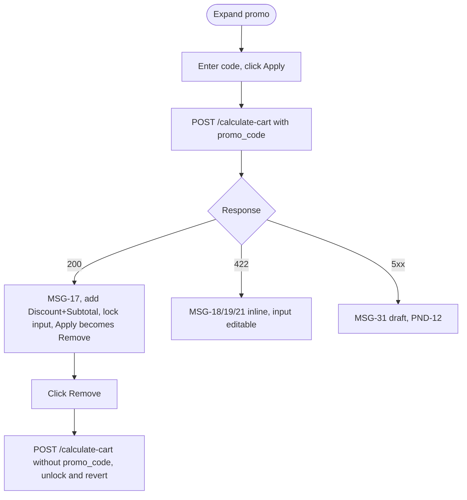

### 7. ALTERNATIVE FLOWS (Luồng phụ / Luồng thay thế)

| ID | Condition | Behaviour |
| --- | --- | --- |
| AF-1 | User clicks [Remove] | Spinner + disabled → `/calculate-cart` without `promo_code` → Tax/Total recalculated → Discount line removed → input unlocked and cleared → button reverts to [Apply] → success text cleared. |
| AF-2 | User enters a new code after Remove | Repeat from main step 3. Applying different codes multiple times before payment is allowed; each replaces the prior discount (`BR_7.5.1`). |
| AF-3 | Promo panel collapsed and re-expanded | State is preserved (UC_7.1 §9.2 row 6). |
| AF-4 | Discount brings the total to $0.00 (100% code) | Not defined — whether a payment step / token is still required. See `Q-E19`. |
| AF-5 | Package (`product_id`) changed at Step 2 after a code was applied | The `MSG-21` mismatch check runs at [Apply] only (`BR_7.5.7`); what happens to the stored code is ⚠️ PND-30. |

### 8. EXCEPTION FLOWS (Luồng ngoại lệ / Xử lý lỗi)

| ID | Scenario | Handling | Message |
| --- | --- | --- | --- |
| EX-1 | HTTP 422 — invalid / expired / limit reached | Inline error; [Apply] re-enables; input editable. | `MSG-18` |
| EX-2 | HTTP 422 — per-user limit exceeded | Same as EX-1. | `MSG-19` |
| EX-3 | HTTP 422 — code not valid for the selected package | Same as EX-1. Check runs at [Apply] click only. | `MSG-21` |
| EX-4 | HTTP 5xx / no network / timeout | The source spec does not define the UI. ⚠️ PND-12 | `MSG-31` (draft) |
| EX-5 | Code invalid / limit reached at `/execute-checkout` (re-validation) | HTTP 422; **banner, not overlay**; Discount + Subtotal rows removed; Tax/Total revert; input stays locked with the now-invalid code — manual [Remove] required. | `MSG-20` |
| EX-6 | `PRICE_CHANGED` at `/execute-checkout` | Promo re-validation is skipped entirely for that attempt (`BR_7.5.6`); see `UC_8.1 §8 EX-6`. | `MSG-06` |

### 9. BUSINESS RULES & DATA VALIDATION (Quy tắc nghiệp vụ & Ràng buộc dữ liệu)

#### 9.1 Business Rules

| # | BR Code | Function | Description |
| --- | --- | --- | --- |
| 1 | BR_7.5.1 | Apply Trigger — Click Only | `/calculate-cart` with a promo code fires only on explicit [Apply] click, never on `onBlur`. ⚠️ PND-15. `current_usage_count` is incremented **after** the server-side price/tax check passes at `/execute-checkout` (step 6.1.b), not at [Apply]. Genuine decline → restored immediately (+1). 10-min timeout → not restored immediately; stays reserved until the backend webhook confirms explicit failure. Success → deduction kept permanently + `promo_code_usage_log` record inserted. |
| 2 | BR_7.5.2 | One Promo Code Per Transaction | Only one code may be applied per checkout. |
| 3 | BR_7.5.3 | Subtotal Field | See 9.2 row 6. Ref `CR-04`. |
| 4 | BR_7.5.4 | Promo Code Types & DB Schema | Percentage: `discount_amount = Base_Price × rate`. Flat: `discount_amount = promo_code_value`. FE only reads `discount_amount`, never the type. Input is case-insensitive. **`promo_codes` table:** `code, discount_amount, discount_percentage (nullable), expiration_date, usage_limit, current_usage_count, max_uses_per_user (nullable, default 1), product_id (enum, NOT NULL)`. Invalid if: expired OR `current_usage_count >= usage_limit` OR personal count `>= max_uses_per_user`. |
| 5 | BR_7.5.5 | Tax Calculated on Post-Discount Amount | Quaderno receives `Final_Amount = (Base_Price + Addon_Prices) − discount_amount`. `Total = Final_Amount + tax_amount`. A percentage discount applies to `Base_Price` only, not add-ons. |
| 6 | BR_7.5.6 | Promo Re-Validation at Execute-Checkout | Re-validated **and** reserved atomically at step 6.1.b of `/execute-checkout`, only after the price/tax check (6.1.a) passes. If 6.1.a fails (`PRICE_CHANGED`) → promo re-validation skipped. If the code is invalid/limit-reached at this point → see EX-5. |
| 7 | BR_7.5.7 | Promo Code Mapped 1-to-1 to Product ID | Recognized `product_id` values: `EVAL_L1, EVAL_L2, EVAL_L5, RESET, REBUY, EXTENSION, MARKET_DATA`. Mismatch check runs at [Apply] only (`MSG-21`). |

#### 9.2 Data Validation & Component Rules

| # | Component | Type | Req. | Displaying / Behaviour | Validation |
| --- | --- | --- | --- | --- | --- |
| 1 | Promo code input | Search Field | No | Expands on "Have a promo code?" click. Locks (read-only) after successful apply. Stays locked with the invalid code after re-validation failure at pay time — not auto-cleared. | Max 100 chars (block input at limit); case-insensitive |
| 2 | [Apply] / [Remove] | Button (Secondary) | N/A | `CR-06`. See §6 and AF-1. | [Apply] disabled until ≥ 1 char |
| 3 | Inline success text | Static Text | N/A | `MSG-17`. Visible below the input on success; persists while applied; cleared only on [Remove]. | N/A |
| 4 | Inline error text | Static Text | N/A | `MSG-18` / `MSG-19` / `MSG-21` inline; `MSG-20` banner (needs manual [Remove]). | N/A |
| 5 | Discount (Order Summary row) | Static Text | N/A | `CR-04`. Visible when `discount_amount > 0`; between base price and Tax rows. Label `Promo code (<code>)`; amount `−$XX.XX`. | N/A |
| 6 | Subtotal (Order Summary row) | Static Text | N/A | `CR-04`. Same show/hide rule as Discount; directly below it. Value `(Base_Price + Addon_Prices) − discount_amount`. | N/A |

#### 📝 BA NOTE — Sections to add on rework (10–14)

- **§10 API Contracts:** `/calculate-cart` with/without `promo_code` — 200 / 422 (which error code maps to `MSG-18` vs `MSG-19` vs `MSG-21`) / 5xx; `promo_codes` and `promo_code_usage_log` schema.
- **§12 State Machine:** promo states — Empty → Applying → Applied (locked) → Invalid-at-pay (locked, banner) → Removed; plus usage-counter states (Reserved → Confirmed / Restored / Held-until-webhook).
- **§13 Security/Audit:** brute-force guessing of codes (rate limit on [Apply]), audit of reservations, atomic reservation to prevent over-use.
- **§14 UI/UX:** lock/unlock visual states, spinner placement, Discount/Subtotal row insertion animation.

---

# STEP 7 — ORDER PROCESSING & PROVISIONING

## UC_8.1 — Phase 1: Payment Execution

### 1. OVERVIEW (Mô tả tổng quan)

| Field | Content |
| --- | --- |
| **Use Case ID** | UC_8.1 |
| **Use Case Name** | Phase 1 — Payment Execution |
| **Description** | This use case allows the System to execute the actual charge against the selected gateway with full server-side integrity checks, in order to guarantee no duplicate charges, correct pricing, and correct promo-code accounting regardless of payment method or network reliability. |
| **List Screen** | Processing overlay (`MDL-02`), Payment Successful overlay (`MDL-03`), Failure banner, Email-lock overlay (`MDL-04`), Post-payment restricted-region states (`FPS-03` / `FPS-04`) |

### 2. TRIGGER (Sự kiện kích hoạt)

User clicks the CTA button on Step 6.

### 3. PRE-CONDITIONS (Điều kiện tiên quyết)

- Payment method selected; all required fields completed.
- `/calculate-cart` already succeeded (pricing/tax/totals up to date).
- No active email lock.

### 4. POST-CONDITIONS (Trạng thái sau hoàn thành)

- **Success:** payment executed → confirmation state; Flow 1 triggered via webhook.
- **Failure:** failure banner (`CR-11`); retry allowed.
- **Email lock:** 5+ consecutive failures → all inputs locked 15 min (`MSG-14`).

### 5. ACTORS (Tác nhân tham gia)

User · System · NMI · Quaderno

### 6. MAIN FLOW / HAPPY PATH (Luồng xử lý chính)

**Client side**
1. User clicks the CTA.
2. CTA is disabled immediately (`CR-06`).
3. `MDL-02` renders (`MSG-15`).
4. Promo reservation happens later, server-side (step 6.1.b).
5. FE calls `POST /execute-checkout` with the payload below.

| Parameter | Source |
| --- | --- |
| `product_id` | Session state |
| `addon_ids` | Session state |
| `promo_code` | Session state (if applied) |
| `billing_country` / `billing_region` | Session state (Step 5) — forwarded to gateway for AVS |
| `billing_city` | Session state (Step 5) — forwarded for AVS (`CR-08`) |
| `billing_address` | Session state (Step 5) — forwarded for AVS |
| `zip_code` | Session state (Step 5), conditional per `country_zip_requirements` — forwarded for AVS |
| `payment_method` | e.g. `"CC"`, `"GOOGLE_PAY"`, `"APPLE_PAY"` |
| `payment_token` | Gateway-specific token, e.g. NMI Collect.js response (Optional) |
| `utm_source/medium/campaign/term/content` | Read at submit time per `CR-05` (Optional) |
| `user_ip` | Backend-detected (silent) |
| `timestamp_utc` | FE-generated at submit (silent, Optional) |
| `everflow_transaction_id` | Everflow SDK cookie via `getTransactionId()` (silent, Optional) — `NULL` if SDK failed to load. ⚠️ PND-16 |
| `everflow_sdk_blocked` | FE boolean (silent, Optional) — `true` when SDK failed; fail-open |
| `st_affiliate_data` | First-party cookie from raw URL affiliate params (silent, Optional) — only when `getTransactionId()` returns `null` |
| `user_id` | Current logged-in user (Optional) |

**Server side (single `/execute-checkout` call)** — ⚠️ PND-09: The source spec says "steps 6–7 are server-side" but never lists them. The order below is **reconstructed** from `BR_7.5.1`, `BR_7.5.6`, `BR_8.1.4` and RFQ Prop Tech; BAL must confirm.

6. **Integrity checks:**
   - Dedup check on `provider_event_id` (blocks only if a prior attempt for this `user_id` already **succeeded**, see AF-2 / EX-3).
   - 6.1.a Price/tax re-check (re-runs Sanctions, Pricing, Tax) → mismatch returns `PRICE_CHANGED` (EX-6).
   - 6.1.b Promo re-validation + atomic reservation (only if 6.1.a passed; failure → `UC_7.5 §8 EX-5`).
7. **Charge & post-processing:** gateway charge (NMI: MID selected by weighted round-robin; token charged, `customer_vault_id` saved) → attribution parameters written to the user record → `NEW_PAYMENT_SUCCESS` pushed to Zapier Flow 1.

**Client side (result)**
8. Response handling: failure → failure banner (EX-1); success → `MDL-02` replaced by `MDL-03` (`MSG-16`), auto-dismiss after ~2 s, then continue to UC_8.2 (⚠️ PND-10).

### 7. ALTERNATIVE FLOWS (Luồng phụ / Luồng thay thế)

| ID | Condition | Behaviour |
| --- | --- | --- |
| AF-1 | Wallet payment (Apple Pay / Google Pay) | Result arrives asynchronously as `PAYMENT_RESULT` (success/failure). If the user closes the UI before the result, the system keeps listening in the background (`CR-13`). ⚠️ PND-18 |
| AF-2 | Retry after a prior attempt that failed or is still in progress | Allowed. Dedup check only blocks when a prior attempt already succeeded (`BR_8.1.4`). |
| AF-3 | Payment succeeds | `MDL-03` (`MSG-16`) auto-dismisses after ~2 s; Flow 1 is triggered via webhook. If the webhook / Email 2 delivery fails: `Q-E24`. |
| AF-4 | User closes / loses the tab while a card payment is processing | Not defined for CC (`CR-13` is written for asynchronous wallet confirmation) and there is no login to resume. See `Q-E25`. |

### 8. EXCEPTION FLOWS (Luồng ngoại lệ / Xử lý lỗi)

| ID | Scenario | Handling | Message |
| --- | --- | --- | --- |
| EX-1 | Payment declined / failure | `MDL-02` removed; red banner at top of screen with the **raw** gateway decline text (`CR-11`); CTA re-enables; failure counts toward the 5-failure lock. | raw gateway text |
| EX-2 | 10-min frontend session timeout | `MDL-02` dissolves; banner shown; CTA re-enables. Server-side webhooks keep listening independently of what FE shows. Risk of a late success followed by a retry: `Q-E23`. | `MSG-22` |
| EX-3 | HTTP 409 — duplicate payment (`provider_event_id` exists) | `MDL-02` dismissed; banner; no new charge; CTA re-enables. | `MSG-23` |
| EX-4 | Double payment detected post-success | Banner; CTA **stays disabled**; logged for manual reconciliation. Refund / ownership of the 2nd charge: `Q-E23`. | `MSG-24` |
| EX-5 | 5+ consecutive declines in a rolling 10-min window (keyed by email, counted across all payment methods) | `MDL-04` blocking modal; 15-min countdown; resets when countdown ends. What counts as a failure, and lock abuse on someone else's email: `Q-E22`. | `MSG-14` |
| EX-6 | `PRICE_CHANGED` (Founder cohort sold out or tax changed) | No charge, no promo reservation. Popup `POP-02`; [Refresh now] closes overlay and refreshes Order Summary, no full reload (`BR_1.5.2`). | `MSG-06` |
| EX-7 | Promo invalid / limit reached at execution | See `UC_7.5 §8 EX-5`. | `MSG-20` |
| EX-8 | Post-payment restricted-region match | Full-page "refunding" state, then "refunded" state. ⚠️ PND-05 (why a 3rd sanctions check exists). Side-effects on promo usage / provisioning: `Q-E29`. | `MSG-25` → `MSG-26` (`FPS-03` → `FPS-04`) |

### 9. BUSINESS RULES & DATA VALIDATION (Quy tắc nghiệp vụ & Ràng buộc dữ liệu)

#### 9.1 Business Rules

| # | BR Code | Function | Description |
| --- | --- | --- | --- |
| 1 | BR_8.1.1 | CTA Disabled During Processing | `CR-06`. Disabled from click until the API resolves or the 10-min timer expires. |
| 2 | BR_8.1.2 | 5-Failure Lock Is Cross-Method | Email-keyed, response-order counted, counts failures across all payment methods together (see EX-5). |
| 3 | BR_8.1.3 | CTA Re-enable on Failure Only | Not re-enabled on overlay dismissal or back-navigation while a payment is in progress — only on an actual failure response (including the 10-min timeout). |
| 4 | BR_8.1.4 | Retry Allowed When Prior Payment Failed or In-Progress | Dedup check blocks only when a prior attempt for this `user_id` already succeeded (`MSG-23`). |

#### 9.2 Data Validation & Component Rules

| # | Component | Type | Displaying / Behaviour |
| --- | --- | --- | --- |
| 1 | Processing Overlay (`MDL-02`) | Modal (blocking) | Orizon dark overlay + gold spinner. Text `MSG-15`. |
| 2 | Success Overlay (`MDL-03`) | Modal (auto-dismiss) | "Payment Successful" (`MSG-16`), auto-dismiss ~2 s. |
| 3 | Failure Banner | Banner (inline, top of screen) | Red banner, raw gateway text (`CR-11`); CTA re-enables alongside. |
| 4 | Email Lock Overlay (`MDL-04`) | Modal (blocking, 15-min countdown) | `MSG-14`; all inputs disabled underneath. |
| 5 | Refunding (`FPS-03`) | Full-page state | `MSG-25`. |
| 6 | Refunded (`FPS-04`) | Full-page state | `MSG-26`. |

Payload validation: `product_id`, `payment_method`, `billing_country` are mandatory; `payment_token` is optional (omitted for wallet/vaulted flows); UTM, `timestamp_utc`, Everflow fields are optional and never block checkout (fail-open).

#### 📝 BA NOTE — Sections to add on rework (10–14)

- **§10 API Contracts (priority):** full `POST /execute-checkout` request/response (`status`, `error_code`, `transaction_id`, `gateway_payload`), error codes (`PRICE_CHANGED`, 409, 422, decline), `PAYMENT_RESULT` event, and the exact server-side sequence (PND-09). The source-spec payload has fields missing in the RFQ contract → PND-21. Also: neither `/calculate-cart` nor `/execute-checkout` carries `platform` or `asset_class` — how Step 7 knows which platform to provision must be confirmed (`Q-E11`).
- **§12 State Machine (priority):** Payment attempt: Idle → Processing → Success / Failed / Timed-out / Duplicate / Refunding → Refunded; plus email-lock counter and promo-reservation states.
- **§13 Security/Audit:** PCI, idempotency key (`provider_event_id`), WORM audit receipt (RFQ: PDF stamped with IP + timestamp + transaction ID → S3 Object Lock), HMAC-signed webhooks, IP/AVS data handling.
- **§11 Regional:** restricted-region refund path per country.
- **§14 UI/UX:** overlay layering order (MDL-02 → MDL-03 / banner / MDL-04), countdown timer, banner placement on mobile.

---

## UC_8.2 — Phase 2: Account Claim

### 1. OVERVIEW (Mô tả tổng quan)

| Field | Content |
| --- | --- |
| **Use Case ID** | UC_8.2 |
| **Use Case Name** | Phase 2 — Account Claim |
| **Description** | This use case allows the User to activate their newly provisioned account by clicking the emailed link and providing a phone number, in order to proceed to Phase 3 (Provisioning & Redirect to Login) — notably WITHOUT setting a password at this step. |
| **List Screen** | Step 7 Phase 2 — "Create an Account" (Phone Number only) |

### 2. TRIGGER (Sự kiện kích hoạt)

User clicks the "Claim Your Account" link in Email 2.

### 3. PRE-CONDITIONS (Điều kiện tiên quyết)

Email 2 (Claim Account) has been received and contains a valid JWT link.

### 4. POST-CONDITIONS (Trạng thái sau hoàn thành)

`POST /claim-account` returned HTTP 200 → transitions to UC_8.3 (Phase 3).

### 5. ACTORS (Tác nhân tham gia)

User · System

### 6. MAIN FLOW / HAPPY PATH (Luồng xử lý chính)

1. User clicks the emailed link.
2. JWT is valid (within 48 h) → "Create an Account" screen renders with the Phone Number field only.
3. User enters the phone number and submits → `POST /claim-account` (`email`, `transaction_id`, `phone_number`).
4. HTTP 200 → UC_8.3.

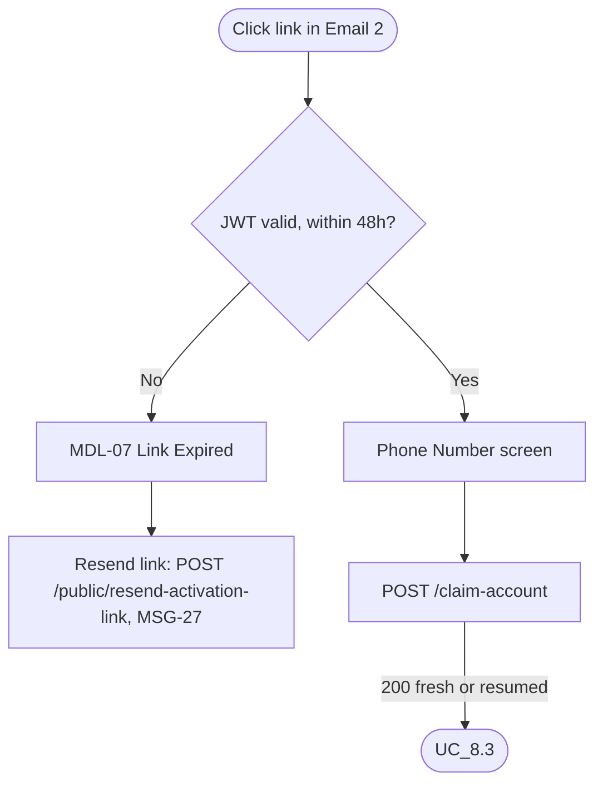

### 7. ALTERNATIVE FLOWS (Luồng phụ / Luồng thay thế)

| ID | Condition | Behaviour |
| --- | --- | --- |
| AF-1 | Reopening an already-claimed link | `POST /claim-account` returns HTTP 200 (resumed) → UC_8.3. |
| AF-2 | User clicks [Resend link] on the expired state | `POST /public/resend-activation-link` (no auth, **always HTTP 200**, `CR-12`) → fires `MSG-27` if the address exists. |
| AF-3 | Admin-side resend | Separate Admin-only `POST /resend-welcome` (Admin JWT). Out of user-facing scope. |
| AF-4 | User has not received Email 2 but the link has not expired | [Resend link] exists only on the expired state (`MDL-07`). Whether a resend is reachable earlier, and whether a new link invalidates the old one: `Q-E26`. |

### 8. EXCEPTION FLOWS (Luồng ngoại lệ / Xử lý lỗi)

| ID | Scenario | Handling | Message |
| --- | --- | --- | --- |
| EX-1 | JWT expired (> 48 h) | `MDL-07` replaces the form; [Resend link]. | `MSG-27` (email) |
| EX-2 | `/claim-account` returns an error / phone invalid | Not defined in the source spec. ⚠️ PND-13. Duplicate phone numbers: `Q-E28`. | — |

### 9. BUSINESS RULES & DATA VALIDATION (Quy tắc nghiệp vụ & Ràng buộc dữ liệu)

#### 9.1 Business Rules

| # | BR Code | Function | Description |
| --- | --- | --- | --- |
| 1 | BR_8.2.1 | Password Field Removed | Phase 2 no longer collects a password — only a phone number. ⚠️ PND-06 (where is the login credential set?) and PND-17 (RFQ still specifies password + in-page Phase 2). |
| 2 | BR_8.2.2 | Anti-Enumeration on Resend | `CR-12`. `POST /resend-welcome` (Admin JWT, admin-only) vs `POST /public/resend-activation-link` (no auth, always HTTP 200 regardless of whether the email exists). |

#### 9.2 Data Validation & Component Rules

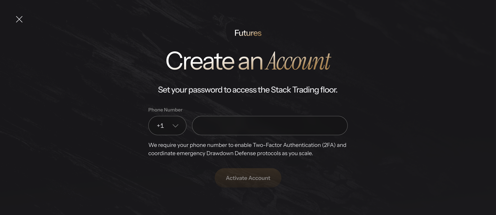

| # | Component | Type | Req. | Displaying / Behaviour | Validation |
| --- | --- | --- | --- | --- | --- |
| 1 | Phone Number | Text Input + country-code dropdown | Yes | Sole PII field at this phase. | `CR-03`; format rules ⚠️ PND-13 |
| 2 | [Activate Account] / [Submit] | Button (Primary) | N/A | `CR-06`. Click → `POST /claim-account`; success → UC_8.3. | N/A |
| 3 | "Link Expired" state (`MDL-07`) | Static Text + Button | N/A | [Resend link] → `POST /public/resend-activation-link` → always HTTP 200 (`CR-12`) → `MSG-27` if the address exists. | N/A |

#### 📝 BA NOTE — Sections to add on rework (10–14)

- **§10 API Contracts:** `POST /claim-account` (the source spec sends no password; RFQ contract has `new_password` and `shirt_size`) and `POST /public/resend-activation-link`; JWT claims + 48 h expiry → PND-21.
- **§12 State Machine:** account status Guest → (claim) → provisioning → Active_SIM; link status Valid → Expired → Re-issued.
- **§13 Security:** single-use/time-limited JWT, anti-enumeration (`CR-12`), rate limit on resend, MFA enrolment (Zapier V7 says the claim link forces MFA enrolment).
- **§14 UI/UX:** country-code dropdown with flags and auto-formatting (RFQ), expired-link screen.

---

## UC_8.3 — Phase 3: Provisioning & Redirect to Login

### 1. OVERVIEW (Mô tả tổng quan)

| Field | Content |
| --- | --- |
| **Use Case ID** | UC_8.3 |
| **Use Case Name** | Phase 3 — Provisioning & Redirect to Login |
| **Description** | This use case allows the System to finalize account provisioning (Auth0 + SIM) and hand the user off to the login screen, in order to complete the checkout-to-active-account journey. |
| **List Screen** | Step 7 Phase 3 — "Setting up your trading floor" interstitial |

### 2. TRIGGER (Sự kiện kích hoạt)

Successful transition from UC_8.2.

### 3. PRE-CONDITIONS (Điều kiện tiên quyết)

Entered via `POST /claim-account` HTTP 200 (fresh) **or** by reopening an already-claimed link (resumed).

### 4. POST-CONDITIONS (Trạng thái sau hoàn thành)

- Success: user is redirected to the Auth0 login screen.
- Failure: `MDL-05` renders instead.

### 5. ACTORS (Tác nhân tham gia)

User · System · Auth0

### 6. MAIN FLOW / HAPPY PATH (Luồng xử lý chính)

1. "Setting up your trading floor" interstitial (`MDL-06`) renders (4-step sequence), masking provisioning latency. ⚠️ PND-08
2. Backend completes Auth0 account creation and SIM account provisioning.
3. On success → redirect to the Auth0 login screen. ⚠️ PND-17 (RFQ specifies a seamless token handoff into the dashboard instead)

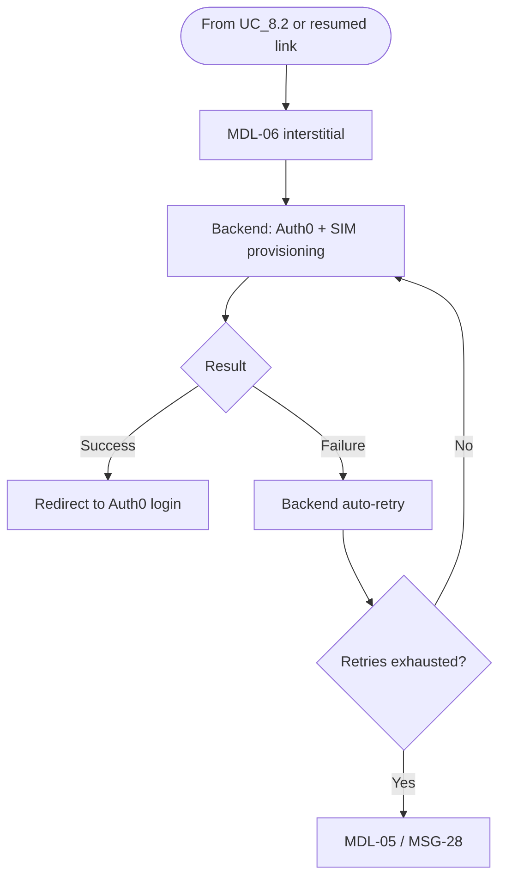

### 7. ALTERNATIVE FLOWS (Luồng phụ / Luồng thay thế)

| ID | Condition | Behaviour |
| --- | --- | --- |
| AF-1 | Reload while `account_status = 'Active_SIM'` | Redirect to Auth0 login immediately. |
| AF-2 | Reload while `account_status = 'Guest'` | Keep showing the provisioning/waiting state **indefinitely** — no frontend timeout; failure handling fully delegated to backend auto-retry. After retries are exhausted and `MDL-05` was closed, a reload would show the wait state again with no exit: `Q-E27`. |
| AF-3 | Email already has an Auth0 account (e.g. returning `Failed` user) | Not defined. See `Q-E30`. |

### 8. EXCEPTION FLOWS (Luồng ngoại lệ / Xử lý lỗi)

| ID | Scenario | Handling | Message |
| --- | --- | --- | --- |
| EX-1 | Backend auto-retry exhausted without successful provisioning | `MDL-05` renders instead of the redirect; user closes it and contacts support. | `MSG-28` |

### 9. BUSINESS RULES & DATA VALIDATION (Quy tắc nghiệp vụ & Ràng buộc dữ liệu)

#### 9.1 Business Rules

| # | BR Code | Function | Description |
| --- | --- | --- | --- |
| 1 | BR_8.3.1 | No Frontend Timeout at Phase 3 | Reload while `Guest` → wait state indefinitely. Reload while `Active_SIM` → immediate redirect to Auth0 login. |
| 2 | BR_8.3.2 | Backend Auto-Retry on Provisioning Failure | Number of retries and interval are not defined. ⚠️ PND-07 |

#### 9.2 Data Validation & Component Rules

| # | Component | Type | Displaying / Behaviour |
| --- | --- | --- | --- |
| 1 | "Setting up your trading floor" interstitial (`MDL-06`) | Static/Animated Display | 4-step animated sequence (labels ⚠️ PND-08). Holds indefinitely if `Guest` on reload. |
| 2 | "Account Creation Failure" (`MDL-05`) | Modal | `MSG-28`. Renders only after backend auto-retry is exhausted. |

#### 📝 BA NOTE — Sections to add on rework (10–14)

- **§10 API Contracts:** how FE learns the provisioning result (polling vs push), `account_status` read endpoint, Auth0 redirect URL/params, `Provision Simulation User` response (credentials returned as ciphertext only, per Zapier V7).
- **§12 State Machine (priority):** `Guest → Provisioning → Active_SIM` / `Provisioning-Failed`; retry counter; idempotency so a resumed link never creates duplicate Auth0/SIM accounts.
- **§13 Security/Audit:** credential handling (KMS-encrypted, never emailed), audit of provisioning attempts, break-glass manual provisioning if Zapier/provider is down.
- **§14 UI/UX:** 4-step interstitial animation (respect "Reduce Motion"), failure modal layout.

---

## APPENDIX A — SESSION STATE MAP (cross-step consistency)

One table that shows which step owns which piece of state, who reads it, and what changes it. It is derived from the UCs above; cells marked ⚠️ are the places where the spec is silent or contradictory.

| State key | Written at | Read at | Persistence / reset rule |
| --- | --- | --- | --- |
| `required_flow`, `geo_country`, `methods[]`, `zip_requirements`, `is_founder_cohort`, `pricing_tiers`, `is_launch_phase`, `historical_pass_rate` | Step 0 (UC_1.1) | UC_1.2, UC_3, UC_6.1, UC_7.1 | Global state; re-fetched on full page refresh only (`BR_1.1.1`). No re-check mid-session (`BR_1.3.2`) — stale-state risk `Q-E03`. |
| UTM / affiliate params (`utm_*`, `st_affiliate_data`, Everflow cookie) | Page init (`CR-05`, `BR_6.1.3`) | UC_1.3, UC_6.2, UC_8.1 | `localStorage`, read once from URL. |
| `asset_class` | Step 1 (UC_2) | UC_4 API param, UC_5 gate, UC_6.1 payload path, UC_7.1 summary | Changed only at Step 1. Change resets `platform` (`BR_2.3`). |
| `product_id` | Step 2 (UC_3) | `/calculate-cart`, `/execute-checkout`, promo mapping (`BR_7.5.7`) | Overwritten by a new card. Effect on an applied promo: ⚠️ PND-30. |
| `platform` | Step 3 (UC_4) | UC_7.1 summary, provisioning (Step 7) | Reset on asset-class change; **not** reset when changed later from Step 5 (`BR_4.3`). |
| `addon_ids[]` | Step 4 (UC_5) | `/calculate-cart`, `/execute-checkout` | `[]` on Forex; always contains CME on Futures. Restore rule after Forex round-trip: ⚠️ PND-27. |
| PII + billing address + shirt size + checkbox states | Step 5 (UC_6.1) | `/capture-lead`, Phase 2 UPSERT, AVS at `/execute-checkout` | Kept on back-navigation and on asset-class change (`CR-07`, `BR_6.1.4`); lost on full refresh ⚠️ PND-23. |
| `base_price`, `discount_amount`, `tax_amount`, `total_price` | Step 5 `/calculate-cart` (silent), updated at Step 6 by promo | UC_7.1 Order Summary | Recalculated on every successful [Next] at Step 5 and on every promo Apply/Remove. Drift vs Step 2: ⚠️ PND-29. |
| `promo_code` | Step 6 (UC_7.5) | `/calculate-cart`, `/execute-checkout` | Cleared by [Remove]. Step 5 re-sends `promo_code = NULL`: ⚠️ PND-30. |
| `payment_method`, `payment_token` | Step 6 (UC_7.2–7.4) | `/execute-checkout` | Not persisted across reload — no resumable mid-state (UC_7.1 AF-4). |
| `account_status` (`Guest` → `Active_SIM`) | Backend (Step 7) | UC_8.3 reload handling | Backend-owned. |

---

## APPENDIX B — CHANGE LOG

### B.1 ver_3 vs `UC_main.md` (Steps 0–4)

| # | Change | Reason |
| --- | --- | --- |
| 1 | Every Step 0–4 UC re-laid-out from "Use Case Specification Table + Activity Flow + Screen Description + Business Rules + Message List" into the 9-section layout used in Steps 5–7. | One layout for the whole document. |
| 2 | Original exception flows E1…En and the "Message List" tables merged into §8 tables with message codes; Screen Description merged into §9.2; reference snapshots (payload, Table J, package data, platform registry) moved to §9.3. | Same as ver_2 rows 1–4; §9.3 added because Steps 0–4 own real data tables. |
| 3 | **New §7 Alternative Flows** for every Step 0–4 UC (gate precedence, back-navigation, refresh, 1-result pre-select, Founder/Standard modes, asset-class switch, etc.). | Round-1 feedback: too few edge cases. All AF rows restate behaviour already implied by the original BRs — no new behaviour invented. |
| 4 | UC_1.1: `BR_1.1.3` (gate order / short-circuit) and `BR_1.1.4` (fail-open defaults) promoted from prose in Basic Flow and E3/E4. Pre-condition reworded from "current session" to "current page load" (matches `BR_1.1.1`). | Make implicit rules referenceable. |
| 5 | UC_1.1 §9.3: consolidated state-payload table (which field, which gate step, who consumes). `zip_requirements` and `methods[]` added because Steps 5 and 6 depend on them. | Steps 5–7 read fields that Step 0 never listed. |
| 6 | UC_1.3: partial CRM failure (1 of 2 calls) made explicit as "treated as failure, retry-safe"; success state now has popup code `POP-04`. | Activity flow already said so; MSG-03 lacked a catalog component. |
| 7 | UC_1.4: Gate 2 vs Step 5 billing-country pre-check written as two independent mechanisms; source contradictions flagged (PND-24, PND-25). | Cross-step consistency with UC_6.1 / `CR-09`. |
| 8 | UC_1.5: `PRICE_CHANGED` reference redirected to `UC_8.1 §8 EX-6` + `POP-02`; Step 2→Step 5 drift flagged (PND-29). | Match ver_2 UC_8.1 structure. |
| 9 | `BR_2.3` wording: Step 3 reset is the exception to `CR-07`; Step 5 persistence is *consistent* with `CR-07`. (Original called Step 5 non-reset "the one exception", which reads backwards.) | Removes a logical contradiction; behaviour unchanged. |
| 10 | `CR-06` reference removed from [Next] at Steps 1–4 (pure client-side navigation, no API call). Kept at Step 5 [Next] and everywhere an API is fired. | `CR-06` is defined for API-triggering buttons only. |
| 11 | UC_4 / UC_5 pre-condition "market-data-products returns a non-empty array" moved to §8 as an exception. | An empty response is an exception, not a pre-condition. |
| 12 | Per-UC "BA NOTE — Sections to add on rework (10–14)" added to Steps 0–4 (as in ver_2). | Same convention. |

### B.2 ver_3 vs `UC_main_ver_2.md` (Steps 5–7)

| # | Change | Reason |
| --- | --- | --- |
| 1 | Document header, TOC and "How to read" rewritten for the unified file; ver_2 "Scope / not yet converted" line removed. | Steps 0–4 are now converted. |
| 2 | "UC_main says / uses / does not define" rewritten as "the source spec …". | Avoid pointing at a file that is no longer the reader's reference. |
| 3 | UC_6.1 AF-6: "exception noted in `BR_2.3`" → "see `BR_2.3`". | Aligns with B.1 row 9. |
| 4 | New AF/EX rows with references to open points only (no new behaviour): UC_6.1 AF-8/AF-9, EX-8/EX-9; UC_6.2 AF-3; UC_7.1 AF-8; UC_7.2 AF-2; UC_7.3 AF-3; UC_7.5 AF-4/AF-5; UC_8.1 EX-2/EX-4/EX-5/EX-8 notes; UC_8.2 AF-4; UC_8.3 AF-3 / EX-2. | Link Steps 5–7 to the new PNDs and `Q-E##` questions. |
| 5 | Original ver_2 CHANGE LOG replaced by this appendix. | Single change log. |

### B.3 Satellite files (re-issued)

| File | Change |
| --- | --- |
| `common_rules.md` | Added "Áp dụng tại" column. `CR-05` now lists Waitlist (UC_1.3). `CR-06` scope clarified (API-firing buttons only). `CR-07` notes the `BR_2.3` reset and PND-23. `CR-09` clarified vs Gate 2. `CR-12` lists UC_1.3 as a 3rd-party analogue. No new CR codes. |
| `message_catalog.md` | Added `MSG-29` (Step 5 tax-calculation text), `MSG-30` (draft), `MSG-31` (draft). Added "Component" and "Dùng tại" columns. Types normalised to the component catalogs (Popup / Modal / Full-page). |
| `modal_catalog.md` | "Dùng tại" corrected: `MDL-02` also in UC_7.3 / UC_7.4, `MDL-03` only UC_8.1 (transition to UC_8.2 flagged PND-10). Notes column added. |
| `popup_catalog.md` | Added `POP-03` (No Payment Methods) and `POP-04` (Waitlist Joined); `POP-02` usage extended to UC_7.5 EX-6. |
| `full_page_state.md` | Usage aligned; `FPS-01` flagged PND-24; `FPS-02` message list confirmed. |

---
